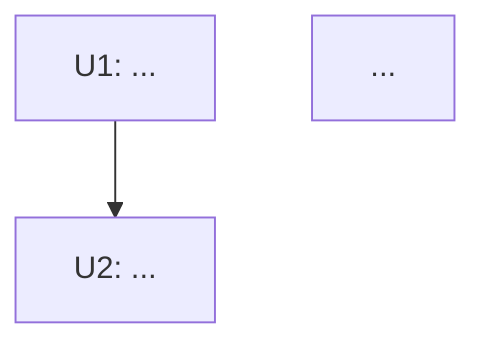

# MVP開発フローの作成

このコマンドは、`docs/` 配下の永続ドキュメントを読み込んで理解し、
**MVPに含める機能を洗い出した上で、MVP完成をゴールとした開発フロー**を
`docs/mvp-development-flow.md` として作成します。

作成するフローは、各「作業単位」がそのまま **steering スキル1サイクル**
（`.steering/[YYYYMMDD]-[作業単位名]/` = `/add-feature` の実装単位）に
対応する粒度で分割します。開発時はこのドキュメントを引用し、
作業単位ごとに steering スキルで実装していきます。

## 実行方法

```bash
claude
> /plan-mvp
```

## 前提

- `docs/` に6つの永続ドキュメントが存在すること（未整備なら先に `/setup-project`）。
- 出力先 `docs/mvp-development-flow.md` は、既存6ドキュメントを**引用する派生ロードマップ**であり、
  永続ドキュメントの内容を再定義・上書きしない（差分が出たら永続ドキュメント側を正とする）。

---

## ステップ0: インプットの読み込み

1. 以下の永続ドキュメントを全て読む:
   - `docs/product-requirements.md`（PRD: 何を作るか / MVPスコープ）
   - `docs/functional-design.md`（機能設計: どう実現するか）
   - `docs/architecture.md`（アーキテクチャ: 構成・依存の方向）
   - `docs/repository-structure.md`（リポジトリ構造: 実装の置き場所）
   - `docs/development-guidelines.md`（開発プロセス・規約）
   - `docs/glossary.md`（用語の統一）
2. `docs/ideas/` 配下のファイルも読み、背景・意図を補完する。
3. `docs/mvp-development-flow.md` が既に存在する場合は読み込み、
   **新規作成ではなく更新**として扱う（既存の作業単位IDと進捗を保持する）。

## ステップ1: MVP機能の洗い出し

1. PRDと機能設計書から、**MVPに含める機能**と**Post-MVP(対象外)**を明確に切り分ける。
   - PRD内の「MVP」「スコープ」「対象外」「将来検討」等の記述を最優先の根拠とする。
   - 機能設計書で「MVP機能を実現するために必要なコンポーネント/処理」を拾う。
2. 各MVP機能について、以下を1行ずつ整理する:
   - 機能名
   - 概要（何をするか）
   - 根拠（引用元: `product-requirements.md` の該当セクション等）
   - MVP必須である理由 / Post-MVPとの線引き
3. **判断に迷う機能（MVP必須か曖昧なもの）が残る場合**は、
   `AskUserQuestion` でスコープの線引きをユーザーに確認する。
   （曖昧なまま作業単位に落とし込まない）

## ステップ2: 作業単位への分割

洗い出したMVP機能を、**依存関係に沿って実装可能な「作業単位」へ分割**する。

各作業単位は次の条件を満たすこと:

- **steering 1サイクルで完結する粒度**（大きすぎる場合は分割、小さすぎる場合は統合）。
- **独立して実装・検証できる**（受け入れ基準を単体で判定できる）。
- **依存の向きが一方向**（先行する作業単位が完了していれば着手できる）。
- アーキテクチャ／リポジトリ構造上の**レイヤーや配置**と整合する
  （例: 共有ロジック → ストレージ → UI の順など、`architecture.md` の依存方向に従う）。

各作業単位について以下を定義する:

- **作業単位ID**（例: `U1`, `U2` …。既存があれば踏襲）
- **作業単位名**（steering ディレクトリ名に使える簡潔なスラッグ。例: `search-engine-core`）
- **概要 / 実装スコープ**
- **対応するMVP機能**（ステップ1で洗い出した機能への参照）
- **依存する作業単位**（先行必須のID。なければ「なし」）
- **受け入れ基準**（この単位が「完了」と言える条件。requirements.md の受け入れ基準の種）
- **主な対象領域**（`repository-structure.md` に沿った実装先ディレクトリの見当）

## ステップ3: 開発フローの構成

1. 作業単位を**依存関係で順序付け**し、必要ならフェーズ（マイルストーン）へグルーピングする。
   - 例: フェーズ1=基盤/共有ロジック、フェーズ2=ストレージ、フェーズ3=UI、フェーズ4=移行/品質。
2. 依存グラフを **mermaid** で表現する（`graph TD` で作業単位ノードと依存エッジ）。
3. **「MVP完成」の定義**（Definition of Done）を明文化する:
   - どの作業単位が全て完了すれば MVP 達成か。
   - MVP達成時に満たすべき横断的な受け入れ基準（例: PRDの成功指標、非機能要件）。

## ステップ4: ドキュメントの作成

`docs/mvp-development-flow.md` を以下の構成で作成（既存があれば更新）する。
**冒頭に引用元（6つの永続ドキュメント）へのリンクを明記**し、派生ロードマップであることを示す。

```markdown
# MVP開発フロー (MVP Development Flow)

- **ドキュメント名**: mvp-development-flow
- **プロダクト名**: [PRDのプロダクト名]
- **作成日 / 更新日**: [YYYY-MM-DD]
- **ゴール**: MVPの完成
- **参照元（引用）**:
  - [docs/product-requirements.md](./product-requirements.md)
  - [docs/functional-design.md](./functional-design.md)
  - [docs/architecture.md](./architecture.md)
  - [docs/repository-structure.md](./repository-structure.md)
  - [docs/development-guidelines.md](./development-guidelines.md)
  - [docs/glossary.md](./glossary.md)

> 本書は上記の永続ドキュメントを引用して構成した派生ロードマップである。
> 内容が永続ドキュメントと食い違う場合は、永続ドキュメント側を正とする。

---

## MVPゴールとスコープ

### MVPの目的
[PRDから要約したMVPの狙い]

### スコープ内（MVP対象機能）
[ステップ1で洗い出したMVP機能の一覧。各行に引用元を併記]

### スコープ外（Post-MVP）
[MVPに含めない機能と、その理由 / 線引き]

---

## 作業単位一覧

| ID | 作業単位名 | 概要 | 対応MVP機能 | 依存 | 受け入れ基準 | 主な対象領域 |
|----|-----------|------|------------|------|-------------|-------------|
| U1 | ...       | ...  | ...        | なし | ...         | ...         |
| U2 | ...       | ...  | ...        | U1   | ...         | ...         |

---

## 開発フロー（順序と依存）

### フェーズ / マイルストーン
[フェーズごとに含まれる作業単位を列挙]

### 依存グラフ



---

## MVP完成の定義（Definition of Done）

- [ ] 作業単位 U1〜Un が全て完了している
- [ ] [MVP達成時に満たすべき横断的な受け入れ基準 / 成功指標 / 非機能要件]

---

## 開発の進め方（steering 連携）

各作業単位は steering スキル1サイクルとして実装する。

1. 着手する作業単位を本書の一覧から1つ選ぶ（依存が解決済みのものから）。
2. `.steering/[YYYYMMDD]-[作業単位名]/` を作業ディレクトリとし、
   `/add-feature [作業単位名]` または `steering` スキル（モード1）で
   `requirements.md` / `design.md` / `tasklist.md` を作成する。
   - このとき、本書の当該作業単位の「受け入れ基準」を requirements.md の受け入れ基準に写す。
3. 計画承認（ゲート1）→ 実装（モード2）→ 検証（モード3）→
   受け入れ承認（ゲート2）→ 振り返り（モード4）の順で完了させる。
4. 完了した作業単位に本書の一覧でチェック（または進捗欄を更新）する。

---

## 進捗

| ID | 作業単位名 | 状態 | steering ディレクトリ |
|----|-----------|------|----------------------|
| U1 | ...       | 未着手 | -                    |
```

## ステップ5: 承認

1. 作成した `docs/mvp-development-flow.md` の内容、特に以下をユーザーに提示する:
   - MVPスコープ（スコープ内 / スコープ外の線引き）
   - 作業単位の分割と依存順序
2. **ユーザーの承認を得るまで待機**する。修正要望があれば本書を更新し、再度承認を求める。

## 完了時のメッセージ

```
MVP開発フローを作成しました。

✅ docs/mvp-development-flow.md

- MVP対象機能: N件
- 作業単位: M件（フェーズ K 分割）
- ゴール: 全作業単位の完了 = MVP完成

次の進め方:
- 依存が解決済みの作業単位から着手します。
- 各作業単位は steering スキル1サイクルで実装します:
    /add-feature [作業単位名]
  例: /add-feature [先頭の作業単位名]
- 実装の区切りで /commit-steering [作業単位名] によりコミットできます。
```

## 注意事項

- 本書は永続ドキュメントを**引用する派生ロードマップ**であり、それ自体が仕様の正本ではない。
  設計・要件の変更は必ず `docs/` 側の永続ドキュメントに反映し、本書はそれに追従して更新する。
- 作業単位は「steering 1サイクルで完結する粒度」を厳守する。大きすぎる単位は分割し、
  依存の向きが一方向になるよう順序付ける。
- MVPスコープの線引きに迷いが残る場合は、勝手に断定せず `AskUserQuestion` で確認する。
