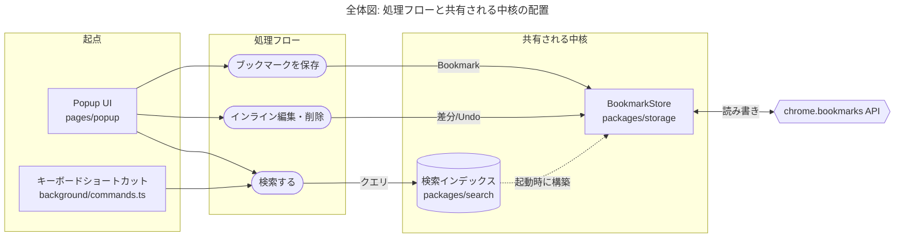
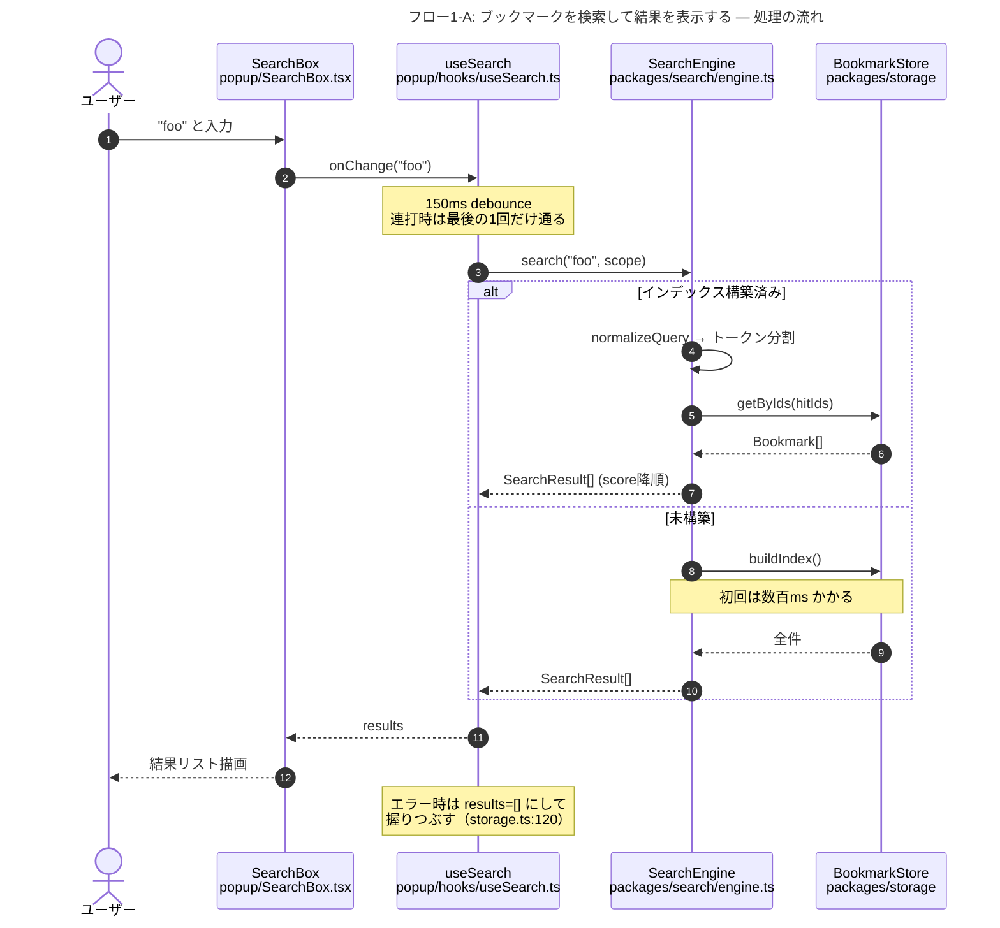
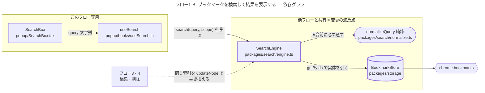
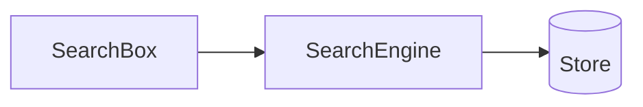
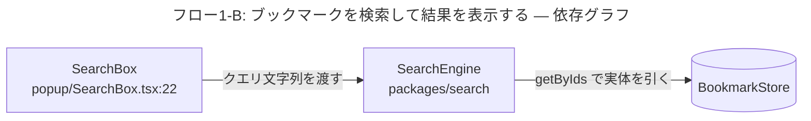
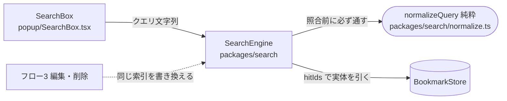
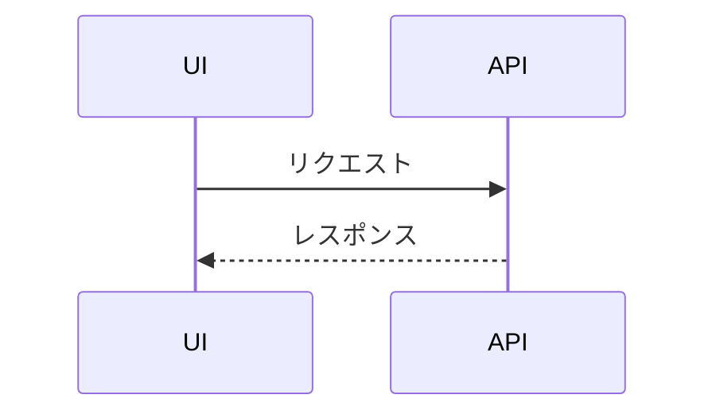
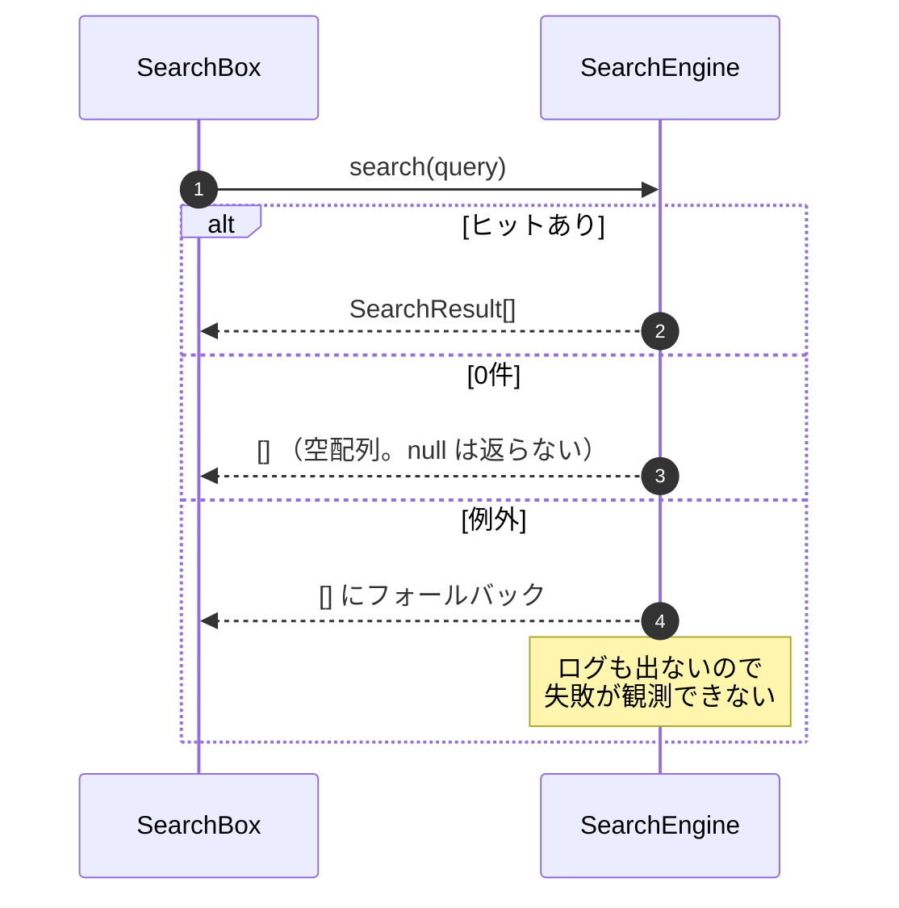

# 図の描き方

全体図1枚と、処理ごとの2枚組（A. 処理の流れ / B. 依存グラフ）を描くための具体的なパターン集。**図種は固定で、フローごとに選び直さない。**

- [鉄則: どの処理の図かを明示する](#鉄則-どの処理の図かを明示する)
- [図は2枚1組で固定](#図は2枚1組で固定)
- [全体図](#全体図)
- [A. 処理の流れ: sequenceDiagram](#a-処理の流れ-sequencediagram)
- [B. 依存グラフ: flowchart](#b-依存グラフ-flowchart)
- [使わない図とその理由](#使わない図とその理由)
- [共通ルール](#共通ルール)
- [良い図・悪い図](#良い図悪い図)
- [Mermaid の構文的な落とし穴](#mermaid-の構文的な落とし穴)

---

## 鉄則: どの処理の図かを明示する

他のどのルールより先に守る。図が複数ある文書では、読み手は常に「今見ているこれは何の話か」を探しながら読んでいる。それが即答できない図は、理解を助けるどころか認知の負荷を増やす。

**図は本文と違って前後の文脈を持ち込めない。** スクロールで飛ばされ、切り出して貼られ、スクショで共有される。1枚だけ取り出しても意味が通ることが必須条件になる。

### 二重に名前を付ける

**① フローの冒頭に4行のヘッダ**（Markdown 側。A・B の2枚で共有するので1回だけ置く。各図には「答える問い」を1行ずつ添える）

```markdown
**処理**: 検索結果の行をインライン編集して保存する
**起動**: 結果行をダブルクリック、または行フォーカス中に Enter
**範囲**: 編集モード開始から、保存完了して表示モードに戻るまで
**含まない**: 削除とアンドゥ（→ フロー4）、検索そのもの（→ フロー1）
```

**② Mermaid コード内にタイトル**（切り出されても残るように）

Mermaid は先頭の frontmatter でタイトルを持てる。どの図種でも使える。

````markdown
```mermaid
---
title: "フロー3: 検索結果の行をインライン編集して保存する"
---
sequenceDiagram
...
```
````

frontmatter が使えない環境向けに、`flowchart` なら先頭ノード、`sequenceDiagram` なら冒頭の `Note over` にタイトルを置く手もある。とにかく**図の内側に名前が残る**ようにする。

### 「含まない」を必ず埋める

4行のうちこれが一番効く。隣接する処理との境界が引かれて初めて、読み手はその図の輪郭を正しく掴める。境界が書かれていないと、読み手は無意識にスコープを広げて解釈し、「この図に描かれていない ＝ 存在しない」と誤読する。

書き方は「除外するもの → どこを見ればいいか」。参照先まで書くと、読み手はそこで迷子にならずに済む。

### 起点と終点を図の中でも分かるようにする

範囲をヘッダに書いたら、図の中でも一目で分かるようにする。

- `flowchart` — 最初と最後のノードをスタイルで区別する、あるいは `[*]` 相当の明示的な開始/終了ノードを置く
- `sequenceDiagram` — 最初のメッセージが起動トリガーそのものになるように書く（`actor U` からの矢印で始める）。終端は結果が返る矢印で締める
- どちらも、図の外に出ていく先は破線や別形状にして「ここから先は別の図の話」と分かるようにする

### A・B のタイトルの付け方

2枚は必ずどちらの側の図か分かる名前にする。

- ✅ 「フロー2-A: ブックマークを保存する — 処理の流れ」／「フロー2-B: ブックマークを保存する — 依存グラフ」
- ❌ 「保存フロー」「保存フロー(2)」

**さらに分割が必要になったとき**（A が長すぎて1枚に収まらない等）は、そのフローが実は2つのフローである可能性を先に疑う。それでも分けるなら `2-A①` / `2-A②` とし、各図の「含まない」欄で相互に参照させる。①は「②で扱う永続化は含まない」、②は「①の検証済みの値を受け取るところから始まる」と書く。

---

## 図は2枚1組で固定

**フローの性質を見て図種を選んではいけない。全フローで同じ2枚を描く。**

| | 図種 | 軸 | 答える問い |
|---|---|---|---|
| **A. 処理の流れ** | `sequenceDiagram` | 時間 | 誰が誰を呼び、何が返り、どこで失敗するか |
| **B. 依存グラフ** | `flowchart` | 空間 | 何に依存し、変更すると何に波及するか |

（プロダクト全体の配置を描く全体図だけは別枠で、`flowchart` を1枚。）

### なぜ2枚とも要るのか

A だけだと、**変更の影響範囲が読めない**。sequenceDiagram は登場したモジュールしか描かないので、「この関数を直したら他に誰が困るか」が見えない。呼ばれていないが依存している、という関係が落ちる。

B だけだと、**順序と失敗が読めない**。依存グラフに時間軸はないので、「A が成功してから B を呼ぶ」なのか「並行に呼ぶ」なのかが区別できない。この違いはバグの温床そのものなので、落とすと危険。

人間が処理を頭の中で再生するには、**「いつ何が起きるか」と「何に支えられているか」の両方**が要る。片方だけのモデルは、予測はできても波及が読めない（あるいはその逆）という欠けた状態になる。

### なぜ固定するのか

フローごとに図種が変わると、読み手は図を開くたびに「これはどう読む図か」の判断からやり直す。その判断コストは、図の内容を理解するために使えたはずの容量を削る。同じ形式が並んでいれば、2枚目以降は読み方を考えずに中身だけを見られる。

**一貫性は理解速度そのものであり、個々の図の表現力より優先する。** 「このフローは状態遷移が主だから stateDiagram のほうが正確に描ける」は正しいかもしれないが、それでも固定を崩さない。表現力で得るものより、形式の揺れで失うもののほうが大きい。

### A と B は同じ名前で書く

2枚は同じ処理の表と裏なので、**登場するモジュール名は一致させる**。A に出てくるのに B にいない、B にあるのに A に出てこない、というズレがあったら、それは調査が足りていないサイン（あるいは片方の粒度が間違っている）。整合を取ること自体が調査の検算になる。

---

## 全体図

**描くもの**: 処理フローと、それらが共有するモジュール・データ・外部境界。

**描かないもの**: 各フローの内部。ディレクトリ構造。層の名前。

狙いは、読み手が個別のフロー図を読むときに「これは全体のここの話だ」と位置づけられるようにすること。もう一つ、**複数のフローが同じものを触っている箇所を可視化する**こと。そこが後で「変更するとどこが壊れるか」の判断材料になる。

**処理**: このプロダクトが持つ処理フロー全体の配置
**起動**: —（個別の処理ではなく全体の見取り図）
**範囲**: 入口・主要フロー・共有される中核・外部境界
**含まない**: 各フローの内部（→ 個別の図）



ポイント:

- **フローを丸ノード `([ ])` で、モジュールを角ノードで**描き分けると、動詞と名詞が視覚的に分離されて読みやすい
- `subgraph` で「起点 / 処理 / 共有される中核 / 外部」に分けると、依存の向きが目で追える
- 外部システムは `{{ }}` など別の形にして、自分たちの管轄外だと分かるようにする
- ノードに実際のパスを `<br/>` で添える。読み手が実物に辿り着ける

---

## A. 処理の流れ: sequenceDiagram

2枚組の1枚目。「起動 → 各モジュールを経由 → 結果」の時系列を、**参加者を実際のモジュール名にして**描く。

**処理**: ブックマークを検索して結果を表示する
**起動**: 検索ボックスへの入力
**範囲**: `onChange` の発火から、結果リストの描画まで
**含まない**: 検索インデックスの構築（→ フロー6）、結果行の編集・削除（→ フロー3・4）

### 1-A 処理の流れ
> 答える問い: 誰が誰を呼び、何が返り、どこで失敗するか



ポイント:

- `autonumber` を付ける。文章から「③のところで」と参照できるようになる
- participant 名は **`表示名<br/>実際のパス`**。これがないと図とコードが繋がらない
- **`alt` / `opt` で分岐と失敗経路を必ず描く。** 正常系だけの図は読み手に間違ったモデルを植え付ける
- `Note` は「図の線には現れないが知らないと事故る情報」に使う。debounce、リトライ、タイムアウト、握りつぶし、キャッシュ
- 同期の戻りは `-->>`、呼び出しは `->>` で統一する

---

## B. 依存グラフ: flowchart

2枚組の2枚目。**A に登場したモジュールが何に支えられているか**を描く。時間軸は捨て、代わりに「変えたらどこに波及するか」を見えるようにする。

A と同じフローを、同じモジュール名で描く。

### 1-B 依存グラフ
> 答える問い: このフローは何に依存し、変更すると何に波及するか



ポイント:

- **矢印は依存の向きだけを描く。戻りの矢印は描かない。** 返り値の往復は A の担当。ここで描くと A と役割が重複して両方ぼやける
- **矢印ラベルには依存の中身**を書く。呼ぶ関数名か、受け取る型。「使う」「依存」は情報量ゼロ
- **`subgraph` で「このフロー専用」と「他フローと共有」を分ける。** これがこの図の主目的。共有側にあるものを変えると別のフローが壊れる、という判断がひと目でつく
- **他フローからの矢印を破線で描き入れる。** 「自分以外の誰がここを触るか」が見えて初めて波及が読める
- **形で性質を分ける** — 純粋モジュール（React/chrome/DOM 非依存）は `([ ])`、永続ストアは `[( )]`、外部 API は `{{ }}`。テストしやすさと壊れやすさが形で伝わる
- **循環依存があったら必ず描く。** 設計上の重大な事実であり、隠すと読み手が同じ罠を踏む
- ノードにはパスを `<br/>` で添える。読み手が実物に飛べる

---

## 使わない図とその理由

以下は Mermaid で描けるが、このスキルでは**使わない**。表現力が足りないからではなく、形式が揺れることの害のほうが大きいからだ。

| 図種 | 使わない理由 | 代わりにどう表すか |
|---|---|---|
| `stateDiagram-v2` | 状態遷移が主題のフローでは確かに正確だが、これを1つ許すと「このフローは分岐が多いから flowchart」も許すことになり、固定が崩れる | A の `alt` で状態ごとの分岐を描き、遷移条件と「遷移しない経路」を `Note` と**要点**に書く |
| 処理パイプラインの `flowchart` | B と同じ図種なのに読み方が違う（片方は依存、片方は時系列）ため、最も混乱を生む組み合わせ | A の `alt` で分岐を、変形の中身は**要点**に書く |
| `classDiagram` / ER 図 | 型や継承の構造であって、処理の理解には直結しない | 型の意味は**中核概念**に、実際の依存は B に描く |
| ディレクトリツリー | 読み手は `ls` できる | 描かない。なぜその区切りなのかだけを文章で書く |

### 状態機械をどう A・B に落とすか

「編集中 → 保存中 → 表示」のようなライフサイクルは、実際には**イベントごとの処理フロー**に分解できる。分解したほうが、状態図より具体的になることが多い。

- 各状態遷移を起こすイベント（Enter・Escape・blur・タイムアウト）を A の `alt` の分岐として描く
- 遷移**しない**ことが重要な経路（「blur では保存しない」「期限切れ後の Undo は無効」）は `Note` で明示する
- 状態そのものをどこが保持しているか（`useState` か、モジュールスコープの単一実体か）は B に描く。**状態の所有者が図に出るのは B の役割**

これで状態図が持っていた情報はほぼ保存される。失われるのは「全状態の一覧性」だけで、それはフロー一覧の表が肩代わりする。

---

## 共通ルール

**単体で見て何の処理か分かること。**
4行ヘッダと図中タイトル。他のすべてに優先する。詳しくは[鉄則](#鉄則-どの処理の図かを明示する)。

**図種は選ばない。**
A = `sequenceDiagram`、B = 依存グラフ（`flowchart`）を全フローで貫く。「このフローには別の図種が向いている」と感じても崩さない。

**A と B でモジュール名を一致させる。**
同じ処理の表と裏なので、片方にしか出てこない名前があってはいけない。ズレは調査不足のサイン。

**ノード名はコードの語彙をそのまま使う。**
コードが `Entry` と呼ぶものを図で「レコード」と書かない。読み手は最終的にコードを読むのだから、語彙がずれていると翻訳コストが永続的にかかる。

**矢印のラベルには流れる値を書く。**
「呼ぶ」「使う」「渡す」は情報量ゼロ。書くのは `SearchResult[]`、`正規化済み URL`、`削除イベント`。何が流れているかが分かって初めて、読み手はデータの旅を想像できる。

**1枚あたりノード7〜12個。**
超えたら、そのフローは実は複数のフローか、粒度が細かすぎる。分割する。読めない図は描かなかったのと同じ。

**位置情報を入れる。**
`file.ts:42` を図の中に入れる。図はいずれ古くなるが、実物に飛べる図は読み手が自分で直せる。

**分岐と失敗を描く。**
正常系だけの図は嘘。読み手は「この処理は必ず成功する」というモデルを作り、エラー処理の抜けた差分を通す。

**推測を図に混ぜない。**
確認できていない経路は、ラベルに `?` を付けるか描かずに「未解明」に書く。図は断定に見えるので、嘘が混ざると特に害が大きい。

---

## 良い図・悪い図

### 悪い: 何の処理か分からない

````markdown
## データの流れ


````

見出しが名詞（「データの流れ」）で、どの操作の話か分からない。起動条件も範囲もないので、読み手はこれが検索なのか初期化なのか同期なのかを推測するしかない。図を切り出したら完全に無意味になる。

### 良い: 単体で意味が通る

````markdown
## フロー1: ブックマークを検索して結果を表示する

**処理**: ブックマークを検索して結果を表示する
**起動**: 検索ボックスへの入力
**範囲**: `onChange` の発火から結果リストの描画まで
**含まない**: インデックス構築（→ フロー6）

### 1-B 依存グラフ
> 答える問い: このフローは何に依存し、変更すると何に波及するか


````

見出しが動詞で、いつ始まるか・どこまでか・何が外かが全部ある。A・B のどちら側かもタイトルに入っている。図だけ切り出しても中に名前が残る。

### 悪い: 層の名前だけ


どのプロダクトにも描ける。つまり何も言っていない。読み手は1ミリも予測できるようにならない。

### 良い: そのプロダクト固有のものが出ている



固有名詞があり、矢印のラベルが依存の中身（「照合前に必ず通す」）を語っている。純粋モジュールとストアが形で区別され、**他フローからの破線**で波及点が示されている。これを見た読み手は「`SearchEngine` に触る差分はフロー3も確認が要る」と予測できる。

戻りの矢印（`C --> B` のような返り値）は描いていない。それは A の担当で、B に混ぜると両方の役割がぼやける。

### 悪い: 正常系だけ



### 良い: 失敗と分岐がある



---

## Mermaid の構文的な落とし穴

書いたあと必ず構文が通るか確認する。壊れた図は 0 点なので横着しない。よくある事故:

- **frontmatter の `title`** → Mermaid 9.4 以降でしか効かない。レンダラが古くて落ちる場合は、`flowchart` なら先頭の説明ノード、`sequenceDiagram` なら冒頭の `Note over` にタイトルを置き換える。タイトル自体を省いてはいけない
- **ノードラベル内の丸括弧・角括弧** → `["foo(bar)"]` のようにダブルクォートで囲む
- **ラベル内のコロン** → sequenceDiagram のメッセージでは `:` が区切りなので、本文中のコロンは避けるかクォートする
- **日本語やスペースを含む ID** → ID は英数字にし、表示名はラベルで与える（`A[検索する]`）
- **改行** → `\n` ではなく `<br/>`
- **`end` の閉じ忘れ** → `subgraph` / `alt` / `note` は全て `end` が要る
- **`-->` と `->>`** → flowchart は `-->`、sequenceDiagram は `->>` / `-->>`。混ぜるとパースが落ちる
- **絵文字や記号の多用** → レンダラによって崩れる。情報は言葉で書く
