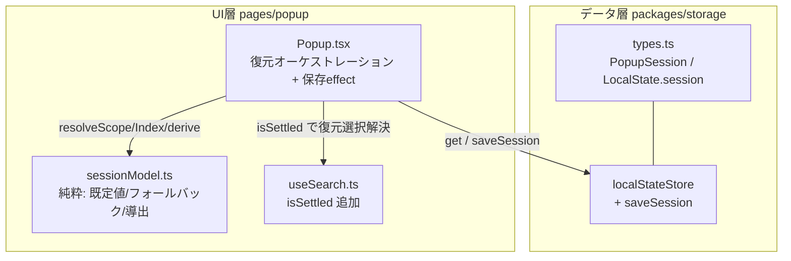

# 設計書

## アーキテクチャ概要

レイヤー依存「UI → サービス → データ」に従い、状態の**永続化はデータ層(`localStateStore`)** に、**復元/保存のオーケストレーションと純粋ロジック**は UI 層(popup)に置く。純粋ロジック(既定値・フォールバック解決・セッション導出)は `sessionModel.ts`(React 非依存)へ切り出し、既存の pure module 群(`modeMachine.ts` / `folderTreeModel.ts`)に倣ってユニットテストする。



## コンポーネント設計

### 1. `PopupSession` 型 と `LocalState.session`(データ層 / `packages/storage/lib/types.ts`)

**責務**:
- ポップアップを閉じた時点の UI 状態の型を定義する(functional-design の定義に一致させる)。

**実装の要点**:
```ts
export interface PopupSession {
  focusArea: 'search' | 'result' | 'folderTree'; // 既定: 'folderTree'
  scopeFolderId: string | null;                  // 既定: null(=「すべて」)
  selectedBookmarkId?: string;                    // 既定: 未指定(=先頭行)。ID で保持
  query: string;                                  // 既定: ''
}
```
- `LocalState` に `session?: PopupSession;` を追加する。
- **`createStorage` の既定値オブジェクトには `session` を足さない**(未保存時は `undefined` のまま)。既存テスト `localStateStore.get()` が `{ expandedFolderIds: [] }` と等値であることに依存しているため、既定値の形を変えない。
- `focusArea` の union は modeMachine の `FocusArea` と同一の文字列。データ層は UI 型に依存できない(逆依存禁止)ため、storage 側で独自に定義し、両者が同じ文字列リテラルであることをコメントで明示する。

### 2. `localStateStore.saveSession`(データ層 / `localStateStore.ts`)

**責務**:
- `LocalState.session` フィールドのみを更新する利便メソッド。

**実装の要点**:
```ts
saveSession: async (session: PopupSession) => {
  await storage.set(current => ({ ...current, session }));
}
```
- 既存の `setLastUsedFolder` / `toggleExpanded` と同じく他フィールドを保つマージ更新。
- 型 `LocalStateStorageType` に `saveSession` を追加する。

### 3. `sessionModel.ts`(UI層・純粋 / `pages/popup/src/hooks/sessionModel.ts`)

**責務**:
- 既定値・フォールバック解決・現在状態からのセッション導出を、React/`chrome.*` 非依存の純粋関数で提供する。

**実装の要点(公開する純粋関数)**:
- `DEFAULT_SESSION: PopupSession` = `{ focusArea: 'folderTree', scopeFolderId: null, query: '' }`(`selectedBookmarkId` 未指定)。
- `resolveRestoredScope(sessionScope: string | null, exists: boolean): string | null`
  - `sessionScope !== null && exists` のときのみ `sessionScope`、それ以外は `null`(AC-5)。
- `resolveRestoredIndex(id: string | undefined, resultIds: string[]): number`
  - `id` 未指定 → `0`。`resultIds.indexOf(id)` が見つかれば該当 index、無ければ `0`(AC-6/AC-8)。
- `deriveSession(input: { focusArea; scopeFolderId; selectedBookmarkId; query }): PopupSession`
  - 現在の UI 状態から `PopupSession` を組み立てる。`selectedBookmarkId` が `undefined` のときはキーを省く。
- `sessionsEqual(a: PopupSession, b: PopupSession): boolean`
  - 保存 effect の無駄な書き込み・`liveUpdate` 通知を避けるための等値比較(4項目)。
- 宣言は非 export とし、ファイル末尾で export をまとめる(既存 pure module の作法)。

### 4. `useSearch` に `isSettled` を追加(UI層 / `useSearch.ts`)

**責務**:
- debounce 済みクエリが現在のクエリに追いついたか(= `results` が現在の `query`/`scope` を反映しているか)を UI へ伝える。

**実装の要点**:
- `isSettled = debouncedQuery === query` を返す。
- 復元時の選択行 ID 解決を、`results` が復元後のクエリ/スコープを反映してから行うためのゲートに使う(debounce 中の既定結果に対して誤解決してフォールバックしてしまう競合を防ぐ)。
- スコープ(`folderId`)は debounce しないため、`isSettled` が真なら `results` は現在の `query` と `scope` の両方を反映している。

### 5. `Popup.tsx` の復元オーケストレーション + 保存 effect(UI層)

**責務**:
- 起動時: 既定値を先に適用 → 索引構築後にセッションを上書き復元。
- 変更時: 4項目を debounce 付きで保存。

**実装の要点**:

**(a) セッション読み込み(mount 時)**
- `localStateStore.get()` を1回呼び、`sessionRef`(または state)へ格納。`session ?? DEFAULT_SESSION`。`foldersLoaded` を `onFoldersLoaded` で真にする。

**(b) 復元適用(1回のみ)** — 条件: `!hasRestored && sessionLoaded && foldersLoaded`(AC-10)
> フォーカス/スコープ/クエリは索引を必要としないため、**索引構築(`isIndexReady`)を待たず**セッション/フォルダ読込完了時点(数ms〜数十ms)で即適用し、既定状態(左ペインフォーカス＋「すべて」)が索引完了(~数百ms)まで見えるフラッシュを避ける。選択行の ID→index 解決だけは下記 (c) で `isIndexReady`/`isSettled` を待つ。
1. スコープ: `resolveRestoredScope(session.scopeFolderId, findFolderPath(folders, session.scopeFolderId).length > 0)` → `setScopeFolderId`。
2. クエリ: `setQuery(session.query)`(復元は生 `setQuery`。ユーザー入力用ラッパとは別経路)。
3. フォーカス: `applyFocusArea(session.focusArea)`
   - `'folderTree'`: 既定モードが `FOLDER_TREE` のため通常は現状維持(必要なら `enterFolderTree()`)。DOM フォーカスは FolderTree の `focused` effect が担う。
   - `'search'`: `exitToList()` → `setListFocus('search')` → 入力へ `focus()`。
   - `'result'`: `exitToList()` → `setListFocus('result')` → 入力を `blur()`。
4. 選択保留: `setPendingSelectId(session.selectedBookmarkId ?? null)`。
5. 復元クエリ全選択の保留: `session.query !== '' && session.focusArea !== 'search'` のとき `restoredQuerySelectPendingRef = true`(AC-11)。
6. `setHasRestored(true)`(保存 effect の解禁)。

**(c) 選択行 ID 解決(復元専用)** — 条件: `pendingSelectId !== null(保留中) && isSettled && isIndexReady`
- `idx = resolveRestoredIndex(pendingSelectId, results.map(r => r.node.id))` → `setSelectedIndex(idx)` → `pendingSelectId` をクリア。
- `isSettled` ゲートにより、`results` が復元後クエリを反映してから解決する(AC-8)。
- 既存の「`[query, scopeFolderId]` 変化で `selectedIndex=0`」effect が復元直後に一旦 0 を入れても、本 effect が後続コミットで正しい index に上書きするため整合する。

**(d) 保存(debounce 付き + クローズ時フラッシュ)** — 条件: `hasRestored && pendingSelectId === null`(復元前は保存しない=既定値で保存済みセッションを潰さない)
> フォーカス/スコープ/クエリの復元を索引構築前に行うため、`hasRestored` が索引完了より早く真になる。その間 `results` は空で `selectedBookmarkId` が拾えず、保存すると保存済みの選択 ID を空で上書き(クロバー)してしまう。よって**選択の ID→index 解決が保留中(`pendingSelectId !== null`)の間は保存しない**（元から選択なし=null なら即保存可）。
> **クローズ時フラッシュ**: ポップアップは外側クリックで唐突に閉じるため、閉じる直前の変更が debounce 待ちのまま失われうる（例: 選択行を動かして即 Enter で開く）。毎レンダーで現在セッションを `sessionSnapshotRef` に保持し、`pagehide` / `visibilitychange`(hidden) で debounce を介さず即時保存する。保存処理は等値ガード付きの `persistSession` に共通化し、debounce 保存とフラッシュで共用する。

**(f) 左ペインの行描画ゲート(`FolderTree.ready`)**
- `FolderTree` に `ready` プロップを追加し、`Popup` は `ready={hasRestored}` を渡す。`ready === false` の間は行を描画しない（フォルダ取得は継続する）。
- 復元スコープが当たる前に既定スコープ「すべて」で行を描画すると、起動直後の1フレームだけ「すべて」がハイライトされてから保存スコープへ移るフラッシュになる。最初に描画される行が既に復元スコープになるよう、復元適用まで行描画を保留する。
- 依存: `focusArea`(=`toFocusArea(mode.mode, listFocus)`)/ `scopeFolderId` / `selectedBookmarkId`(=`results[selectedIndex]?.node.id`)/ `query`。
- `setTimeout`(例 200ms)で debounce し、`deriveSession(...)` を作り、直近保存値と `sessionsEqual` で差分があるときのみ `localStateStore.saveSession` を呼ぶ(AC-1/AC-2/AC-3)。
- アンマウント/依存変化でタイマーをクリアする。

**(e) 復元クエリ全選択の消費(AC-11)**
- 既存の「検索ファースト復帰」分岐で `focusSearch()` を呼んだ直後、`restoredQuerySelectPendingRef` が真なら `searchInputRef.current?.select()` してフラグを落とす。次の印字文字(keydown の既定動作)が全選択を置き換える。
- ユーザーがクエリを編集したら(`SearchHeader` の `onQueryChange` ラッパ)フラグを落とす。復元の生 `setQuery` は消費しない。

## データフロー

### 復元(起動時)
```
1. mount: localStateStore.get() → session(なければ DEFAULT_SESSION)
2. 既定フォーカス(左ペイン)を即適用(useMode 初期値 = FOLDER_TREE / 200ms 要件)
3. 索引構築(useSearch)完了 & folders 取得完了を待つ
4. 復元適用: scope(存在検証) / query / focusArea を上書き、selectedBookmarkId を保留
5. debounce 後 results が復元クエリを反映(isSettled) → 保存 ID を index へ解決
```

### 保存(変更時)
```
1. focusArea / scopeFolderId / query / 選択行 ID のいずれかが変化
2. debounce(200ms)
3. deriveSession → 直近保存値と差分あり → localStateStore.saveSession
```

## エラーハンドリング戦略

- `localStateStore.get()` 失敗時: 復元をスキップし既定値のまま継続(検索・入力を阻害しない)。`console.error` のみ。
- `saveSession` 失敗時: `console.error` のみ(保存失敗で UI を止めない)。次回変更で再試行される。
- 削除済み参照(スコープ/選択)は例外ではなく**当該項目のみ既定値へフォールバック**(AC-5/AC-6)。

## テスト戦略

### ユニットテスト(`sessionModel.test.ts`)
- `DEFAULT_SESSION` の各既定値(focusArea='folderTree' / scope=null / selectedBookmarkId 未指定 / query='')。
- `resolveRestoredScope`: 存在する→そのまま / 存在しない→null / sessionScope=null→null。
- `resolveRestoredIndex`: 未指定→0 / 見つかる→該当 index / 見つからない→0。
- `deriveSession`: selectedBookmarkId 有無でキー省略が正しい。
- `sessionsEqual`: 4項目の同一/差分判定。

### ストアテスト(`stores.test.ts` に追記)
- `saveSession` が `session` フィールドのみ更新し他フィールドを保つ。
- `localStateStore` の公開 API に `saveSession` が存在する。
- 既定 `get()` が従来どおり `{ expandedFolderIds: [] }`(session 無し)であること。

### 手動確認(受け入れ)
- スコープ/選択/クエリ/フォーカスを変えて閉じ→開き直して復元されること。
- 削除済みフォルダ/ブックマークのフォールバック。
- 復元クエリ残存時の印字文字で全選択置換。

## 依存ライブラリ

なし(新規追加なし)。

## ディレクトリ構造

```
packages/storage/lib/
  types.ts                      # PopupSession 追加 / LocalState.session 追加
  impl/localStateStore.ts       # saveSession 追加
  impl/stores.test.ts           # saveSession テスト追記
pages/popup/src/hooks/
  sessionModel.ts               # 新規(純粋ロジック)
  sessionModel.test.ts          # 新規(ユニットテスト)
  useSearch.ts                  # isSettled 追加
pages/popup/src/
  Popup.tsx                     # 復元オーケストレーション + 保存 effect + 全選択消費
```

## 実装の順序

1. データ層: `PopupSession` 型・`LocalState.session`・`saveSession`(+ ストアテスト)。
2. 純粋ロジック: `sessionModel.ts`(+ `sessionModel.test.ts`)。
3. `useSearch` に `isSettled` を追加。
4. `Popup.tsx`: 保存 effect → 復元適用 → 選択解決 → 全選択消費 の順で結線。
5. 品質ゲート(test/lint/type-check)。

## セキュリティ考慮事項

- 外部通信ゼロを維持(`storage.local` のみ / `fetch`・XHR なし)。
- 保存対象は既存の権限(`storage`)内で完結。追加権限なし。

## パフォーマンス考慮事項

- 既定フォーカスを先に適用し、復元は索引構築後に上書き(200ms 要件を満たす / AC-10)。
- 保存は debounce + `sessionsEqual` で書き込み回数を抑え、`liveUpdate` の無用な再通知を避ける。

## 将来の拡張性

- `PopupSession` に項目を増やす場合も、`sessionModel` の解決関数と `deriveSession` に閉じて拡張できる。
- U13(複数選択)・U14(現在ページ登録)の状態を将来加える余地(本単位ではスコープ外)。
