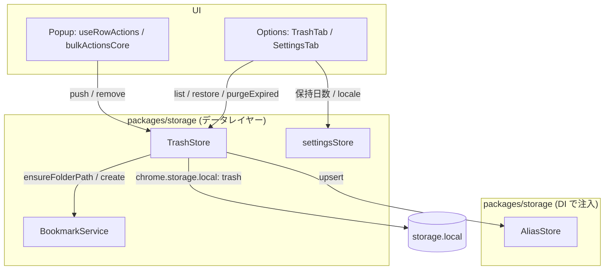

# 設計書

## アーキテクチャ概要

architecture.md のレイヤー依存（**UI → サービス → データ**）に従い、ゴミ箱の永続化・復元ロジックはデータレイヤー（`packages/storage`）に閉じ込める。UI（Popup / Options）は `chrome.*` を直接触らず `TrashStore` の公開 API のみを使う。



## コンポーネント設計

### 1. TrashStore（新規: `packages/storage/lib/impl/trashStore.ts`）

**責務**:
- 削除データ（`TrashItem`）の `chrome.storage.local`（キー `trash`）への保存・一覧・復元・取り消し
- 保持日数超過分の purge、件数/容量上限超過分の古い順自動削除

**公開 API**（functional-design「TrashStore(ゴミ箱)」に準拠。`push` のみ後述の理由で入力型を変える）:

```typescript
class TrashStore {
  constructor(bookmarks: TrashBookmarkGateway, aliases: TrashAliasGateway);

  /** 削除データを退避する。id/deletedAt は本メソッドが採番する。戻り値はゴミ箱内 ID。 */
  push(input: TrashInput): Promise<string>;
  /** 新しい順（deletedAt 降順）で一覧を返す。 */
  list(): Promise<TrashItem[]>;
  /** 元パスへ復元する（フォルダは配下ツリーごと）。成功時のみゴミ箱から取り除く。 */
  restore(id: string): Promise<void>;
  /** ゴミ箱から完全に削除する（復元せず捨てる / 即時アンドゥ時の取り消しにも使う）。 */
  remove(id: string): Promise<void>;
  /** ゴミ箱を空にする。 */
  clear(): Promise<void>;
  /** 保持日数を過ぎた項目を削除する。戻り値は削除件数。 */
  purgeExpired(retentionDays: number): Promise<number>;
  /** 件数上限・容量上限を超えた分を古い順に削除する。戻り値は削除件数。 */
  enforceLimits(maxItems?: number, maxBytes?: number): Promise<number>;
}
```

**実装の要点**:

- **DI（構造的インターフェース）**: 復元には `BookmarkService`（`ensureFolderPath`/`create`）と `AliasStore`（`upsert`）が要る。`AliasStore` は `Normalizer` 注入が必須で `packages/storage` 内では生成できない（`storage → shared` は循環依存になるため。`AliasStore` の `AliasNormalizer` と同じ制約）。よって両者を**構造的インターフェースで受け取り、呼び出し側（`services.ts`）が注入**する。

  ```typescript
  export interface TrashBookmarkGateway {
    ensureFolderPath(path: string[]): Promise<string>;
    create(data: { url?: string; title: string; parentId: string }): Promise<BookmarkNode>;
  }
  export interface TrashAliasGateway {
    upsert(url: string, aliases: string[]): Promise<void>;
  }
  ```

- **`push` の入力型**: functional-design の署名は `push(item: TrashItem)` だが、`TrashItem.id` は「ゴミ箱内の一意ID（**再採番**）」・`deletedAt` は削除日時であり、いずれも**ストア側の責務**。UI に採番させないため入力型を分ける（振り返り時に functional-design.md 側へ反映する）。

  ```typescript
  export interface TrashInput {
    kind: 'bookmark' | 'folder';
    url?: string;
    title: string;
    folderPath: string[];
    aliases: string[];
    children?: TrashInput[];
  }
  ```
  `id` は `crypto.randomUUID()`（Service Worker / 拡張ページの両方で利用可）で採番し、`deletedAt` は `Date.now()`。子孫にも同様に採番する。

- **`createStorage` ではなく `chrome.storage.local` 直アクセス**: `settingsStore`/`localStateStore` は単一オブジェクトの薄いラッパのため `createStorage` を使うが、ゴミ箱は (1) 配列の read-modify-write、(2) **バイト長ベースの容量上限判定**、(3) 書き込みの直列化、が要る。`AliasStore` と同じく直アクセス + 自前のキュー方式を採る。

- **書き込みの直列化**: 一括削除（U13）は複数件を連続で `push` する。`AliasStore.writeQueue` と同じ「read-modify-write を直列化するキュー」を持ち、後勝ちの `set` による取りこぼしを防ぐ（AliasStore で実測済みの不具合）。

- **上限**: `MAX_TRASH_ITEMS = 500`（architecture「件数上限(例500件)」）、`MAX_TRASH_BYTES = 4 * 1024 * 1024`（`storage.local` 既定 約10MB の枠から逆算）。`push` の直後に `enforceLimits` を内部実行し、上限超過分を**古い順**に落とす。バイト長は `TextEncoder` で `JSON.stringify(items)` を測る（`AliasStore.byteLength` と同じ方式）。

- **`purgeExpired` の境界**: `deletedAt < now - retentionDays * 86_400_000` を削除対象とする（ちょうど N 日は残す）。

- **復元（`restore`）**: `ensureFolderPath(folderPath)` → `kind` で分岐。
  - `bookmark`: `create({ url, title, parentId })` → `aliases.length > 0` なら `upsert(url, aliases)`。
  - `folder`: `create({ title, parentId })` でフォルダを作り、`children` を再帰的に復元する（子の `folderPath` ではなく**作成した親 ID** を使う。ゴミ箱内で保持している親子関係を正とするため）。
  - 復元が成功した場合のみ `trash` から当該項目を取り除く。失敗は例外を伝播し項目を残す（データ損失ゼロ優先）。

### 2. Popup 側の接続（変更: `useRowActions.ts` / `bulkActionsCore.ts` / `services.ts`）

**責務**: 削除の成功後にゴミ箱へ退避し、即時アンドゥで戻した際は退避を取り消す。

**実装の要点**:
- `pages/popup/src/services.ts` に `trashStore = new TrashStore(bookmarkService, aliasStore)` を追加する（既存の単一インスタンス集約パターン）。
- `deleteRow`: `bookmarkService.remove` 成功 → `aliasStore.remove` → **`trashStore.push({ kind:'bookmark', url, title, folderPath, aliases })`** の順。push は `try/catch` で握り、失敗しても削除自体は成功扱い（`console.error` のみ）。得られた `trashId` を undo クロージャが捕捉し、undo 成功時に `trashStore.remove(trashId)` する。
- `bulkActionsCore.DeleteDeps` に `pushTrash(target): Promise<string | null>` / `removeTrash(id): Promise<void>` を**必須**で追加し、`RemovedRecord` に `trashId?: string` を持たせる。`deleteRowsCore` が push、`undoDeleteRowsCore` が remove を担う（1件ごとに独立 try/catch という既存方針を踏襲）。
  - 必須にする理由: 任意（`?`）にすると呼び出し側が渡し忘れてもコンパイルが通り、**気づかないまま第2層が無効化される**。型で漏れを検出させる。
- レイヤー方針どおり `bulkActionsCore` は純粋関数のまま（chrome API 非依存・DI）。

### 3. Options のタブ機構（変更: `Options.tsx`、新規: `TrashTab.tsx` / `SettingsTab.tsx`）

**責務**: 3タブの切り替えと、ゴミ箱一覧・復元・設定変更のUI。

**実装の要点**:
- `Options.tsx` に `useState<TabId>('import-export')` の最小構成のタブを置く（ルーターは導入しない。3タブのみで外部依存を増やす必要がない）。タブは `role="tablist"` / `role="tab"` / `aria-selected` を付けキーボードでも到達可能にする。
- `TrashTab`: マウント時に `settingsStore.get()` → `trashStore.purgeExpired(retentionDays)` → `trashStore.list()` の順で実行し、一覧を表示。行ごとに「復元」「削除」ボタン、ヘッダに「ゴミ箱を空にする」。空状態のメッセージを持つ。
- `SettingsTab`: 保持日数は選択式（7 / 14 / 30 / 60 / 90 日）にして不正入力を型で排除する。locale は `ja` / `en` の select。どちらも変更即保存（`settingsStore.setRetentionDays` / `setLocale`）。locale の UI 適用は U18。
- スタイルは U15 の `ImportExportTab` と同じデザイントークン（`bg-pane` / `text-ink` / `border-line` / `bg-accent` 等・`pages/options/tailwind.config.ts`）を使う。

## データフロー

### UC-5: 削除 → ゴミ箱 → 復元（functional-design UC-5）

```
[削除]
1. Popup: bookmarkService.remove(id)          … 実データ削除
2. Popup: aliasStore.remove(url)              … 別名を除去（失敗しても続行）
3. Popup: trashStore.push({...})              … 第2層へ退避（失敗しても続行・trashId を保持）
4. Popup: searchEngine.removeNode(id) → refresh → register(undo)

[即時アンドゥ（5秒以内）]
5. ensureFolderPath → create → aliasStore.upsert → searchEngine.addNode
6. trashStore.remove(trashId)                 … ゴミ箱側の退避を取り消す（重複防止）

[ゴミ箱から復元（30日以内）]
7. Options: trashStore.list() で一覧表示
8. Options: trashStore.restore(id)
   8-1. ensureFolderPath(folderPath)          … 無ければ階層を再作成
   8-2. create({url,title,parentId})          … ID・作成日時は新規採番
   8-3. aliasStore.upsert(url, aliases)       … 別名を復帰
   8-4. trash から当該項目を除去
```

### 上限・保持期間の適用

```
push → 追加 → enforceLimits(500件 / 4MB)   … 超過分を deletedAt 昇順に削除
TrashTab マウント → purgeExpired(retentionDays) → list()
```

## エラーハンドリング戦略

### カスタムエラークラス

新規のエラークラスは定義しない。復元対象が見つからない場合は `Error`（`TrashStore: 対象がゴミ箱に存在しません`）を throw し、UI 側でメッセージ化する。

### エラーハンドリングパターン

development-guidelines「エラーハンドリング」に従う。

| 箇所 | 方針 |
|---|---|
| `trashStore.push` の失敗（Popup） | **握って続行**。ブックマークは既に削除済みで、ここで例外を投げると UI と実データが乖離する。`console.error` を残す（第1層アンドゥは有効なまま） |
| `trashStore.remove`（アンドゥ時）の失敗 | 握って続行 + `console.error`。ゴミ箱に残るだけで実害は小さい（復元済みの項目が二重に復元されうる点は許容し、ログで追える状態にする） |
| `restore` の失敗 | 例外を伝播し、TrashTab がエラーメッセージを表示。**項目はゴミ箱に残す**（データ損失ゼロ優先） |
| `storage.local` の quota 超過 | `enforceLimits` で予防する。それでも `set` が失敗した場合は push の呼び出し側で握られる（削除操作は継続） |

## テスト戦略

### ユニットテスト（`packages/storage/lib/impl/trashStore.test.ts`）

`aliasStore.test.ts` と同じ「Map バックのインメモリ `chrome.storage.local`」を `vi.stubGlobal` で差し替える方式。`BookmarkService`/`AliasStore` は構造的インターフェースの `vi.fn()` スタブを注入する。

- `push` が id / deletedAt を採番し `trash` に積む
- `list` が deletedAt 降順で返す
- `restore`（bookmark）が `ensureFolderPath` → `create` → `upsert` を呼び、ゴミ箱から消える
- `restore`（bookmark・別名なし）で `upsert` を呼ばない
- `restore`（folder）が配下ツリーを再帰的に復元する
- `restore` 失敗時に項目がゴミ箱に残る / 存在しない id で throw する
- `purgeExpired` の境界（30日ちょうどは残す・31日は消える）
- `enforceLimits` が件数上限超過分を古い順に落とす
- `enforceLimits` が容量上限超過分を古い順に落とす
- `push` が内部で `enforceLimits` を適用する
- 並行 `push`（`Promise.all`）で取りこぼしが起きない（直列化キューの検証）
- `remove` / `clear`

### ユニットテスト（`pages/popup/src/hooks/bulkActionsCore.test.ts` 追記）

- `deleteRowsCore` が成功件のみ `pushTrash` し、`trashId` を `RemovedRecord` に載せる
- `pushTrash` が失敗しても削除は成功扱いで続行する
- `undoDeleteRowsCore` が `trashId` を持つ件で `removeTrash` を呼ぶ

### 統合テスト

E2E は U18 の範囲。本単位では手動確認シナリオを tasklist に置く（削除 → Options のゴミ箱で確認 → 復元 → 元フォルダに戻る / フォルダを消して復元 → 階層が再作成される）。

## 依存ライブラリ

新規追加なし。

## ディレクトリ構造

```
packages/storage/lib/
├── types.ts                       # 変更: TrashItem / TrashInput を追加
├── impl/
│   ├── trashStore.ts              # 新規: TrashStore
│   ├── trashStore.test.ts         # 新規: ユニットテスト
│   └── index.ts                   # 変更: trashStore を再エクスポート
└── (vitest.config.ts)             # 変更: trashStore.ts のカバレッジしきい値 80% を追加

pages/popup/src/
├── services.ts                    # 変更: trashStore インスタンスを追加
└── hooks/
    ├── useRowActions.ts           # 変更: deleteRow / deleteDeps にゴミ箱を接続
    ├── bulkActionsCore.ts         # 変更: DeleteDeps に pushTrash/removeTrash を追加
    └── bulkActionsCore.test.ts    # 変更: 新 deps のテストを追加

pages/options/src/
├── Options.tsx                    # 変更: 3タブの切り替えを導入
├── services.ts                    # 変更: trashStore インスタンスを追加
└── components/
    ├── TrashTab.tsx               # 新規: ゴミ箱一覧・復元・完全削除
    └── SettingsTab.tsx            # 新規: 保持日数・locale
```

## 実装の順序

1. `types.ts` に `TrashItem` / `TrashInput` を追加（データモデルを先に確定）
2. `TrashStore` 実装（push / list / restore / remove / clear / purgeExpired / enforceLimits）
3. `trashStore.test.ts` でデータレイヤーを固める（UI 接続前に振る舞いを保証）
4. Popup 接続（`services.ts` → `bulkActionsCore` → `useRowActions`）+ テスト更新
5. Options のタブ機構 → `TrashTab` → `SettingsTab`
6. 品質ゲート（test / lint / type-check）

## セキュリティ考慮事項

- ゴミ箱は削除済み URL・タイトルを最大30日保持する。外部送信は一切行わず `chrome.storage.local`（端末固有・sync 対象外）にのみ置く（PRD「外部通信ゼロ」）。
- TrashTab に「ゴミ箱を空にする」「個別の完全削除」を用意し、保持期間を待たずにユーザーが消せるようにする。
- 新しい権限は追加しない（`storage` / `bookmarks` は U1 で付与済み）。

## パフォーマンス考慮事項

- `push` は「read → 追加 → enforceLimits → write」の1往復。削除は連続操作になりうるため直列化キューで順序を保証する（並行書き込みによる取りこぼし防止）。
- `enforceLimits` のバイト長計測は `JSON.stringify` 全体に対して行うが、上限500件・4MB の範囲であり削除操作の頻度も低いため許容する（検索パス上には無い）。
- Popup 起動時には `purgeExpired` を呼ばない（起動 200ms 要件を守るため）。purge は Options を開いた時点、および U17 の Service Worker 起動時に行う。

## 将来の拡張性

- **U17（service-worker）**: 起動時クリーンアップで `purgeExpired(settings.trashRetentionDays)` と `enforceLimits()` を呼ぶだけで、定期的な掃除が成立する形にしておく。
- **フォルダ削除UI**: `TrashStore` は `kind: 'folder'` と `children` を最初から扱えるため、将来フォルダ削除の導線が入っても `push` の入力を変えるだけで済む。
- **ゴミ箱のエクスポート**（PRD 未解決事項）: `list()` がそのまま素材になる。
