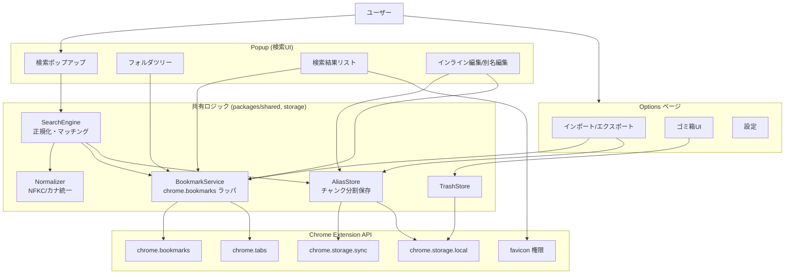
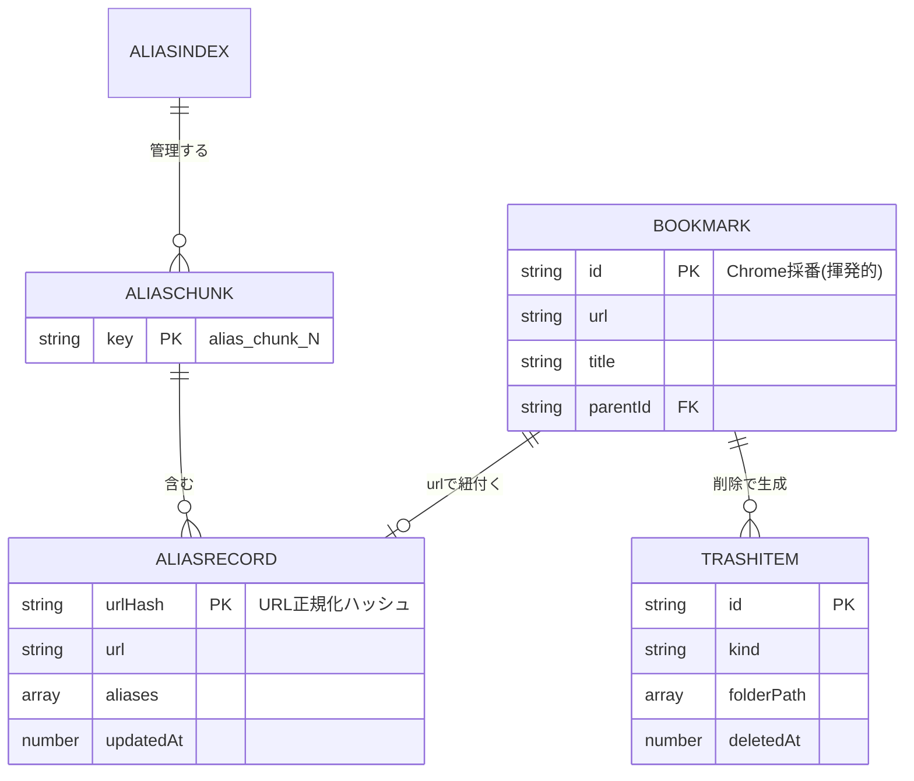
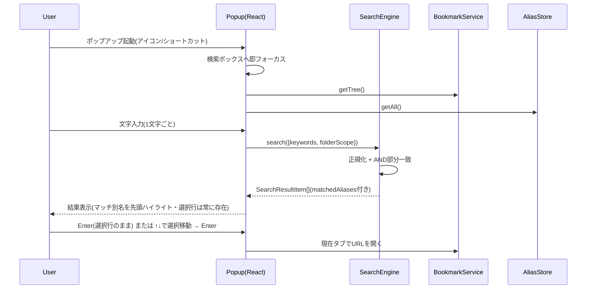
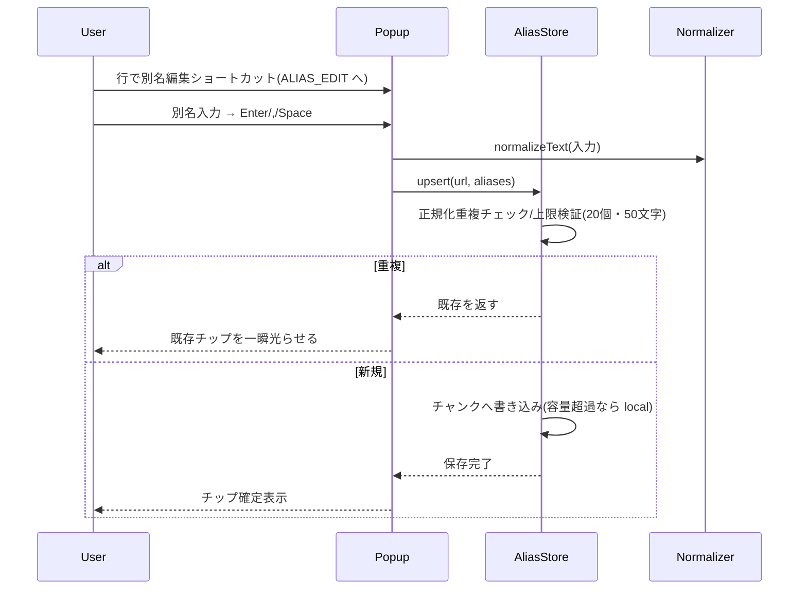
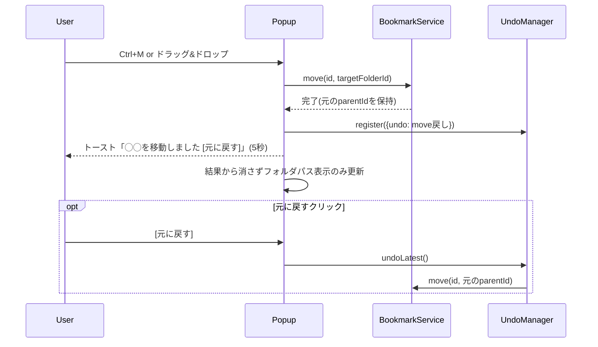
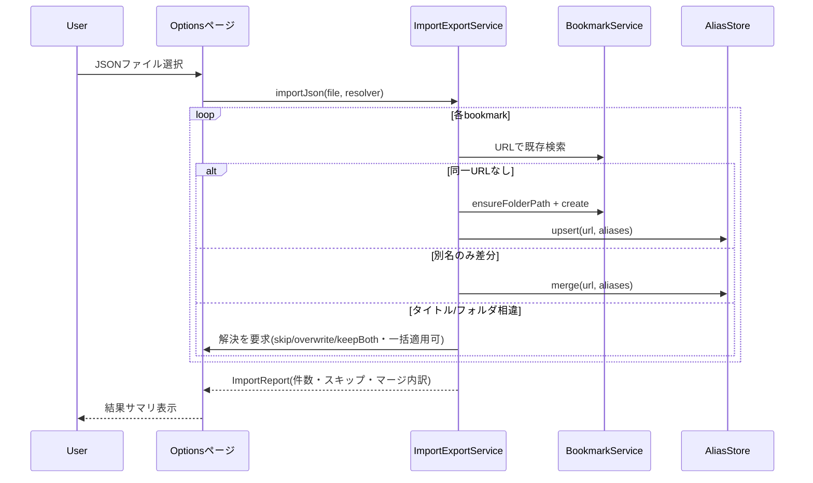
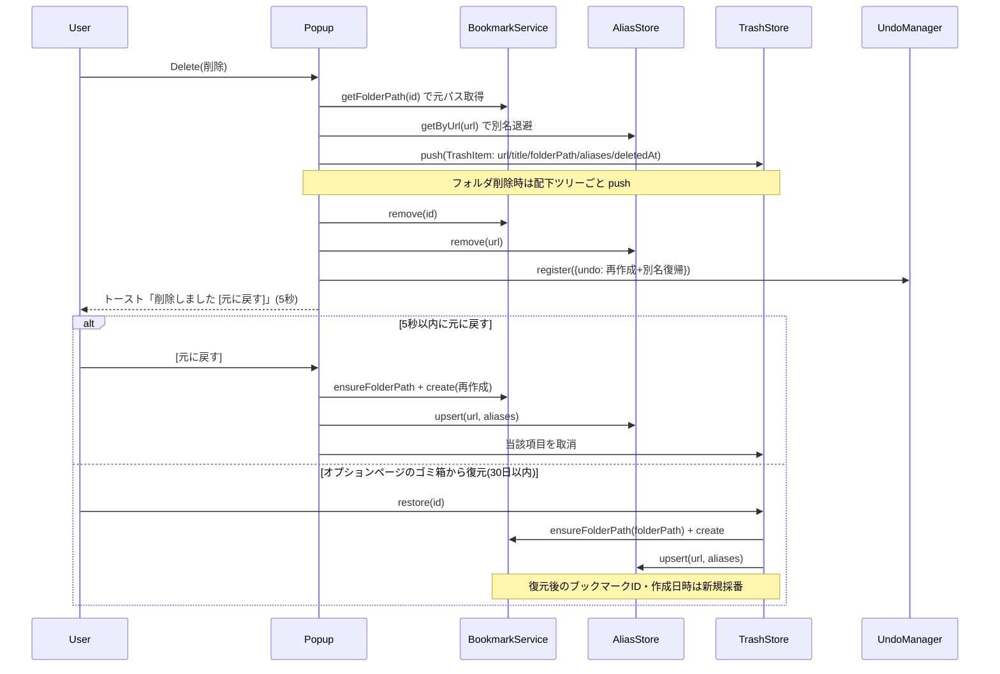
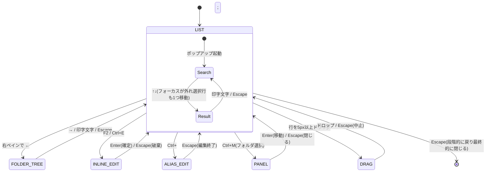

# 機能設計書 (Functional Design Document)

- **ドキュメント名**: functional-design
- **プロダクト名**: Findmark
- **作成日**: 2026-07-24
- **参照元**: [docs/product-requirements.md](./product-requirements.md)

本書は、PRDで定義した「何を作るか」を「どう実現するか」に落とし込む。対象はChrome拡張機能(Manifest V3)であり、外部通信ゼロ・host permission不要という制約を全設計の前提とする。

---

## システム構成図



**構成方針**:
- **バックグラウンド(Service Worker)は薄く保つ**。検索・編集はPopupのUIスレッドで完結し、Service Workerはブラウザ起動時の掃除処理(存在しないフォルダID/別名参照のクリーンアップ)やコマンドショートカット受信のみを担う。
- **共有ロジックは `packages/` に集約**し、PopupとOptionsの両方から利用する。UI(React)とドメインロジックを分離する。

---

## 技術スタック

| 分類 | 技術 | 選定理由 |
|------|------|----------|
| 拡張仕様 | Manifest V3 | Chrome Web Store の必須要件。Service Worker 型 |
| 言語 | TypeScript | 型安全。データモデル・正規化ロジックの正確性を担保 |
| UIフレームワーク | React 19 | ボイラープレート標準。宣言的UIとモード状態管理に適する |
| ビルド | Vite + Turborepo | ボイラープレート標準。HMRによる高速開発、モノレポのタスク並列化 |
| スタイル | Tailwind CSS | ボイラープレート標準。800×600pxの密なUIをユーティリティで構築 |
| パッケージ管理 | pnpm workspace | モノレポ。`packages/` の共有コードを各ページから参照 |
| ストレージ | chrome.storage (sync/local) | 別名の別PC同期(sync)、端末固有状態(local)。外部DB不使用 |
| 検索 | 自前の正規化 + 部分一致 | 辞書非同梱。フォールバックのあいまい一致のみ軽量ライブラリを検討 |
| i18n | @extension/i18n (`_locales`) | 日本語(既定)/英語対応 |

---

## データモデル定義

### エンティティ: Bookmark(Chrome管理・読み取り主体)

ブックマーク本体は `chrome.bookmarks` が保持する。Findmarkはこれを直接生成・更新・移動・削除し、独自コピーは持たない(single source of truth)。

```typescript
// chrome.bookmarks.BookmarkTreeNode に準拠(参考)
interface BookmarkNode {
  id: string;              // Chrome採番。端末/アカウントで変わりうる → 別名の紐付けキーには使わない
  parentId?: string;       // 親フォルダID
  title: string;           // タイトル(フォルダ名にもなる)
  url?: string;            // 未定義ならフォルダ
  dateAdded?: number;      // 追加日時(epoch ms)
  children?: BookmarkNode[];
}
```

### エンティティ: AliasRecord(独自データ・別名)

```typescript
interface AliasRecord {
  urlHash: string;         // URL正規化後のハッシュ(紐付けキー)。ID非依存で移行に強い
  url: string;             // 突合・復元・エクスポート用に原URLも保持
  aliases: string[];       // 別名の配列。1件最大20個、各50文字。正規化後に重複排除
  updatedAt: number;       // 更新日時(epoch ms)
}
```

**制約**:
- `aliases` は最大20要素、各要素は最大50文字。正規化(NFKC + 小文字化 + カナ統一)後に比較して重複を排除する。
- `urlHash` はURLを正規化(後述)してからハッシュ化した文字列。同一ページを指すURLは同一ハッシュに寄せる。

### ストレージ上の格納形式: AliasChunk

`chrome.storage.sync` の「1アイテム8KB / 最大512アイテム」制限を回避するため、AliasRecordをチャンクにまとめて1キーに保存する。

**チャンク分割はバイト数ベースで判定する**(件数はあくまで目安)。`chrome.storage.sync` の 8KB/アイテム上限は「キー名 + JSON化した値」のUTF-8バイト長で評価されるため、別名が多い/長いレコードでは100件でも8KBを超えうる。実装ではレコード追加時に `JSON.stringify(chunk)` のバイト長を計測し、**安全マージンを見た閾値(例: 7KB)を超えたら新しいチャンクへ切り出す**。「100件」は初期見積り用の目安値とする。

```typescript
// key: `alias_chunk_0`, `alias_chunk_1`, ...
type AliasChunk = Record<string /* urlHash */, AliasRecord>;

interface AliasIndex {         // key: `alias_index`
  chunkCount: number;          // 現在のチャンク数
  hashToChunk: Record<string, number>;  // urlHash → チャンク番号の逆引き
  storageMode: 'sync' | 'local';        // 容量超過で local にフォールバック
}
```

### エンティティ: TrashItem(ゴミ箱)

```typescript
interface TrashItem {
  id: string;              // ゴミ箱内の一意ID(再採番)
  kind: 'bookmark' | 'folder';
  url?: string;            // bookmark のとき
  title: string;
  folderPath: string[];    // 元の階層(復元先)
  aliases: string[];       // 削除時点の別名
  children?: TrashItem[];  // folder のとき配下ツリーを丸ごと保持
  deletedAt: number;       // 削除日時(epoch ms)
}
```

**制約**: `storage.local` に保存。保持30日(設定可)。件数上限(例500件・暫定、要確定)または容量上限を超えたら古い順に自動削除。

### エンティティ: UserSettings / LocalState

```typescript
interface UserSettings {         // storage.sync
  trashRetentionDays: number;    // 既定30
  locale?: 'ja' | 'en';
}

interface LocalState {           // storage.local(端末固有・sync不可)
  expandedFolderIds: string[];   // フォルダツリーの展開状態
  lastUsedFolderId?: string;     // 現在ページ登録時の初期フォルダ
}
```

### ER図



**設計上の要点**: BookmarkとAliasRecordは **URL(のハッシュ)** で結合する。Chrome採番のIDは端末/アカウント移行で変わるため紐付けキーにしない。これがPRDの「移行しても別名が外れない」を実現する中核である。

---

## コンポーネント設計

### Normalizer(正規化)

**責務**: 検索語・被検索文字列・別名・URLの正規化。

```typescript
class Normalizer {
  // 検索/別名比較用: NFKC → 小文字化 → カタカナ→ひらがな統一
  normalizeText(input: string): string;

  // URL紐付けキー用: 末尾スラッシュ正規化(クエリ・フラグメントは保持。SPAのハッシュルーティングを別ページとして区別)
  normalizeUrl(url: string): string;
  // normalizeUrl の結果を同期ハッシュ化(FNV-1a 32/64bit を採用し同期処理にする)
  hashUrl(url: string): string;
}
```

**依存**: なし(純粋関数)。

### SearchEngine(検索・マッチング)

**責務**: ブックマーク全件と別名を対象に、正規化AND部分一致で絞り込み、マッチ理由を付与して返す。

```typescript
interface SearchQuery {
  keywords: string[];        // スペース区切りのAND語
  // フォルダスコープ。未指定(undefined)は「すべて」= 全ブックマークが対象。
  // 指定時は当該フォルダの「直下のみ」を対象とする(サブフォルダは含めない)。
  folderScope?: {
    folderId: string;
  };
}

interface SearchResultItem {
  node: BookmarkNode;
  folderPath: string[];
  aliases: string[];
  matchedAliases: string[];  // ヒットした別名(先頭ハイライト表示用)
  matchedFields: ('title' | 'folder' | 'alias')[];
  score: number;             // 並び順(部分一致の位置/一致数から算出)
}

class SearchEngine {
  search(query: SearchQuery): SearchResultItem[];
  private fuzzyFallback(query: SearchQuery): SearchResultItem[]; // 結果0件時のあいまい一致
}
```

**依存**: Normalizer, BookmarkService, AliasStore。

**照合ルール**:
- 照合対象は「タイトル + フォルダ名 + 別名」。**フォルダスコープ(folderScope)は照合対象から除外**(絞り込み範囲として扱う)。
- 全キーワードが(いずれかのフィールドに)部分一致した項目のみ通す(AND)。
- ヒット0件時のみ `fuzzyFallback`(編集距離ベース等)を実行。

**スコープの適用ルール**:
- `folderScope` 未指定(=「すべて」)は全ブックマークが対象。クエリが空のとき(ブラウズ)は**タイトル昇順**で返す(デザインの「最近順」は非採用。下記「デザイン非採用項目」#2 を参照)。
- `folderScope` 指定時は**当該フォルダの直下のみ**が対象。サブフォルダ配下は含めない。クエリの有無で範囲は変わらない。
- 「サブフォルダを含む」オプションは持たない(「直下のみ」か「すべて」かの2択)。

### AliasStore(別名の永続化)

**責務**: AliasRecordのCRUD、チャンク分割/結合、sync↔localフォールバック。

```typescript
class AliasStore {
  getByUrl(url: string): Promise<AliasRecord | null>;
  getAll(): Promise<Map<string /* urlHash */, AliasRecord>>;
  upsert(url: string, aliases: string[]): Promise<void>;  // 正規化・重複排除・上限検証を内包
  merge(url: string, incoming: string[]): Promise<AliasRecord>; // インポート時の別名マージ
  remove(url: string): Promise<void>;
  private loadIndex(): Promise<AliasIndex>;
  private writeChunk(chunkNo: number, chunk: AliasChunk): Promise<void>;
  private failoverToLocal(): Promise<void>;  // sync容量超過時
}
```

**依存**: Normalizer, chrome.storage。

### BookmarkService(Chrome APIラッパ)

**責務**: `chrome.bookmarks` / `chrome.tabs` の薄いラッパ。フォルダパス解決、フォルダ自動作成、現在タブ取得を提供。

```typescript
class BookmarkService {
  getTree(): Promise<BookmarkNode[]>;
  getFolderPath(nodeId: string): Promise<string[]>;      // ルートまで辿る
  ensureFolderPath(path: string[]): Promise<string>;     // 無ければ自動作成し末端IDを返す
  create(data: { url?: string; title: string; parentId: string }): Promise<BookmarkNode>;
  rename(id: string, title: string): Promise<void>;
  updateUrl(id: string, url: string): Promise<void>;
  move(id: string, parentId: string): Promise<void>;
  remove(id: string): Promise<void>;
  getCurrentTab(): Promise<{ url: string; title: string }>;
  // ファビコンURLを組み立てて返す(chrome.runtime.id へのアクセスをデータ層に閉じ込める)
  faviconUrl(pageUrl: string, size?: number): string;
}
```

**依存**: chrome.bookmarks, chrome.tabs, chrome.runtime。

> **レイヤー遵守**: ファビコン取得は `chrome-extension://<runtime.id>/_favicon/?pageUrl=...` というURLを `` に渡す方式だが、URL組み立てに `chrome.runtime.id` が必要。UIコンポーネント(`Favicon.tsx`)から `chrome.*` を直接触らせないため、URL生成は `BookmarkService.faviconUrl()`(データ層)に集約する。UI側は文字列URLを受け取り `` に描画し、`onerror` で頭文字アバターにフォールバックするだけにする。

### TrashStore(ゴミ箱)

**責務**: 削除データの保存・一覧・復元・自動退避。

```typescript
class TrashStore {
  push(item: TrashItem): Promise<void>;      // フォルダは配下ツリーごと
  list(): Promise<TrashItem[]>;
  restore(id: string): Promise<void>;        // ensureFolderPath で復元先を再作成
  purgeExpired(retentionDays: number): Promise<void>;
  enforceLimits(maxItems: number): Promise<void>;
}
```

**依存**: BookmarkService, AliasStore, chrome.storage.local。

### UndoManager(即時アンドゥ)

**責務**: 削除・移動・一括操作を1単位のアンドゥ可能アクションとして保持(メモリ5秒)。

```typescript
interface UndoableAction {
  label: string;
  undo(): Promise<void>;
  expiresAt: number;   // now + 5000ms
}

class UndoManager {
  register(action: UndoableAction): void;  // トースト表示をトリガ
  undoLatest(): Promise<void>;
}
```

### ImportExportService(オプションページ)

```typescript
// インポート対象の1件(独自JSON/HTML共通の中間表現)
interface ImportBookmark {
  url: string;
  title: string;
  folderPath: string[];      // 階層。無ければ ensureFolderPath で自動作成
  aliases: string[];         // HTMLインポート時は空配列
  addedAt?: number;          // epoch ms(任意)
}

// インポート結果のサマリ
interface ImportReport {
  total: number;             // 入力件数
  created: number;           // 新規作成した件数
  aliasMerged: number;       // 別名をマージした件数
  skipped: number;           // スキップした件数
  overwritten: number;       // 上書きした件数
  keptBoth: number;          // 両方残した件数
  errors: { url: string; reason: string }[];  // 失敗した項目
}

class ImportExportService {
  exportJson(): Promise<Blob>;               // 独自JSON(別名含む)
  exportHtml(): Promise<Blob>;               // Netscape Bookmark File
  importHtml(file: File): Promise<ImportReport>;         // 新規作成のみ
  importJson(file: File, resolver: ConflictResolver): Promise<ImportReport>;
}

// 独自JSONの重複解決
type ConflictResolution = 'skip' | 'overwrite' | 'keepBoth';
interface ConflictResolver {
  // タイトル/フォルダ相違時の解決。applyToAll=true で以降の同種競合へ一括適用
  resolve(existing: BookmarkNode, incoming: ImportBookmark): {
    resolution: ConflictResolution;
    applyToAll: boolean;
  };
}
```

> **標準HTML(Netscape Bookmark File)の処理概要**: エクスポートは `<DL><DT><A HREF>` 構造でフォルダ階層を `<DL>` の入れ子として出力する(別名は独自属性にできないため含めない)。インポートは同構造をパースして `ImportBookmark[]` に変換し、`ensureFolderPath` + `create` で新規作成のみ行う(重複解決は独自JSONのみ対象)。

---

## 独自JSONフォーマット

```json
{
  "format": "my-bookmark-search",
  "version": 1,
  "exportedAt": "2026-07-23T10:00:00+09:00",
  "bookmarks": [
    {
      "url": "https://developer.chrome.com/docs/extensions/",
      "title": "Chrome Extensions Docs",
      "folderPath": ["ブックマーク バー", "開発", "chrome"],
      "aliases": ["拡張機能", "kakuchou", "extension docs"],
      "addedAt": "2025-11-02T09:30:00+09:00"
    }
  ]
}
```

| フィールド | 意図 |
|---|---|
| `url` | 突合キー。IDに依存しない移行を可能にする |
| `folderPath` | 階層を配列で保持。インポート時に無ければ `ensureFolderPath` で自動作成 |
| `aliases` | 読みがな・略称・英語名・自分だけの呼び名 |
| `version` | フォーマット変更後も旧ファイルを読めるようにする(マイグレーション分岐) |

---

## ユースケース図

### UC-1: インクリメンタル検索して開く



> **↑↓ を押さずに Enter でも開ける**: 選択行は常に存在する(既定は先頭行)ため、「打つ → Enter」で最短到達できる。`↑↓` を押した場合は検索ボックスからフォーカスが外れ、同時に選択行が1つ移動する。

### UC-2: 別名を付与する



### UC-3: フォルダ移動(アンドゥ付き)



### UC-4: 独自JSONインポート(重複解決)



### UC-5: 削除 → ゴミ箱 → 復元

削除は「即時アンドゥ(5秒)」と「ゴミ箱(30日)」の2層で保護する。別名は削除時にゴミ箱へ退避し、復元時に元URLへ復帰させる。



**整合ルール**:
- ゴミ箱へは別名も退避するため、`chrome.bookmarks.remove` と `AliasStore.remove` を必ず同時に行う(別名だけ残る/消えるを防ぐ)。
- 復元は URL をキーに別名を戻すため、ブックマークIDが変わっても別名が正しく再紐付けされる。
- フォルダ削除時は配下のブックマーク・別名を含めツリーごと1つの TrashItem に保存する。

---

## 画面遷移図(Popupのモード状態遷移)

キー操作の衝突を防ぐため、Popupは明示的なモードを持つ。既定状態は **フォーカス位置** によって `LIST`(検索ボックス / 右ペイン)と `FOLDER_TREE`(左ペイン)に分かれる。

### フォーカスの3状態

フォーカスは **検索ボックス / 右ペイン(ブックマーク一覧) / 左ペイン(フォルダツリー)** を行き来する。起動直後は検索ボックス。

**選択行は常に存在する。** 検索ボックスにフォーカスがある間も右ペインには選択行があり(既定は先頭)、ハイライトされる。`Enter` はフォーカス位置に関係なく選択行を開く。これにより「打つ → `Enter`」で最短到達できる。



### 既定モードのキー挙動(フォーカス位置別)

| キー | 検索ボックス(LIST) | 右ペイン(LIST) | 左ペイン(FOLDER_TREE) |
|---|---|---|---|
| 文字入力 | インクリメンタル検索 | 検索ボックスへ復帰 | 検索ボックスへ復帰 |
| `←` | キャレット移動 | 左ペインへ | 親フォルダへ(最上位では何もしない) |
| `→` | キャレット移動 | — | 右ペインへ |
| `↑↓` | フォーカスが外れ、同時に選択行が1つ移動 | 選択行の移動(端では何もしない) | 展開中のフォルダ間を移動(スコープが追従) |
| `Enter` | 選択行を現在タブで開く | 選択行を現在タブで開く | 展開 / 折りたたみのトグル |
| `Ctrl/Cmd+Enter` | 選択行を新規タブで開く | 選択行を新規タブで開く | — |
| `Home` | キャレットを先頭へ | — | 「すべて」へ戻る |
| `Escape` | 段階戻り(後述) | 検索ボックスへ戻る | 検索ボックスへ戻る |

> **`←→` を検索ボックスで奪わない理由**: 検索ボックスでペイン移動に使うと、`docs` と打って `doc` に直すといったクエリ途中の修正ができなくなる。`↑↓` を「検索欄を抜けるキー」に定めたことで、この衝突は原理的に解消されている。

### 編集モードのキー挙動

| モード | ↑↓ | Enter | Escape |
|---|---|---|---|
| INLINE_EDIT | キャレット移動 | 確定→LIST | 破棄→LIST |
| ALIAS_EDIT | 候補移動 | チップ確定 | 編集終了 |
| DRAG | — | — | ドラッグ中止 |
| PANEL | 候補移動 | 決定 | パネルを閉じる |

### Escape の段階戻り(4段階)

`Escape` は1段階だけ戻る。フォーカス状態が増えたぶん、従来の3段階を4段階に拡張する。

```
1. 左/右ペインにフォーカス   → 検索ボックスへ戻る
2. キーワードあり            → キーワードをクリア
3. スコープが「すべて」以外   → 「すべて」へ戻す
4. いずれでもない            → ポップアップを閉じる
```

深いフォルダにスコープが残ったまま検索してヒット0になった場合、`Escape` を2〜3回押せば全体検索へ復帰できる。左ペインの `Home` も同じ復帰手段を担う。

**共通ルール**: 編集モード(INLINE_EDIT / ALIAS_EDIT / PANEL)中を除き、文字を打てば検索ボックスにフォーカスが戻る。左ペイン(FOLDER_TREE)もこの復帰の対象とする。編集中もリスト選択のハイライトを薄く保持する。

---

## アルゴリズム設計

### 検索スコアリングとマッチング

**目的**: 正規化した検索語で「タイトル + フォルダ名 + 別名」を照合し、関連度順に並べる。

#### ステップ1: 正規化
検索語・被検索文字列の両方に適用する。
```typescript
function normalizeText(s: string): string {
  return s
    .normalize('NFKC')          // 全角半角統一
    .toLowerCase()              // 大小文字を区別しない
    .replace(/[ァ-ヶ]/g, ch =>  // カタカナ→ひらがな
      String.fromCharCode(ch.charCodeAt(0) - 0x60));
}
```

#### ステップ2: AND部分一致
```
- keywords を空白で分割
- 各キーワードが「タイトル|フォルダ名|別名」のいずれかに部分一致するか判定
- 全キーワードが一致した項目のみ通過(AND)
- folderScope は照合対象から除外し、範囲フィルタとしてのみ適用
  - 未指定 = 「すべて」(全件が範囲)
  - 指定時 = 当該フォルダの直下のみ(サブフォルダは範囲外)
```

#### ステップ3: スコア算出(並び順)

各キーワードについて、一致した最上位フィールドの点数を合算する。同一キーワードが複数フィールドに一致する場合は最大点のみ採用する。

```
フィールド基礎点: タイトル=10, 別名=8, フォルダ名=4
一致位置ボーナス: 前方一致=+3, 完全一致=+5(部分一致は+0)

キーワード単位スコア = max(一致フィールドの基礎点) + 位置ボーナス
総合スコア = Σ(全キーワードのキーワード単位スコア)
```

- マッチした別名は `matchedAliases` に記録し、表示で先頭にハイライトする(省略対象から除外)。
- 同点はタイトルの昇順で安定ソートする。

#### ステップ4: フォールバック(結果0件時のみ)
```
- 各キーワードと候補文字列の編集距離(Levenshtein)を計算
- しきい値: キーワード長 <= 4 は距離1まで、5文字以上は距離2までを許容ヒットとする
- 辞書は使わない(ローマ字/読みは別名登録で対応する方針)
```

### URL正規化とハッシュ(別名紐付けキー)

**目的**: 端末/アカウントをまたいでも別名が外れないよう、IDではなくURLでキーを作る。

```typescript
function normalizeUrl(raw: string): string {
  const u = new URL(raw);
  if (u.pathname.endsWith('/') && u.pathname !== '/')
    u.pathname = u.pathname.slice(0, -1);  // 末尾スラッシュ正規化
  // クエリ(u.search)は保持する。異なるクエリは別ページとみなす(過剰な統合で別名が誤結合するのを防ぐ)
  // フラグメント(u.hash)も保持する。ハッシュルーティングの SPA(例: .../new#settings/usage)では
  // フラグメントがページを識別するため、除去すると別ページが同一 urlHash に衝突し別名を共有してしまう。
  // Chrome もフラグメント違いを別ブックマークとして扱うため、別名の同一性も URL 全体に揃える。
  return u.protocol + '//' + u.host + u.pathname + u.search + u.hash;
}

// 同期ハッシュ(FNV-1a)。crypto.subtle.digest は非同期のため採用しない
function hashUrl(url: string): string {
  const s = normalizeUrl(url);
  let h = 0x811c9dc5;                 // FNV offset basis (32bit)
  for (let i = 0; i < s.length; i++) {
    h ^= s.charCodeAt(i);
    h = Math.imul(h, 0x01000193);     // FNV prime
  }
  return (h >>> 0).toString(16);      // 符号なし16進
}
```

> **クエリ正規化の方針(将来拡張)**: MVPではクエリを保持する単純方式とする。トラッキングパラメータ(`utm_*` 等)の除去は誤結合・誤分離のトレードオフがあるため、必要になった時点で除去リストを別途定義する(現状スコープ外)。

---

## UI設計

> **レイアウトの正 = `docs/design/`**: ポップアップの視覚仕様（レイアウト・寸法・デザイントークン・タイポグラフィ・状態）は [docs/design/README.md](./design/README.md) と `docs/design/Findmark Popup.dc.html` を**正（source of truth）**とし、実装はこれを忠実に再現する。本節はその要約であり、確定値は `docs/design/` を参照する。

### デザインリファレンス（レイアウトの正）

- **成果物**: `docs/design/README.md`（ハンドオフ仕様）＋ `docs/design/Findmark Popup.dc.html`（9状態を並べた hifi プロトタイプ）。
- **忠実度**: High-fidelity。色・タイポグラフィ・余白・行高・角丸はすべて確定値。ピクセル単位で再現してよい。
- **優先関係（precedence）**:
  - `docs/design/` は **視覚仕様の正**（レイアウト・寸法・トークン・タイポグラフィ・9状態・コンポーネント分割）。
  - 本書および `architecture.md` / `product-requirements.md` は **データモデル・保存・検索ロジック・プライバシーの正**。
  - `docs/design/README.md` の「State Management / データ取得 / スコア」節は設計ツール由来の**汎用実装サジェスト**であり、既存アーキテクチャ・実装（U4/U5/U6）を**上書きしない**（下記「デザイン非採用項目」参照）。
- **デザイントークン/フォント**: accent `#4F6BED` ほかのトークン、フォント `Noto Sans JP`（400/500/700）/ `IBM Plex Mono`（400/500）は `docs/design/README.md`「Design Tokens」を正とする。フォントは **woff2 を同梱し `@font-face` で適用**する（CDN参照禁止＝CSP・外部通信ゼロ方針。詳細は architecture.md）。

#### デザイン非採用項目（既存を正とする例外）

`docs/design/README.md` の記述のうち、以下は**採用しない**（既存の永続ドキュメント・実装が正）:

| # | README の記述 | 採用する既存仕様 | 理由 |
|---|--------------|----------------|------|
| 1 | 別名を `bookmarkId` キーで `storage.local` に保存 | **URL正規化ハッシュ**をキーに `storage.sync` へチャンク分割（AliasStore・U5） | ID非依存で端末/アカウント移行しても別名が外れない（PRD中核価値） |
| 2 | スコア100/80/60…・別名を最上位・URL部分一致・既定で最近順 | U6 SearchEngine（タイトル10>別名8>フォルダ4＋位置ボーナス・URL非照合・同点タイトル昇順） | 実装済みロジックを正とする。デザインの「別名優先・最近順」意図は将来のロジック改修作業単位で検討 |
| 3 | 別名は最大 8 件 | **最大20個・各50文字**（U5） | 8はモック便宜値 |
| 4 | フォルダクリックで「そのフォルダ **+ サブフォルダ配下**」を対象に絞り込む | **直下のみ**（サブフォルダ含むオプションは持たない）。「すべて」のみ例外で全件 | 機能5の見直しによる。「直下のみ」か「すべて」かの2択に単純化した |
| 5 | 三角クリックの代替キーとして `→` 展開 / `←` 折りたたみ | `←→` は**ペイン移動専用**。展開/折りたたみは `Enter` のトグル | `←→` の意味を全画面で一定に保つため。左ペインの `←` は親フォルダへの移動に割り当てる |
| 6 | ファビコンに外部 `https://<host>/favicon.ico` を使用 | `chrome-extension://<id>/_favicon/...`（`favicon`権限）**のみ** | 外部通信ゼロ方針。取得失敗時の頭文字アバターfallbackはデザイン通り |
| 7 | 素キー `E`（インライン編集）/ `A`（別名編集） | **修飾キー方式**（`F2`・`Ctrl/Cmd+E` / `Ctrl/Cmd+;`） | 素キーは「文字を打つと検索ボックスへ復帰する」共通ルールと衝突する。`modeMachine.ts` で実装済みの判断 |
| 8 | サンプルコピーをそのまま初期データに使用 | 実 `chrome.bookmarks` を表示 | サンプルは見た目確認用 |
| 9 | `UiState.folderFilter`（フォルダチップの値・`null` = 全体） | **スコープ**（常にどれか1つ存在・「すべて」を含む）＋ **フォーカス位置**の2軸 | 「常にどれか1つにスコープが当たる」方式に変更したため、`null` を全体とする表現を採らない |

### 全体レイアウト（760×560 固定）

```
┌────────────────────────────────────────────────────┐
│ 🔍 〔📁 開発/chrome ×〕 docs▌            [+ 追加] │ ← 固定ヘッダー
├──────────────┬─────────────────────────────────────┤
│ 📁 すべて     │ ▸ Chrome Extensions Docs           │
│  ▾ 開発      │   開発 / chrome    〔拡張機能〕〔公式〕│
│   ├ aws      │ ────────────────────────────────── │
│   └ chrome ◀ │ ▸ Manifest V3 移行ガイド            │
│  ├ 記事      │   開発 / chrome    〔mv3〕         │
│  └ 未整理    │                                     │
└──────────────┴─────────────────────────────────────┘
  左ペイン220px固定       右ペイン=検索結果(フラット)
```

> 上図は概略。確定値（寸法・トークン・状態）は `docs/design/` を正とする。

- **固定寸法**: ポップアップ 760×560 / ヘッダー 56 / 左ペイン 220 / 右ペイン `flex:1` / 結果行 56 / メタ行 34 / ツリー行 30（最上位32）/ 入力 34（副32）/ ボタン 34（一括30・編集28）/ ファビコン・チェックボックス 16。角丸 12px・`overflow:hidden`。ペイン間区切り線 `1px solid #E7E9EE`。
- 左ペイン(220px固定): 常時表示のフォルダツリー。「スコープ指定」と「ドロップ先」の2役。**常にどれか1つのフォルダにスコープが当たっており**(起動直後は「すべて」)、キーボードでフォーカスを移動すると同時にスコープが追従して右ペインが切り替わる。視認性のためフォルダ📁・名前はやや大きめ（名前14px / 📁16px / 行高34px）。各フォルダ行の右端には**フォルダ選択ボタン（📎クリップ）**（押下でそのフォルダをスコープにし、**直下のブックマークのみ**を右ペインに表示。横スクロール時も右端に固定表示）を置く。※デザインmockはこの位置に件数を表示するが、**件数に代えて📎選択ボタンを置く**（ユーザー指示による意図的逸脱。U7 で実装、キーボード操作・スコープ追従・展開永続・多階層省略は U11、範囲を直下のみへ是正するのは U6a）。マウス操作の📎ボタンとキーボード操作は同じスコープ状態を更新する（二重管理にしない）。
- **押下可能フォルダの区別**: 配下フォルダを持つ親フォルダは「開閉三角（▸/▾）＋開閉するフォルダ画像（展開中📂/折りたたみ📁）＋ホバー背景＋指カーソル」で開閉できることを直感的に示し、子のないフォルダは淡色・三角なし・ホバーなしで区別する（選択は 📎 のみ）。展開/折りたたみは「三角＋📁＋フォルダ名」全体の押下範囲。
- 深い階層でフォルダ名が見切れる場合は**横スクロール（スライド）で全表示**（名前は省略しない）＋全文ツールチップ。子リスト省略「さらにN件」・パス圧縮・「階層をたたむ」バー等の本格対応は **U11（状態2b）**。
- 右ペイン: 現在のスコープの中身をフラットリストで表示する。
  - **スコープが「すべて」のとき**: 全ブックマークをフォルダ横断で表示(クエリ空ならタイトル昇順)。各行のフォルダパスが所属の手がかりとして機能する。
  - **スコープが「すべて」以外のとき**: 当該フォルダの**直下のブックマークのみ**。全行が同じパスになるため、パス表示は主に「すべて」と検索時に意味を持つ。
  - いずれの場合もフォルダ階層をペイン内で辿らせることはしない(階層の移動は左ペインが担う)。

### 状態バリエーション（1a〜1g / 2a / 2b）

`docs/design/Findmark Popup.dc.html` は同一レイアウトの9状態を並べる。各状態を実装する作業単位は下表のとおり（[mvp-development-flow.md](./mvp-development-flow.md)「デザイン準拠（レイアウトの正）」と対応）。

| 状態 | 内容 | 実装作業単位 |
|---|---|---|
| 1a | 通常（検索前・3領域シェル・スコープ「すべて」で全ブックマークをタイトル昇順表示） | U7 |
| 1b | フォルダスコープ適用中（検索ボックス先頭のチップは**スコープの可視化**であり操作主体ではない） | U11 |
| 1c | 検索中（別名でヒット・マッチチップを accent 強調） | U7(表示) / U9(編集) |
| 1d | インライン編集中（リネーム/URL/別名展開） | U10 |
| 1e | 別名編集中（チップ入力） | U9 |
| 1f | 複数選択中（ヘッダーが一括操作バーへ切替） | U13 |
| 1g | ドラッグ&ドロップ中 | U12 |
| 2a | 多階層フォルダツリー（3〜4階層） | U11 |
| 2b | 深い階層の扱い（5階層・省略） | U11 |

### 検索結果の行表示

**表示項目**:
| 項目 | 説明 | フォーマット |
|------|------|-------------|
| ファビコン/アバター | サイト識別 | 16px、取得失敗時は頭文字アバター |
| タイトル | ブックマーク名 | 1行、溢れは末尾`…`、ホバーで全文tooltip |
| フォルダパス | 所属階層 | `開発 / chrome` |
| 別名チップ | 登録済み別名 | 最大3個 + `+N`。マッチ別名は先頭ハイライトで省略対象外 |
| 操作ボタン | 編集/移動/削除 | ホバー時または選択時のみ表示 |

- 行の高さ: 56px(約10行表示)。2段組（1段目=ファビコン+タイトル / 2段目=フォルダパス+別名チップ、`padding-left:26px`）の確定仕様は `docs/design/README.md`「右ペイン：結果行の共通仕様」を正とする。

**チェックボックスの段階表示**:
| 状況 | 表示 |
|---|---|
| 通常 | ファビコンのみ |
| ホバー | ファビコン位置がチェックボックスに変化(Gmail/Finder挙動) |
| 1件以上選択中 | 全行で常時表示 + ヘッダーが一括操作バーに切替 |

### カラーコーディング(頭文字アバター)

- 背景色はドメイン(ホスト名)のハッシュから固定パレットを選択。**同一ドメインは常に同色**にし、色自体を識別の手がかりにする。パレットは `docs/design/README.md` の9色（`#2E7CF6` `#E8862B` `#2F74C0` `#1F2430` `#C0447B` `#6D5AE0` `#2B8FB8` `#4B8B3B` `#7A5AC8`）を正とする。
- 頭文字アバターは 16×16・radius 4・白文字 700 9px 中央寄せ（`docs/design/` 準拠）。ファビコンとアバターでサイズ・角丸を揃え、切り替わってもレイアウトが動かない。

### インタラクティブ操作フロー(現在ページ登録)

1. ヘッダー右「+ 追加」→ 即座に登録し編集パネルを開く(登録済みなら「★ 登録済み」で編集パネル)
2. パネルで タイトル / 保存先フォルダ(絞り込みドロップダウン、初期値=前回フォルダ) / 別名 を編集
3. 各フィールドは変更のたび即時保存。[削除]で登録取り消し、[完了]で閉じる

---

## ファイル構造(ストレージ上のキー設計)

```
chrome.storage.sync
├── alias_index                 # AliasIndex(チャンク数・逆引き・storageMode)
├── alias_chunk_0               # AliasChunk(バイト長で分割、目安~100件)
├── alias_chunk_1               # AliasChunk
├── ...
└── user_settings               # UserSettings(ゴミ箱保持日数など)

chrome.storage.local
├── trash                       # TrashItem[]
├── expanded_folder_ids         # フォルダツリー展開状態
├── last_used_folder_id         # 現在ページ登録の初期フォルダ
└── alias_chunk_* (fallback)    # sync容量超過時の退避先
```

---

## パフォーマンス最適化

- **起動時の先読み**: ポップアップ表示と並行して `getTree()` / `getAll()` を非同期取得し、フォーカスは即座に当てる(200ms以内)。
- **検索結果の仮想スクロール**: 表示行のみ描画し、件数増加に対して描画コストを一定に保つ(1,000件で1文字あたり100ms以内)。
- **正規化のメモ化**: ブックマーク・別名の正規化済み文字列をセッション内でキャッシュし、入力ごとの再計算を避ける。
- **チャンクの遅延読み込み**: 別名はインデックス経由で必要チャンクのみ読み込む。

---

## セキュリティ考慮事項

- **外部通信ゼロ**: fetch/XHR を一切行わない。host permission を要求しない。CSPはデフォルト(外部リソース読み込み不可)を維持。
- **最小権限**: `bookmarks` / `storage` / `activeTab` / `favicon` の4権限のみ。`favicon` は申請前に警告表示有無を現行ドキュメントで確認する。
- **URL検証**: URL編集・インポート時に `new URL()` でパースし、`javascript:` 等の危険スキームを弾く。
- **インポートの安全性**: JSON/HTMLパース時に想定外構造を検証し、`version` に応じてマイグレーションする。

---

## エラーハンドリング

| エラー種別 | 処理 | ユーザーへの表示 |
|-----------|------|-----------------|
| URL不正(編集/登録) | 確定不可・赤枠 | 行下にインライン「有効なURLを入力してください」 |
| タイトル空欄 | URLで代用して確定 | (表示なし。空ならURLを表示) |
| 別名の重複 | 追加を弾く | 既存チップを一瞬光らせる |
| 別名の上限超過 | 追加を弾く | 「別名は1件あたり20個までです」 |
| sync容量超過 | local へ自動フォールバック | 「同期容量の上限のため端末内保存に切替えました」 |
| ブックマークAPI失敗 | 操作をロールバック | トースト「操作に失敗しました。元に戻しました」 |
| インポートのパース失敗 | 中断・部分適用しない | 「ファイル形式が不正です(format/version を確認)」 |
| 復元先フォルダ消失 | ensureFolderPath で自動再作成 | (透過的に復元。IDは変わる旨を注記) |

---

## テスト戦略

### ユニットテスト
- Normalizer: NFKC/カナ統一/大小文字、URL正規化の同値クラス
- SearchEngine: AND部分一致、matchedAliases付与、フォルダscope除外、フォールバック発火条件
- AliasStore: チャンク分割/結合、100件境界、20個・50文字の上限、sync→localフォールバック
- ImportExportService: 独自JSONの3系統の重複解決、version マイグレーション

### 統合テスト
- 別名付与 → 検索ヒット → matchedAlias先頭ハイライトまでの一連
- 移動/削除 → 即時アンドゥ → 状態復元
- 大量ブックマーク(数千件)での検索レイテンシ

### E2Eテスト(拡張機能ロード)
- ポップアップ起動 → 検索 → Enterで開く
- ドラッグ&ドロップでのフォルダ移動(スプリングロード/オートスクロール)
- Optionsページでの独自JSONエクスポート → 別プロファイルでインポート → 別名維持の確認
- ゴミ箱からの復元(フォルダごと)
