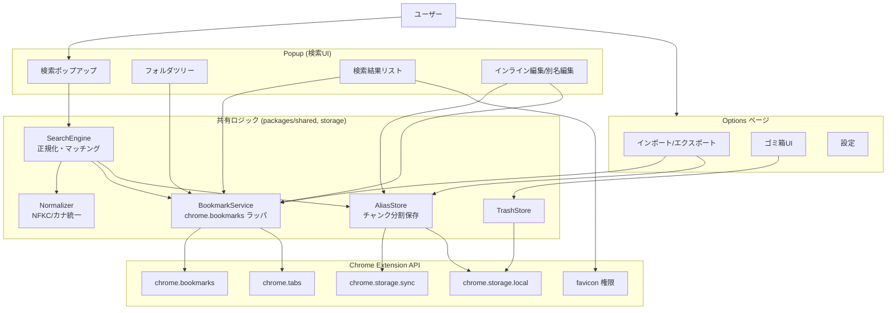
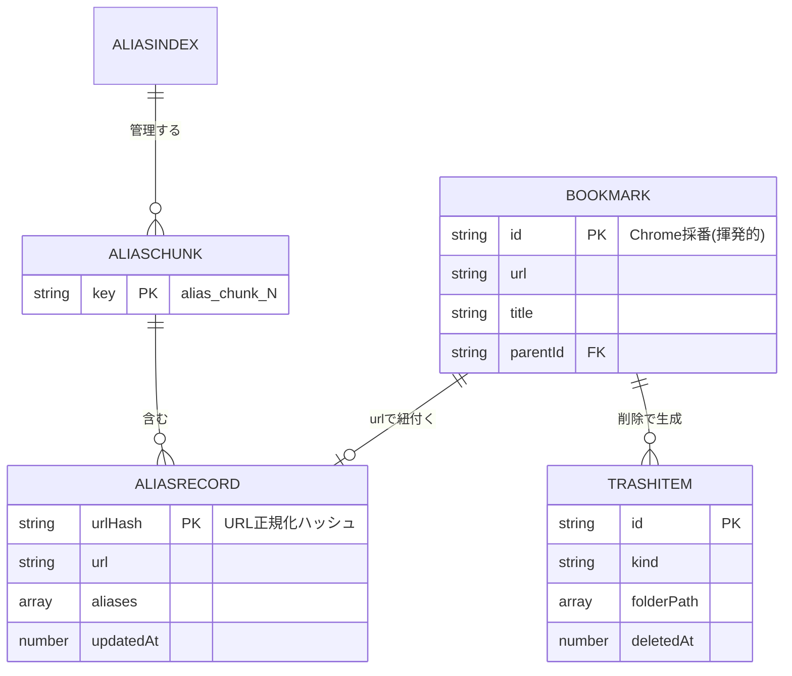
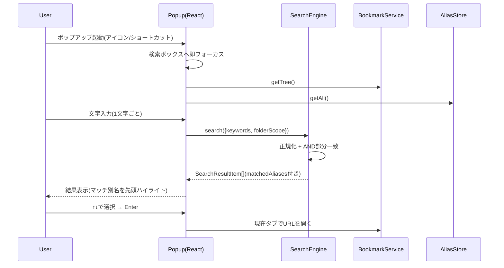
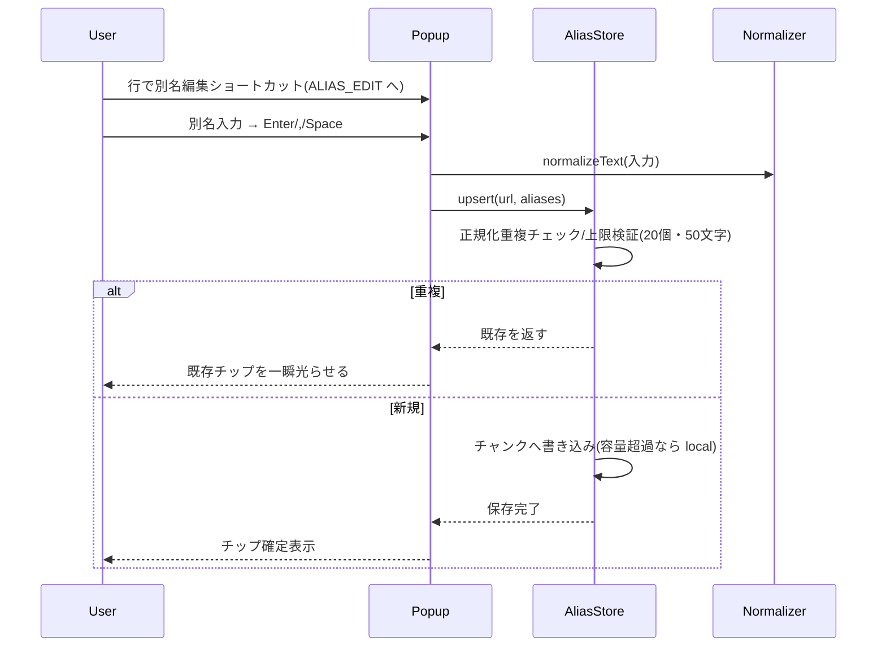
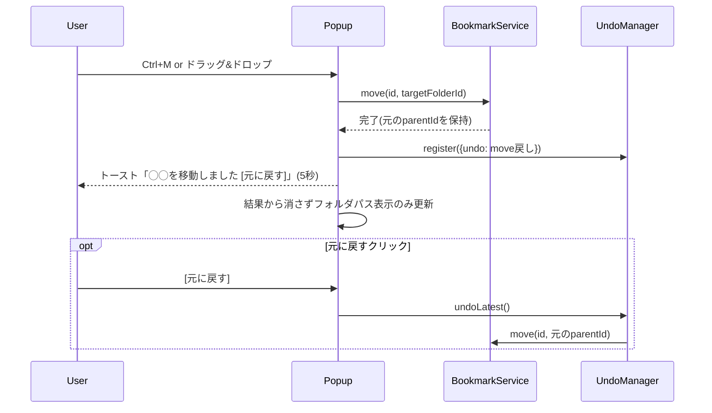
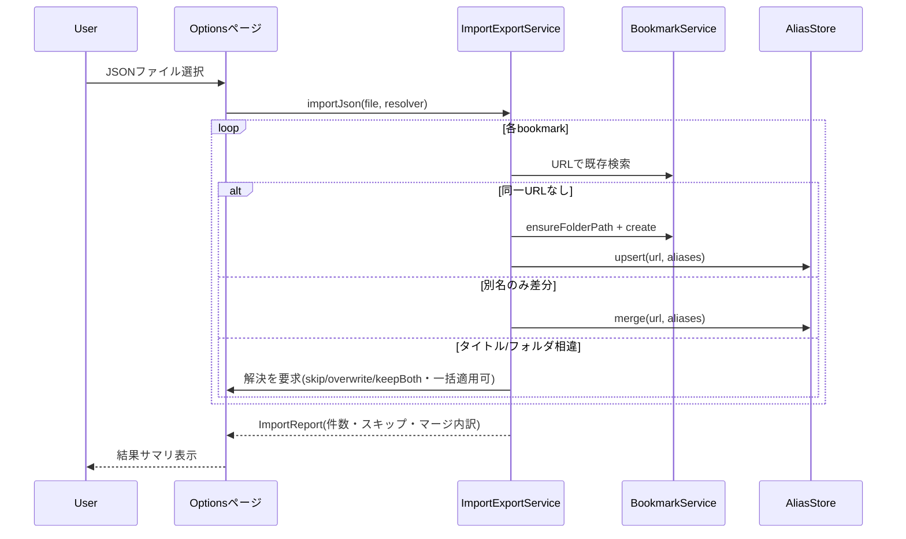
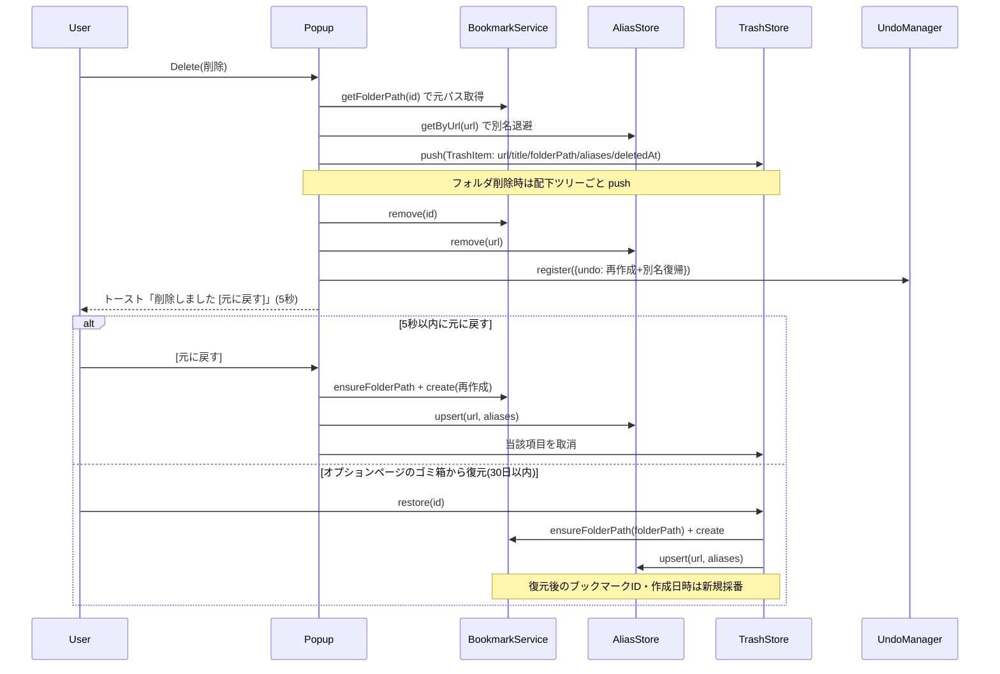
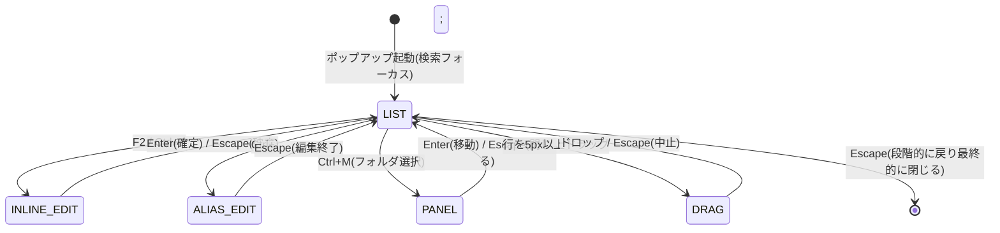

# 機能設計書 (Functional Design Document)

- **ドキュメント名**: functional-design
- **プロダクト名**: Findmark
- **作成日**: 2026-07-24
- **参照元**: [docs/product-requirements.md](./product-requirements.md)

本書は、PRDで定義した「何を作るか」を「どう実現するか」に落とし込む。対象はChrome拡張機能(Manifest V3)であり、外部通信ゼロ・host permission不要という制約を全設計の前提とする。

---

## システム構成図



**構成方針**:
- **バックグラウンド(Service Worker)は薄く保つ**。検索・編集はPopupのUIスレッドで完結し、Service Workerはブラウザ起動時の掃除処理(存在しないフォルダID/別名参照のクリーンアップ)やコマンドショートカット受信のみを担う。
- **共有ロジックは `packages/` に集約**し、PopupとOptionsの両方から利用する。UI(React)とドメインロジックを分離する。

---

## 技術スタック

| 分類 | 技術 | 選定理由 |
|------|------|----------|
| 拡張仕様 | Manifest V3 | Chrome Web Store の必須要件。Service Worker 型 |
| 言語 | TypeScript | 型安全。データモデル・正規化ロジックの正確性を担保 |
| UIフレームワーク | React 19 | ボイラープレート標準。宣言的UIとモード状態管理に適する |
| ビルド | Vite + Turborepo | ボイラープレート標準。HMRによる高速開発、モノレポのタスク並列化 |
| スタイル | Tailwind CSS | ボイラープレート標準。800×600pxの密なUIをユーティリティで構築 |
| パッケージ管理 | pnpm workspace | モノレポ。`packages/` の共有コードを各ページから参照 |
| ストレージ | chrome.storage (sync/local) | 別名の別PC同期(sync)、端末固有状態(local)。外部DB不使用 |
| 検索 | 自前の正規化 + 部分一致 | 辞書非同梱。フォールバックのあいまい一致のみ軽量ライブラリを検討 |
| i18n | @extension/i18n (`_locales`) | 日本語(既定)/英語対応 |

---

## データモデル定義

### エンティティ: Bookmark(Chrome管理・読み取り主体)

ブックマーク本体は `chrome.bookmarks` が保持する。Findmarkはこれを直接生成・更新・移動・削除し、独自コピーは持たない(single source of truth)。

```typescript
// chrome.bookmarks.BookmarkTreeNode に準拠(参考)
interface BookmarkNode {
  id: string;              // Chrome採番。端末/アカウントで変わりうる → 別名の紐付けキーには使わない
  parentId?: string;       // 親フォルダID
  title: string;           // タイトル(フォルダ名にもなる)
  url?: string;            // 未定義ならフォルダ
  dateAdded?: number;      // 追加日時(epoch ms)
  children?: BookmarkNode[];
}
```

### エンティティ: AliasRecord(独自データ・別名)

```typescript
interface AliasRecord {
  urlHash: string;         // URL正規化後のハッシュ(紐付けキー)。ID非依存で移行に強い
  url: string;             // 突合・復元・エクスポート用に原URLも保持
  aliases: string[];       // 別名の配列。1件最大20個、各50文字。正規化後に重複排除
  updatedAt: number;       // 更新日時(epoch ms)
}
```

**制約**:
- `aliases` は最大20要素、各要素は最大50文字。正規化(NFKC + 小文字化 + カナ統一)後に比較して重複を排除する。
- `urlHash` はURLを正規化(後述)してからハッシュ化した文字列。同一ページを指すURLは同一ハッシュに寄せる。

### ストレージ上の格納形式: AliasChunk

`chrome.storage.sync` の「1アイテム8KB / 最大512アイテム」制限を回避するため、AliasRecordをチャンクにまとめて1キーに保存する。

**チャンク分割はバイト数ベースで判定する**(件数はあくまで目安)。`chrome.storage.sync` の 8KB/アイテム上限は「キー名 + JSON化した値」のUTF-8バイト長で評価されるため、別名が多い/長いレコードでは100件でも8KBを超えうる。実装ではレコード追加時に `JSON.stringify(chunk)` のバイト長を計測し、**安全マージンを見た閾値(例: 7KB)を超えたら新しいチャンクへ切り出す**。「100件」は初期見積り用の目安値とする。

```typescript
// key: `alias_chunk_0`, `alias_chunk_1`, ...
type AliasChunk = Record<string /* urlHash */, AliasRecord>;

interface AliasIndex {         // key: `alias_index`
  chunkCount: number;          // 現在のチャンク数
  hashToChunk: Record<string, number>;  // urlHash → チャンク番号の逆引き
  storageMode: 'sync' | 'local';        // 容量超過で local にフォールバック
}
```

### エンティティ: TrashItem(ゴミ箱)

```typescript
interface TrashItem {
  id: string;              // ゴミ箱内の一意ID(再採番)
  kind: 'bookmark' | 'folder';
  url?: string;            // bookmark のとき
  title: string;
  folderPath: string[];    // 元の階層(復元先)
  aliases: string[];       // 削除時点の別名
  children?: TrashItem[];  // folder のとき配下ツリーを丸ごと保持
  deletedAt: number;       // 削除日時(epoch ms)
}
```

**制約**: `storage.local` に保存。保持30日(設定可)。件数上限(例500件・暫定、要確定)または容量上限を超えたら古い順に自動削除。

### エンティティ: UserSettings / LocalState

```typescript
interface UserSettings {         // storage.sync
  trashRetentionDays: number;    // 既定30
  locale?: 'ja' | 'en';
}

interface LocalState {           // storage.local(端末固有・sync不可)
  expandedFolderIds: string[];   // フォルダツリーの展開状態
  lastUsedFolderId?: string;     // 現在ページ登録時の初期フォルダ
}
```

### ER図



**設計上の要点**: BookmarkとAliasRecordは **URL(のハッシュ)** で結合する。Chrome採番のIDは端末/アカウント移行で変わるため紐付けキーにしない。これがPRDの「移行しても別名が外れない」を実現する中核である。

---

## コンポーネント設計

### Normalizer(正規化)

**責務**: 検索語・被検索文字列・別名・URLの正規化。

```typescript
class Normalizer {
  // 検索/別名比較用: NFKC → 小文字化 → カタカナ→ひらがな統一
  normalizeText(input: string): string;

  // URL紐付けキー用: フラグメント除去・末尾スラッシュ正規化(クエリは保持)
  normalizeUrl(url: string): string;
  // normalizeUrl の結果を同期ハッシュ化(FNV-1a 32/64bit を採用し同期処理にする)
  hashUrl(url: string): string;
}
```

**依存**: なし(純粋関数)。

### SearchEngine(検索・マッチング)

**責務**: ブックマーク全件と別名を対象に、正規化AND部分一致で絞り込み、マッチ理由を付与して返す。

```typescript
interface SearchQuery {
  keywords: string[];        // スペース区切りのAND語
  folderScope?: {            // フォルダチップによる絞り込み
    folderId: string;
    includeSubfolders: boolean;
  };
}

interface SearchResultItem {
  node: BookmarkNode;
  folderPath: string[];
  aliases: string[];
  matchedAliases: string[];  // ヒットした別名(先頭ハイライト表示用)
  matchedFields: ('title' | 'folder' | 'alias')[];
  score: number;             // 並び順(部分一致の位置/一致数から算出)
}

class SearchEngine {
  search(query: SearchQuery): SearchResultItem[];
  private fuzzyFallback(query: SearchQuery): SearchResultItem[]; // 結果0件時のあいまい一致
}
```

**依存**: Normalizer, BookmarkService, AliasStore。

**照合ルール**:
- 照合対象は「タイトル + フォルダ名 + 別名」。**フォルダチップ(folderScope)は照合対象から除外**(絞り込み範囲として扱う)。
- 全キーワードが(いずれかのフィールドに)部分一致した項目のみ通す(AND)。
- ヒット0件時のみ `fuzzyFallback`(編集距離ベース等)を実行。

### AliasStore(別名の永続化)

**責務**: AliasRecordのCRUD、チャンク分割/結合、sync↔localフォールバック。

```typescript
class AliasStore {
  getByUrl(url: string): Promise<AliasRecord | null>;
  getAll(): Promise<Map<string /* urlHash */, AliasRecord>>;
  upsert(url: string, aliases: string[]): Promise<void>;  // 正規化・重複排除・上限検証を内包
  merge(url: string, incoming: string[]): Promise<AliasRecord>; // インポート時の別名マージ
  remove(url: string): Promise<void>;
  private loadIndex(): Promise<AliasIndex>;
  private writeChunk(chunkNo: number, chunk: AliasChunk): Promise<void>;
  private failoverToLocal(): Promise<void>;  // sync容量超過時
}
```

**依存**: Normalizer, chrome.storage。

### BookmarkService(Chrome APIラッパ)

**責務**: `chrome.bookmarks` / `chrome.tabs` の薄いラッパ。フォルダパス解決、フォルダ自動作成、現在タブ取得を提供。

```typescript
class BookmarkService {
  getTree(): Promise<BookmarkNode[]>;
  getFolderPath(nodeId: string): Promise<string[]>;      // ルートまで辿る
  ensureFolderPath(path: string[]): Promise<string>;     // 無ければ自動作成し末端IDを返す
  create(data: { url?: string; title: string; parentId: string }): Promise<BookmarkNode>;
  rename(id: string, title: string): Promise<void>;
  updateUrl(id: string, url: string): Promise<void>;
  move(id: string, parentId: string): Promise<void>;
  remove(id: string): Promise<void>;
  getCurrentTab(): Promise<{ url: string; title: string }>;
  // ファビコンURLを組み立てて返す(chrome.runtime.id へのアクセスをデータ層に閉じ込める)
  faviconUrl(pageUrl: string, size?: number): string;
}
```

**依存**: chrome.bookmarks, chrome.tabs, chrome.runtime。

> **レイヤー遵守**: ファビコン取得は `chrome-extension://<runtime.id>/_favicon/?pageUrl=...` というURLを `` に渡す方式だが、URL組み立てに `chrome.runtime.id` が必要。UIコンポーネント(`Favicon.tsx`)から `chrome.*` を直接触らせないため、URL生成は `BookmarkService.faviconUrl()`(データ層)に集約する。UI側は文字列URLを受け取り `` に描画し、`onerror` で頭文字アバターにフォールバックするだけにする。

### TrashStore(ゴミ箱)

**責務**: 削除データの保存・一覧・復元・自動退避。

```typescript
class TrashStore {
  push(item: TrashItem): Promise<void>;      // フォルダは配下ツリーごと
  list(): Promise<TrashItem[]>;
  restore(id: string): Promise<void>;        // ensureFolderPath で復元先を再作成
  purgeExpired(retentionDays: number): Promise<void>;
  enforceLimits(maxItems: number): Promise<void>;
}
```

**依存**: BookmarkService, AliasStore, chrome.storage.local。

### UndoManager(即時アンドゥ)

**責務**: 削除・移動・一括操作を1単位のアンドゥ可能アクションとして保持(メモリ5秒)。

```typescript
interface UndoableAction {
  label: string;
  undo(): Promise<void>;
  expiresAt: number;   // now + 5000ms
}

class UndoManager {
  register(action: UndoableAction): void;  // トースト表示をトリガ
  undoLatest(): Promise<void>;
}
```

### ImportExportService(オプションページ)

```typescript
// インポート対象の1件(独自JSON/HTML共通の中間表現)
interface ImportBookmark {
  url: string;
  title: string;
  folderPath: string[];      // 階層。無ければ ensureFolderPath で自動作成
  aliases: string[];         // HTMLインポート時は空配列
  addedAt?: number;          // epoch ms(任意)
}

// インポート結果のサマリ
interface ImportReport {
  total: number;             // 入力件数
  created: number;           // 新規作成した件数
  aliasMerged: number;       // 別名をマージした件数
  skipped: number;           // スキップした件数
  overwritten: number;       // 上書きした件数
  keptBoth: number;          // 両方残した件数
  errors: { url: string; reason: string }[];  // 失敗した項目
}

class ImportExportService {
  exportJson(): Promise<Blob>;               // 独自JSON(別名含む)
  exportHtml(): Promise<Blob>;               // Netscape Bookmark File
  importHtml(file: File): Promise<ImportReport>;         // 新規作成のみ
  importJson(file: File, resolver: ConflictResolver): Promise<ImportReport>;
}

// 独自JSONの重複解決
type ConflictResolution = 'skip' | 'overwrite' | 'keepBoth';
interface ConflictResolver {
  // タイトル/フォルダ相違時の解決。applyToAll=true で以降の同種競合へ一括適用
  resolve(existing: BookmarkNode, incoming: ImportBookmark): {
    resolution: ConflictResolution;
    applyToAll: boolean;
  };
}
```

> **標準HTML(Netscape Bookmark File)の処理概要**: エクスポートは `<DL><DT><A HREF>` 構造でフォルダ階層を `<DL>` の入れ子として出力する(別名は独自属性にできないため含めない)。インポートは同構造をパースして `ImportBookmark[]` に変換し、`ensureFolderPath` + `create` で新規作成のみ行う(重複解決は独自JSONのみ対象)。

---

## 独自JSONフォーマット

```json
{
  "format": "my-bookmark-search",
  "version": 1,
  "exportedAt": "2026-07-23T10:00:00+09:00",
  "bookmarks": [
    {
      "url": "https://developer.chrome.com/docs/extensions/",
      "title": "Chrome Extensions Docs",
      "folderPath": ["ブックマーク バー", "開発", "chrome"],
      "aliases": ["拡張機能", "kakuchou", "extension docs"],
      "addedAt": "2025-11-02T09:30:00+09:00"
    }
  ]
}
```

| フィールド | 意図 |
|---|---|
| `url` | 突合キー。IDに依存しない移行を可能にする |
| `folderPath` | 階層を配列で保持。インポート時に無ければ `ensureFolderPath` で自動作成 |
| `aliases` | 読みがな・略称・英語名・自分だけの呼び名 |
| `version` | フォーマット変更後も旧ファイルを読めるようにする(マイグレーション分岐) |

---

## ユースケース図

### UC-1: インクリメンタル検索して開く



### UC-2: 別名を付与する



### UC-3: フォルダ移動(アンドゥ付き)



### UC-4: 独自JSONインポート(重複解決)



### UC-5: 削除 → ゴミ箱 → 復元

削除は「即時アンドゥ(5秒)」と「ゴミ箱(30日)」の2層で保護する。別名は削除時にゴミ箱へ退避し、復元時に元URLへ復帰させる。



**整合ルール**:
- ゴミ箱へは別名も退避するため、`chrome.bookmarks.remove` と `AliasStore.remove` を必ず同時に行う(別名だけ残る/消えるを防ぐ)。
- 復元は URL をキーに別名を戻すため、ブックマークIDが変わっても別名が正しく再紐付けされる。
- フォルダ削除時は配下のブックマーク・別名を含めツリーごと1つの TrashItem に保存する。

---

## 画面遷移図(Popupのモード状態遷移)

キー操作の衝突を防ぐため、Popupは明示的なモードを持つ。



**モード別のキー挙動**:

| モード | ↑↓ | Enter | Escape |
|---|---|---|---|
| LIST(既定) | 選択移動 | 開く | 段階的に戻る(キーワードクリア→チップ解除→閉じる) |
| INLINE_EDIT | キャレット移動 | 確定→LIST | 破棄→LIST |
| ALIAS_EDIT | 候補移動 | チップ確定 | 編集終了 |
| DRAG | — | — | ドラッグ中止 |
| PANEL | 候補移動 | 決定 | パネルを閉じる |

**共通ルール**: 編集モード中を除き、文字を打てば検索ボックスにフォーカスが戻る(検索ファースト)。編集中もリスト選択のハイライトを薄く保持する。

---

## アルゴリズム設計

### 検索スコアリングとマッチング

**目的**: 正規化した検索語で「タイトル + フォルダ名 + 別名」を照合し、関連度順に並べる。

#### ステップ1: 正規化
検索語・被検索文字列の両方に適用する。
```typescript
function normalizeText(s: string): string {
  return s
    .normalize('NFKC')          // 全角半角統一
    .toLowerCase()              // 大小文字を区別しない
    .replace(/[ァ-ヶ]/g, ch =>  // カタカナ→ひらがな
      String.fromCharCode(ch.charCodeAt(0) - 0x60));
}
```

#### ステップ2: AND部分一致
```
- keywords を空白で分割
- 各キーワードが「タイトル|フォルダ名|別名」のいずれかに部分一致するか判定
- 全キーワードが一致した項目のみ通過(AND)
- folderScope(チップ)は照合対象から除外し、範囲フィルタとしてのみ適用
```

#### ステップ3: スコア算出(並び順)

各キーワードについて、一致した最上位フィールドの点数を合算する。同一キーワードが複数フィールドに一致する場合は最大点のみ採用する。

```
フィールド基礎点: タイトル=10, 別名=8, フォルダ名=4
一致位置ボーナス: 前方一致=+3, 完全一致=+5(部分一致は+0)

キーワード単位スコア = max(一致フィールドの基礎点) + 位置ボーナス
総合スコア = Σ(全キーワードのキーワード単位スコア)
```

- マッチした別名は `matchedAliases` に記録し、表示で先頭にハイライトする(省略対象から除外)。
- 同点はタイトルの昇順で安定ソートする。

#### ステップ4: フォールバック(結果0件時のみ)
```
- 各キーワードと候補文字列の編集距離(Levenshtein)を計算
- しきい値: キーワード長 <= 4 は距離1まで、5文字以上は距離2までを許容ヒットとする
- 辞書は使わない(ローマ字/読みは別名登録で対応する方針)
```

### URL正規化とハッシュ(別名紐付けキー)

**目的**: 端末/アカウントをまたいでも別名が外れないよう、IDではなくURLでキーを作る。

```typescript
function normalizeUrl(raw: string): string {
  const u = new URL(raw);
  u.hash = '';                       // フラグメント除去
  if (u.pathname.endsWith('/') && u.pathname !== '/')
    u.pathname = u.pathname.slice(0, -1);  // 末尾スラッシュ正規化
  // クエリ(u.search)は保持する。異なるクエリは別ページとみなす(過剰な統合で別名が誤結合するのを防ぐ)
  return u.protocol + '//' + u.host + u.pathname + u.search;
}

// 同期ハッシュ(FNV-1a)。crypto.subtle.digest は非同期のため採用しない
function hashUrl(url: string): string {
  const s = normalizeUrl(url);
  let h = 0x811c9dc5;                 // FNV offset basis (32bit)
  for (let i = 0; i < s.length; i++) {
    h ^= s.charCodeAt(i);
    h = Math.imul(h, 0x01000193);     // FNV prime
  }
  return (h >>> 0).toString(16);      // 符号なし16進
}
```

> **クエリ正規化の方針(将来拡張)**: MVPではクエリを保持する単純方式とする。トラッキングパラメータ(`utm_*` 等)の除去は誤結合・誤分離のトレードオフがあるため、必要になった時点で除去リストを別途定義する(現状スコープ外)。

---

## UI設計

### 全体レイアウト(最大 800×600px)

```
┌────────────────────────────────────────────────────┐
│ 🔍 〔📁 開発/chrome ×〕 docs▌            [+ 追加] │ ← 固定ヘッダー
├──────────────┬─────────────────────────────────────┤
│ 📁 すべて     │ ▸ Chrome Extensions Docs           │
│  ▾ 開発      │   開発 / chrome    〔拡張機能〕〔公式〕│
│   ├ aws      │ ────────────────────────────────── │
│   └ chrome ◀ │ ▸ Manifest V3 移行ガイド            │
│  ├ 記事      │   開発 / chrome    〔mv3〕         │
│  └ 未整理    │                                     │
└──────────────┴─────────────────────────────────────┘
  左ペイン220px固定       右ペイン=検索結果(フラット)
```

- 左ペイン(220px固定): 常時表示のフォルダツリー。「絞り込み指定」と「ドロップ先」の2役。
- 右ペイン: 常にフォルダ横断のフラットリスト。各行にフォルダパスを表示。ファイルマネージャ型ではない。

### 検索結果の行表示

**表示項目**:
| 項目 | 説明 | フォーマット |
|------|------|-------------|
| ファビコン/アバター | サイト識別 | 16px、取得失敗時は頭文字アバター |
| タイトル | ブックマーク名 | 1行、溢れは末尾`…`、ホバーで全文tooltip |
| フォルダパス | 所属階層 | `開発 / chrome` |
| 別名チップ | 登録済み別名 | 最大3個 + `+N`。マッチ別名は先頭ハイライトで省略対象外 |
| 操作ボタン | 編集/移動/削除 | ホバー時または選択時のみ表示 |

- 行の高さ: 56px(約10行表示)。

**チェックボックスの段階表示**:
| 状況 | 表示 |
|---|---|
| 通常 | ファビコンのみ |
| ホバー | ファビコン位置がチェックボックスに変化(Gmail/Finder挙動) |
| 1件以上選択中 | 全行で常時表示 + ヘッダーが一括操作バーに切替 |

### カラーコーディング(頭文字アバター)

- 背景色はドメイン文字列のハッシュから固定パレット(8〜12色)を選択。**同一ドメインは常に同色**にし、色自体を識別の手がかりにする。
- ファビコンとアバターでサイズ・角丸を揃え、切り替わってもレイアウトが動かない。

### インタラクティブ操作フロー(現在ページ登録)

1. ヘッダー右「+ 追加」→ 即座に登録し編集パネルを開く(登録済みなら「★ 登録済み」で編集パネル)
2. パネルで タイトル / 保存先フォルダ(絞り込みドロップダウン、初期値=前回フォルダ) / 別名 を編集
3. 各フィールドは変更のたび即時保存。[削除]で登録取り消し、[完了]で閉じる

---

## ファイル構造(ストレージ上のキー設計)

```
chrome.storage.sync
├── alias_index                 # AliasIndex(チャンク数・逆引き・storageMode)
├── alias_chunk_0               # AliasChunk(バイト長で分割、目安~100件)
├── alias_chunk_1               # AliasChunk
├── ...
└── user_settings               # UserSettings(ゴミ箱保持日数など)

chrome.storage.local
├── trash                       # TrashItem[]
├── expanded_folder_ids         # フォルダツリー展開状態
├── last_used_folder_id         # 現在ページ登録の初期フォルダ
└── alias_chunk_* (fallback)    # sync容量超過時の退避先
```

---

## パフォーマンス最適化

- **起動時の先読み**: ポップアップ表示と並行して `getTree()` / `getAll()` を非同期取得し、フォーカスは即座に当てる(200ms以内)。
- **検索結果の仮想スクロール**: 表示行のみ描画し、件数増加に対して描画コストを一定に保つ(1,000件で1文字あたり100ms以内)。
- **正規化のメモ化**: ブックマーク・別名の正規化済み文字列をセッション内でキャッシュし、入力ごとの再計算を避ける。
- **チャンクの遅延読み込み**: 別名はインデックス経由で必要チャンクのみ読み込む。

---

## セキュリティ考慮事項

- **外部通信ゼロ**: fetch/XHR を一切行わない。host permission を要求しない。CSPはデフォルト(外部リソース読み込み不可)を維持。
- **最小権限**: `bookmarks` / `storage` / `activeTab` / `favicon` の4権限のみ。`favicon` は申請前に警告表示有無を現行ドキュメントで確認する。
- **URL検証**: URL編集・インポート時に `new URL()` でパースし、`javascript:` 等の危険スキームを弾く。
- **インポートの安全性**: JSON/HTMLパース時に想定外構造を検証し、`version` に応じてマイグレーションする。

---

## エラーハンドリング

| エラー種別 | 処理 | ユーザーへの表示 |
|-----------|------|-----------------|
| URL不正(編集/登録) | 確定不可・赤枠 | 行下にインライン「有効なURLを入力してください」 |
| タイトル空欄 | URLで代用して確定 | (表示なし。空ならURLを表示) |
| 別名の重複 | 追加を弾く | 既存チップを一瞬光らせる |
| 別名の上限超過 | 追加を弾く | 「別名は1件あたり20個までです」 |
| sync容量超過 | local へ自動フォールバック | 「同期容量の上限のため端末内保存に切替えました」 |
| ブックマークAPI失敗 | 操作をロールバック | トースト「操作に失敗しました。元に戻しました」 |
| インポートのパース失敗 | 中断・部分適用しない | 「ファイル形式が不正です(format/version を確認)」 |
| 復元先フォルダ消失 | ensureFolderPath で自動再作成 | (透過的に復元。IDは変わる旨を注記) |

---

## テスト戦略

### ユニットテスト
- Normalizer: NFKC/カナ統一/大小文字、URL正規化の同値クラス
- SearchEngine: AND部分一致、matchedAliases付与、フォルダscope除外、フォールバック発火条件
- AliasStore: チャンク分割/結合、100件境界、20個・50文字の上限、sync→localフォールバック
- ImportExportService: 独自JSONの3系統の重複解決、version マイグレーション

### 統合テスト
- 別名付与 → 検索ヒット → matchedAlias先頭ハイライトまでの一連
- 移動/削除 → 即時アンドゥ → 状態復元
- 大量ブックマーク(数千件)での検索レイテンシ

### E2Eテスト(拡張機能ロード)
- ポップアップ起動 → 検索 → Enterで開く
- ドラッグ&ドロップでのフォルダ移動(スプリングロード/オートスクロール)
- Optionsページでの独自JSONエクスポート → 別プロファイルでインポート → 別名維持の確認
- ゴミ箱からの復元(フォルダごと)
