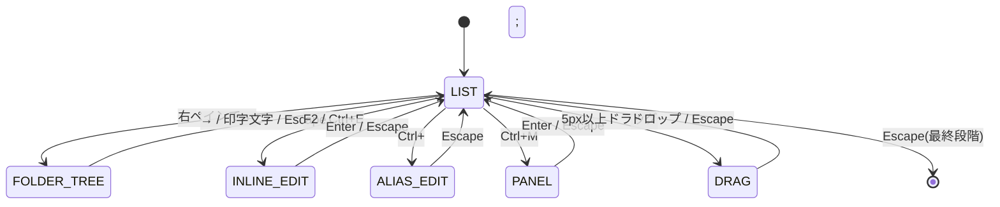

# プロジェクト用語集 (Glossary)

## 概要

このドキュメントは、Findmark プロジェクトで使用される用語の定義を管理する。PRD・機能設計書・アーキテクチャ設計書・リポジトリ構造・開発ガイドラインで用いる用語を統一する。

**更新日**: 2026-07-24

---

## ドメイン用語

### 別名(エイリアス)

**定義**: 1件のブックマークにユーザーが付ける、検索用の追加の呼び名。

**説明**: 読みがな・略称・英語名・自分だけの呼び名を格納する。辞書や自動変換に頼らず、ユーザー自身が付けた別名を検索キーにすることで検索精度を上げる。Findmark の差別化の核。1件あたり最大20個、1個あたり最大50文字。

**関連用語**: 別名チップ、AliasRecord、正規化、独自JSON形式

**使用例**:
- 英語タイトルの「Chrome Extensions Docs」に「拡張機能」「kakuchou」を別名登録する
- `gijutsu` で引きたいブックマークに `gijutsu` を別名登録する(ローマ字対応を辞書なしで実現)

**英語表記**: alias

### 別名チップ

**定義**: 別名編集UIおよび検索結果行で、別名を1つずつ矩形(チップ)で表す表示要素。

**説明**: 入力後 Enter / `,` / Space で確定、`×` で削除、クリックで再編集。結果行では最大3個 + `+N` で省略し、検索でマッチした別名は先頭にハイライト付きで必ず表示する(省略対象から除外)。

**関連用語**: 別名、フォルダチップ、マッチ理由の可視化

### フォルダスコープ

**定義**: 右ペイン(ブックマーク一覧)に何を表示するかを決める、現在対象となっているフォルダ。

**説明**: **常にどれか1つのフォルダにスコープが当たっている**(起動時は既定で「すべて」。保存された状態があれば復元する→[ポップアップ状態の復元])。左ペインでフォーカスを移動すると同時にスコープが追従し、右ペインの内容が切り替わる。「すべて」のときのみ例外的に全ブックマークが対象となり、それ以外は**当該フォルダの直下のブックマークのみ**が対象(サブフォルダは含めない)。クエリの有無で範囲は変わらない。**絞り込み範囲であり検索語ではない**ため、フォルダパスは検索語の照合対象から除外される。

**関連用語**: フォルダツリー、folderScope、フォルダチップ、フォーカスの3状態

**英語表記**: folder scope

### フォルダチップ

**定義**: 検索ボックス先頭に表示され、現在のフォルダスコープを可視化する要素(例 `📁 開発/chrome`)。

**説明**: **スコープの表示要素であり、スコープを操作する主体ではない**。スコープの変更は左ペインのフォーカス移動が担い、解除は `Escape` の段階戻りまたは左ペインの `Home` で行う。左ペインを深くスクロールしている状態でも「今どこを見ているか」が分かる点に価値がある。

**関連用語**: フォルダスコープ、フォルダツリー、別名チップ

### フォーカスの3状態

**定義**: Popup のキーボードフォーカスが取りうる3つの位置。**検索ボックス / 右ペイン(ブックマーク一覧) / 左ペイン(フォルダツリー)**。

**説明**: 起動時は**既定で左ペイン**(保存された状態があれば復元する→[ポップアップ状態の復元])。`↑↓` で検索ボックスを抜け、`←→` でペイン間を行き来する。検索ボックス内では `←→` はキャレット移動専用とし、ペイン移動には使わない(クエリ途中の修正を担保するため)。左ペイン・右ペインで印字文字/Backspace を打つか `Escape` を押すと検索ボックスへ戻る。**スコープ(論理的な選択状態)とは別の概念**である点に注意。

**関連用語**: フォルダスコープ、モード状態遷移、選択行、検索ファースト復帰

### 選択行

**定義**: 右ペインで現在選ばれているブックマーク行。

**説明**: **常に存在する**(既定は先頭行)。検索ボックスにフォーカスがある間もハイライトされ、`Enter` はフォーカス位置に関係なく選択行を開く。これにより「打つ → `Enter`」で最短到達できる。検索ボックスで `↑↓` を押すと、フォーカスが外れると同時に選択行が1つ移動する。

**関連用語**: フォーカスの3状態、フォルダスコープ

### ポップアップ状態の復元

**定義**: ポップアップを閉じた時点の UI 状態(フォーカス位置 / フォルダスコープ / 選択中のブックマーク / 検索クエリ)を `chrome.storage.local` に保存し、次回起動時に引き継ぐ仕組み。

**説明**: 保存された状態がない**初回起動時のみ**、フォーカス=左ペイン / スコープ=「すべて」/ 選択行=先頭 / クエリ=空 の既定値から始まる。選択中のブックマークはインデックスではなく**ブックマークIDで保持**し、Chrome標準機能等で削除されていた場合は当該項目のみ既定値へフォールバックする(スコープ→「すべて」/ 選択行→先頭行。フォーカス位置は保存値のまま)。保存はポップアップが唐突に閉じても失われないよう、変更のたびに即時(debounce付き)行う。

**関連用語**: フォーカスの3状態、フォルダスコープ、選択行、LocalState

**英語表記**: popup state restore

### 検索ファースト復帰

**定義**: 編集モード中を除き、印字文字または修飾なしの `Backspace` を打てば検索ボックスにフォーカスが戻る仕組み。

**説明**: 左ペイン・右ペインのどこにフォーカスがあっても、印字文字または `Backspace` を打つだけで検索へ戻れる。`Backspace` は「残っているクエリを消したい」という操作意図でも検索ボックスへ戻れるようにするために追加した(U8a)。これにより素キー(`E` / `A` など)をコマンドに割り当てられないため、モード入口は修飾キー方式(`F2`・`Ctrl/Cmd+E` / `Ctrl/Cmd+;`)を採る。

**関連用語**: フォーカスの3状態、モード状態遷移

### マッチ理由の可視化

**定義**: 「なぜその項目がヒットしたか」を、マッチした別名をハイライト表示して見せること。

**説明**: 英語タイトルのサイトを `kakuchou` で引いたとき、マッチした別名を先頭にハイライトで表示する。別名機能の価値を体感させる要のため、チップ省略の対象から除外する。

**関連用語**: 別名、別名チップ、matchedAliases

### 即時アンドゥ

**定義**: 削除・移動・一括操作を、実行直後の数秒間だけ取り消せる仕組み。

**説明**: トーストで5秒間表示し、メモリに保持。一括操作は1単位として扱う(20件移動なら1回で全部戻る)。ゴミ箱(30日保持)とは別レイヤー。

**関連用語**: ゴミ箱、UndoManager、トースト

### ゴミ箱

**定義**: 削除したブックマーク/フォルダを一定期間保持し、後から復元できる領域。

**説明**: 即時アンドゥとは別の第2層。`storage.local` に30日(設定可)保持。フォルダ削除時は配下ツリーごと丸ごと保存。復元は元のフォルダパスへ戻し、フォルダが無ければ自動再作成する。UIはオプションページの「ゴミ箱」タブ。

**関連用語**: 即時アンドゥ、TrashItem、ensureFolderPath

### 独自JSON形式

**定義**: 別名などの独自メタデータごとブックマークを持ち出せる、Findmark固有のエクスポート形式(`format: "my-bookmark-search"`)。

**説明**: url / title / folderPath / aliases / addedAt を含む。URLをキーに突合し、`version` により将来のフォーマット変更後も旧ファイルを読める。別アカウント・別PCへの完全移行を可能にする差別化の核。

**関連用語**: 別名、標準HTML形式、URLハッシュ、重複解決

### 標準HTML形式(Netscape Bookmark File)

**定義**: ブラウザ共通のブックマークエクスポート形式。

**説明**: 他ブラウザ・Chrome標準機能との互換用。インポートは新規作成のみのシンプル動作。別名は保持されない(別名を残すには独自JSONを使う)。

**関連用語**: 独自JSON形式

### 頭文字アバター

**定義**: ファビコンが取得できないサイト向けの、ドメイン頭文字を表示する代替アイコン。

**説明**: ドメイン先頭1文字を大文字化(`www.` 等は除去して判定)。背景色はドメインのハッシュから固定パレット(8〜12色)を選び、同一ドメインは常に同色にして識別の手がかりにする。ファビコンとサイズ・角丸を揃え、切り替わってもレイアウトが動かない。

**関連用語**: favicon権限、ファビコン

### スプリングロード展開

**定義**: ドラッグ中、閉じたフォルダに一定時間ホバーすると自動で展開する挙動。

**説明**: 600msホバーで展開。ドラッグ&ドロップでのフォルダ移動時に深い階層へも運べるようにする。

**関連用語**: ドラッグ&ドロップ、オートスクロール

---

## 技術用語

### Manifest V3

**定義**: Chrome拡張機能の最新のマニフェスト仕様。Service Worker型のバックグラウンドを用いる。

**公式サイト**: https://developer.chrome.com/docs/extensions/develop/migrate

**本プロジェクトでの用途**: Findmark の拡張仕様。`chrome-extension/manifest.ts` で定義。

**関連ドキュメント**: [architecture.md](./architecture.md)

### chrome.bookmarks

**定義**: ブックマークの検索・作成・更新・移動・削除を行う Chrome 拡張API。

**本プロジェクトでの用途**: ブックマーク本体の single source of truth。`BookmarkService` がラップする。復元APIは無いため、削除前データを保持して再作成で復元する。

**関連ドキュメント**: [functional-design.md](./functional-design.md)

### chrome.storage(sync / local)

**定義**: 拡張機能のデータ永続化API。`sync` はアカウント間同期、`local` は端末固有。

**本プロジェクトでの用途**: 別名・設定は `sync`、ゴミ箱・フォルダ展開状態・前回フォルダは `local`。`sync` は「1アイテム8KB / 最大512アイテム」制限があるためチャンク分割が必須。

**関連用語**: AliasChunk、チャンク分割、フォールバック

### favicon権限

**定義**: 訪問済みサイトのファビコンを `chrome-extension://<id>/_favicon/` 経由で取得できる低リスク権限。

**本プロジェクトでの用途**: 外部通信ゼロでファビコンを表示。未訪問サイトでは頭文字アバターにフォールバック。申請前に警告表示有無を現行ドキュメントで確認する。

**関連用語**: 頭文字アバター

### React

**定義**: 宣言的UIライブラリ。

**公式サイト**: https://react.dev
**本プロジェクトでの用途**: Popup / Options のUI。モード状態遷移の管理。
**バージョン**: 19.1

### Vite / Turborepo

**定義**: Vite はビルド・HMRツール、Turborepo はモノレポのタスクランナー。
**本プロジェクトでの用途**: 拡張機能の高速ビルドと、`packages/` `pages/` のタスク並列・キャッシュ。
**バージョン**: Vite 6.3 / Turborepo 2.5

### pnpm workspace

**定義**: pnpm のモノレポ機能。
**本プロジェクトでの用途**: `packages/*`(共有コード)を各ページから参照する。
**バージョン**: pnpm 10.11.0

---

## 略語・頭字語

### MV3
**正式名称**: Manifest V3
**意味**: Chrome拡張の最新マニフェスト仕様。
**本プロジェクトでの使用**: 拡張全体の前提。

### PRD
**正式名称**: Product Requirements Document
**意味**: プロダクト要求定義書。
**本プロジェクトでの使用**: [product-requirements.md](./product-requirements.md)。

### NFKC
**正式名称**: Normalization Form Compatibility Composition
**意味**: Unicode正規化形式の一つ。全角・半角などの互換文字を統一する。
**本プロジェクトでの使用**: `Normalizer` で `String.normalize('NFKC')` を検索語・被検索文字列の両方に適用。

### AND検索
**正式名称**: —
**意味**: 複数キーワードのすべてに一致する項目のみを返す検索。
**本プロジェクトでの使用**: スペース区切りの複数ワードを部分一致でAND評価する。

---

## アーキテクチャ用語

### レイヤー分離(UI / サービス / データ)

**定義**: UIレイヤー(pages)→ サービスレイヤー(packages/shared)→ データレイヤー(packages/storage)の一方向依存。

**本プロジェクトでの適用**: UIから `chrome.*` API を直接呼ばず、必ずデータレイヤー経由にする。サービスレイヤーはReact/DOMに依存しない純粋ロジックとして単体テスト可能に保つ。

**関連コンポーネント**: SearchEngine(サービス)、AliasStore / BookmarkService(データ)、Popup / Options(UI)

**図解**:
```
pages/* (UI) → packages/shared (サービス) → packages/storage (データ) → Chrome API
```

### 実行コンテキスト分離

**定義**: Chrome拡張が Popup / Options / Service Worker という別々の実行環境に分かれること。

**本プロジェクトでの適用**: 各UIコンテキストは薄く保ち、ドメインロジックを `packages/` に集約して重複を避ける。Service Worker は起動時の掃除とコマンド受信のみ。

**関連コンポーネント**: chrome-extension/src/background、pages/popup、pages/options

### チャンク分割(別名ストレージ)

**定義**: AliasRecord を100件ずつまとめて1キー(`alias_chunk_N`)に保存する方式。

**本プロジェクトでの適用**: `chrome.storage.sync` の512アイテム制限を回避。`alias_index` が逆引き(urlHash→チャンク番号)と `storageMode` を持ち、書き込みは該当チャンクのみ更新する。

**関連コンポーネント**: AliasStore、AliasIndex、AliasChunk

### フォールバック(sync→local)

**定義**: `chrome.storage.sync` の容量超過時に `storage.local` へ保存先を切り替えること。

**本プロジェクトでの適用**: 別名データが sync 上限を超えたら自動で local に退避し、ユーザーに通知する。

**関連コンポーネント**: AliasStore、AliasIndex.storageMode

---

## ステータス・状態

### Popup モード状態

キー操作の衝突を防ぐため、Popupは明示的なモードを持つ。既定状態はフォーカス位置により `LIST`(検索ボックス / 右ペイン)と `FOLDER_TREE`(左ペイン)に分かれる。

| モード | 意味 | ↑↓ | Enter | Escape |
|-------|------|-----|-------|--------|
| LIST | 既定。検索結果を操作 | 選択移動(検索ボックスからはフォーカスも外れる) | 選択行を開く | 段階的に戻る |
| FOLDER_TREE | 左ペインのフォルダツリーを操作 | フォルダ移動(スコープが追従) | 展開/折りたたみのトグル | 検索ボックスへ戻る |
| INLINE_EDIT | タイトル/URL編集中 | キャレット移動 | 確定→LIST | 破棄→LIST |
| ALIAS_EDIT | 別名編集中 | 候補移動 | チップ確定 | 編集終了 |
| DRAG | ドラッグ移動中 | — | — | 中止 |
| PANEL | フォルダ選択パネル表示中 | 候補移動 | 決定 | 閉じる |

**状態遷移図**:


**Escape の段階戻り(4段階)**:
```
1. 左/右ペインにフォーカス   → 検索ボックスへ戻る
2. キーワードあり            → キーワードをクリア
3. スコープが「すべて」以外   → 「すべて」へ戻す
4. いずれでもない            → ポップアップを閉じる
```

### 現在ページの登録状態

| 状態 | ヘッダー右の表示 | クリック時 |
|------|----------------|-----------|
| 未登録 | `+ 追加` | 即座に登録 → 編集パネルを開く |
| 登録済み | `★ 登録済み` | 該当ブックマークの編集パネルを開く |

---

## データモデル用語

### AliasRecord

**定義**: 1つのURLに紐づく別名データ。

**主要フィールド**:
- `urlHash`: URL正規化後のハッシュ(紐付けキー。ID非依存)
- `url`: 突合・復元・エクスポート用の原URL
- `aliases`: 別名の配列(最大20個・各50文字、正規化後に重複排除)
- `updatedAt`: 更新日時

**関連エンティティ**: AliasChunk、AliasIndex、BookmarkNode

**制約**: `urlHash` がキー。`chrome.storage.sync` にチャンク化して保存。

### AliasChunk / AliasIndex

**定義**: AliasChunk は AliasRecord を最大100件まとめた1キーの塊。AliasIndex はチャンク数・逆引き・`storageMode` を持つ管理レコード。

**関連エンティティ**: AliasRecord

**制約**: sync制限回避のための格納形式。

### TrashItem

**定義**: ゴミ箱に保持される削除済みブックマーク/フォルダ。

**主要フィールド**:
- `id`: ゴミ箱内の一意ID(復元時は新規採番。元のブックマークIDとは別)
- `kind`: `'bookmark' | 'folder'`
- `url` / `title` / `folderPath`(復元先) / `aliases`(削除時点)
- `children`: フォルダのとき配下ツリー
- `deletedAt`: 削除日時

**制約**: `storage.local`。30日保持(設定可)、件数上限(例500件・暫定)または容量上限で古い順に自動削除。復元時はブックマークID・作成日時が変わる。

### URLハッシュ

**定義**: URLを正規化(末尾スラッシュ正規化等。クエリ・フラグメントは保持)してからハッシュ化した文字列。

**説明**: 別名の紐付けキー。ブックマークIDは端末・アカウント移行で変わるため使わず、URLハッシュを用いることで移行しても別名が外れない。

**関連用語**: AliasRecord、正規化、独自JSON形式

---

## エラー・例外

### AliasLimitError

**クラス名**: `AliasLimitError`
**発生条件**: 別名が1件あたり20個、または1個あたり50文字の上限を超えたとき。
**対処方法**: 上限内に収める。UIは「別名は1件あたり20個までです」等をインライン表示。

```typescript
throw new AliasLimitError('別名は1件あたり20個までです', 20);
```

### URL検証エラー

**クラス名**: (バリデーション。URL不正)
**発生条件**: URL編集・登録・インポート時に `new URL()` がパースに失敗、または `javascript:` 等の危険スキーム。
**対処方法**: 確定不可・赤枠にし、行の下にインラインで「有効なURLを入力してください」を表示。

### sync容量超過(フォールバック)

**クラス名**: (例外にせず自動処理)
**発生条件**: `chrome.storage.sync` の容量上限超過。
**対処方法**: `storage.local` へ自動フォールバックし、「同期容量の上限のため端末内保存に切替えました」と通知。

---

## 計算・アルゴリズム

### テキスト正規化

**定義**: 検索語・被検索文字列・別名を同一条件で比較するための変換。

**計算式**:
```
normalize(s) = カタカナ→ひらがな( toLowerCase( NFKC(s) ) )
```

**実装箇所**: `packages/shared/lib/search/Normalizer.ts`

**例**:
```
入力: "ＤＯＣＳ" / "カクチョウ"
出力: "docs" / "かくちょう"(→ "かくちょう" と一致)
```

### URL正規化とハッシュ

**定義**: 別名の紐付けキーを作るためのURL整形とハッシュ化。

**計算式**:
```
normalizeUrl(url) = protocol + "//" + host + pathname(末尾/正規化) + search   ※hashは除去
hashUrl(url)      = hash(normalizeUrl(url))
```

**実装箇所**: `packages/shared/lib/search/Normalizer.ts`

**例**:
```
入力: "https://example.com/docs/#section"
出力(normalizeUrl): "https://example.com/docs"
```

### 検索スコアリング

**定義**: AND部分一致した項目を関連度順に並べるための点数付け。

**計算式**:
```
総合スコア = Σ(フィールド重み × 一致位置ボーナス)
フィールド重み: タイトル > 別名 > フォルダ名
前方一致は部分一致より加点
```

**実装箇所**: `packages/shared/lib/search/SearchEngine.ts`

**補足**: 結果0件時のみ、編集距離(Levenshtein)によるタイポ耐性フォールバックを実行する(辞書は使わない)。
