# Findmark メンタルモデル

> 2026-08-05 時点（`dev` @ 199fca3 / U10 完了・U11 未着手）のコードを読んで作成。
> ドキュメントではなくコードを正としている。行番号は当時のもの。

## 一行で言うと

**自分がそのページを何と呼んでいるか**（タイトル・フォルダ名・自分で付けた別名）だけを手がかりに、キーボードから手を離さずブックマークへ到達するための Chrome 拡張。

## 処理フロー一覧

各フローに2枚の図がある。**A = 処理の流れ**（誰が誰を呼び、どこで失敗するか）、**B = 依存グラフ**（何に依存し、変えると何に波及するか）。

| # | フロー | 起動される条件 | 何をするか | 起点 |
|---|---|---|---|---|
| 1 | 索引を構築する | ポップアップを開くたび | ブックマーク全件＋別名を平坦な `SearchEntry[]` に変換してメモリに置く | `useSearch.ts:42` |
| 2 | 検索して目的のブックマークを開く | 検索ボックスへの入力 → Enter | 索引を同期走査して結果を並べ、現在タブで開く | `SearchHeader.tsx:35` |
| 3 | キー入力を解釈してモードとフォーカスを動かす | `document` の keydown すべて | キーを1つの意図に変換し、モードとフォーカス位置を決める | `Popup.tsx:221` |
| 4 | フォルダを選んで検索範囲を絞る | 左ペインのフォルダ選択チップのクリック | スコープを1つ設定し、その**直下のみ**を対象にする | `FolderTreeItem.tsx:109` |
| 5 | 別名を追加して保存する | 別名チップ領域のクリック / 別名編集キー | 正規化重複と上限を弾き、`chrome.storage` へ保存して索引に反映 | `AliasEditor.tsx:150` |
| 6 | 行をインライン編集して保存する | `F2` / `Ctrl+E` / 行のダブルクリック | タイトルと URL をその場で書き換え、成功したものだけ索引に反映 | `InlineEdit.tsx:35` |
| 7 | 行を削除して5秒以内に元に戻す | `Delete` / ゴミ箱アイコン | 削除して復元情報を退避し、5秒間だけアンドゥを保持 | `useRowActions.ts:69` |

描いていないもの: options ページ / devtools パネル / content-runtime（いずれもボイラープレートのテーマ切替デモのまま）、background service worker（9行のログ出力のみ。U17 未着手）。必要なら追加で描ける。

---

## 全体図

**処理**: このプロダクトが持つ処理フロー全体の配置
**起動**: —（個別の処理ではなく、全体の見取り図）
**範囲**: 起点となる入口、主要7フロー、それらが共有する中核とデータ層の境界
**含まない**: 各フローの内部（→ 以下の A・B の図）

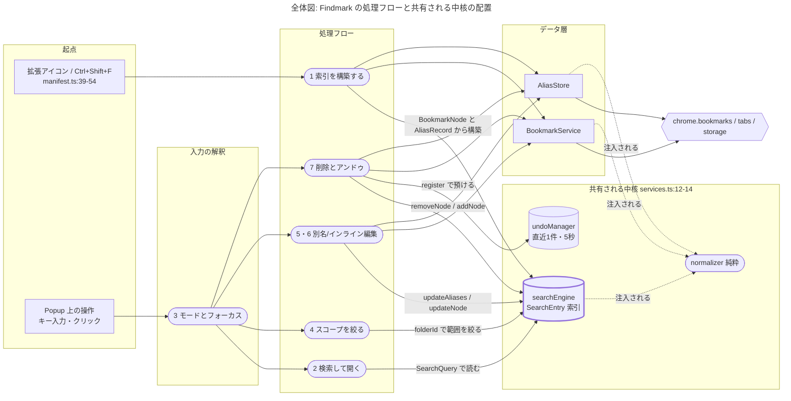

**図の読み方**（以降のすべての図で共通）

| 記法 | 意味 |
|---|---|
| `([ 角丸 ])` | 純粋モジュール（React・chrome・DOM に非依存で単体テスト可能） |
| `[( 円筒 )]` | 状態を持つ単一実体（モジュールスコープ or React state） |
| `{{ 六角 }}` | chrome の外部 API（自分たちの管轄外） |
| 破線の矢印 | 他フローからの依存・書き込み |
| 太枠 | 複数フローが共有する変更の波及点 |

読み取るべきは1点。**`searchEngine` の索引に矢印が集中している**こと。フロー1が作り、フロー2が読み、フロー4〜7が書き換えます。再構築は一切走らないので、**索引を書き換え忘れた差分は「画面と実データがずれる」形で必ず表面化します**。

### 中核概念

- **索引（`SearchEntry[]`）** — 起動時に1回だけ構築される平坦な配列。ここでブックマークの木構造が消え、正規化済みのタイトル/フォルダ名/別名が事前計算される `packages/shared/lib/search/SearchEngine.ts:29,61`
- **`Normalizer`** — 文字列比較の唯一の入り口。NFKC → 小文字化 → カタカナ→ひらがな。順序に意味がある `packages/shared/lib/search/Normalizer.ts:20`
- **`urlHash`** — 別名とブックマークを結ぶキー。Chrome の `node.id` **ではなく**正規化 URL の FNV-1a ハッシュ `packages/storage/lib/types.ts:43`
- **`Mode` / `ListFocus`** — キー意味論を決める状態。`Mode` は6種、`ListFocus` は LIST 内の検索ボックス/右ペインの別。統合位置 `FocusArea` は独立 state に持たず必ず導出する `pages/popup/src/hooks/modeMachine.ts:23,29,38`
- **`KeyIntent` / `ShortcutIntent`** — 「このキーは何をしたいのか」だけを表す値。純粋関数が変換し、`Popup.tsx` は実行のみ `modeMachine.ts:86,144,284`
- **`SearchResultItem`** — 検索層から UI へ渡る唯一の型。ノード＋フォルダパス＋別名＋**マッチ理由**を運ぶ `packages/shared/lib/types/search.ts:22`
- **`CommitPlan` / `CommitOutcome`** — 編集の確定判定を表す判別可能ユニオン。「何を保存すべきか」を純粋関数が決め、React 層は実行するだけ `inlineEditModel.ts:50` / `aliasEditorModel.ts:27`

---

## フロー1: 索引を構築する

**処理**: ブックマーク全件と別名を読み込み、検索用の索引をメモリに構築する
**起動**: ポップアップが開かれ `Popup` がマウントされたとき（依存配列 `[]` の effect）
**範囲**: `useSearch` の mount から `isIndexReady = true` まで
**含まない**: 構築後の索引の部分更新（→ フロー5・6・7）、検索の実行（→ フロー2）

### 1-A 処理の流れ
> 答える問い: 誰が誰を呼び、何が返り、どこで失敗するか

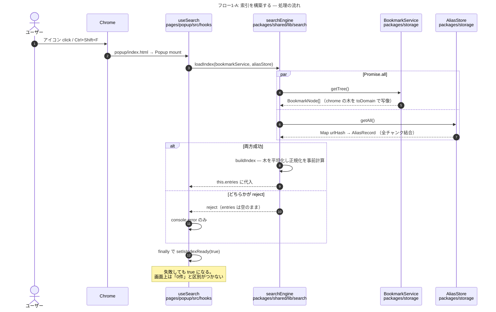

### 1-B 依存グラフ
> 答える問い: このフローは何に依存し、変更すると何に波及するか

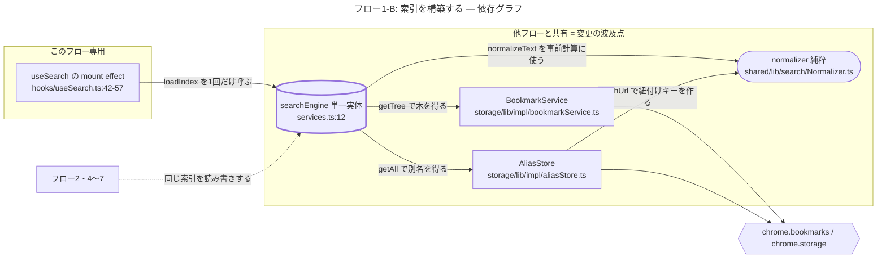

**要点**

- **開くたびに毎回フルロードが走る。** popup は閉じるとプロセスごと消えるので「起動時1回」＝「開くたび1回」。起動 200ms 要件を食う唯一の非同期処理はここ
- **失敗が観測できない。** `catch` はログのみ、`finally` で必ず `isIndexReady = true` (`useSearch.ts:46-53`)
- **`normalizer` は3方向から注入されている。** B の3本の破線がそれ。`packages/storage` は `packages/shared` に依存できない（循環になる）ため、実体は `services.ts` が注入し、`AliasStore` / `SearchEngine` は構造的インターフェースでしか受けない (`aliasStore.ts:33` / `SearchEngine.ts:14`)。**`Normalizer` のシグネチャを変えると、この2つのインターフェース定義も直す必要がある**
- **不変条件（コード強制）**: `buildIndex` は `url` を持つノードだけを entry にし、真のルートはフォルダパスに積まない (`SearchEngine.ts:80,96`)。この規則は `BookmarkService.getFolderPath` と一致していなければならない — ずれると削除アンドゥの復元先が変わる
- **罠**: `loadIndex` を呼ぶ本番コードはここ1箇所だけ。再構築の手段が存在しないので、「データが変わったから作り直す」という発想のコードは設計から外れる

---

## フロー2: 検索して目的のブックマークを開く

**処理**: 入力されたキーワードで索引を検索し、選ばれた行を現在タブで開く
**起動**: 検索ボックスへの入力、その後の Enter または行クリック
**範囲**: `onChange` の発火から `chrome.tabs.update` まで
**含まない**: 索引の構築（→ フロー1）、フォルダスコープの設定（→ フロー4）、キーの解決過程（→ フロー3）

### 2-A 処理の流れ
> 答える問い: 誰が誰を呼び、何が返り、どこで失敗するか

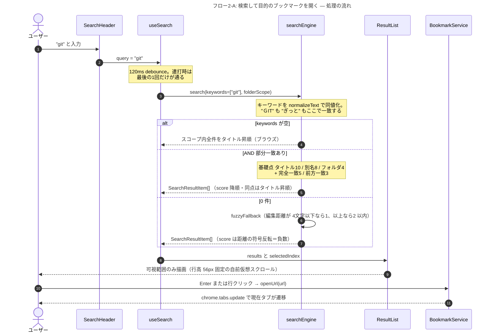

### 2-B 依存グラフ
> 答える問い: このフローは何に依存し、変更すると何に波及するか

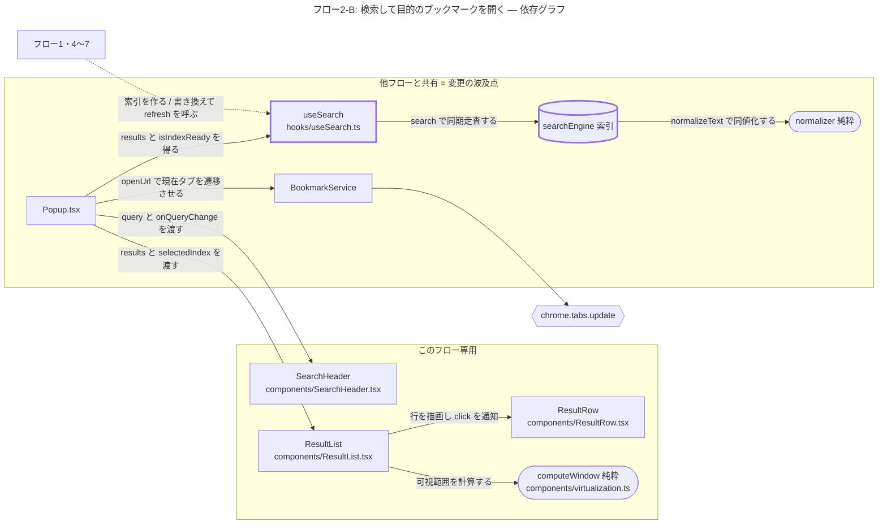

**要点**

- **不変条件（コード強制）**: `search()` は同期関数。1,000件で1文字あたり100msという要件のため、索引構築だけを非同期の外縁にしている (`SearchEngine.ts:55-58`)。`async` 化する差分は要件違反
- **あいまい一致は0件のときだけ。** しかも AND 条件は維持される (`SearchEngine.ts:126,341`)。スコアが負数なのは通常検索と同じ降順ソートに乗せるため — 符号で分岐するコードを足すと壊れる
- **依存グラフに線としては描けない波及**: `results` が再計算される条件は `debouncedQuery` / `isIndexReady` / `folderId` の3つだけ (`useSearch.ts:73`)。**索引の中身の変化はこの依存に入っていない**ので、書き換えたフローは自分で `refresh()` を呼ばないと画面が古いままになる。B の破線が「refresh を呼ぶ」で終わっているのはそのため
- **罠**: 行の**シングルクリックは「開く」**が既定 (`ResultRow.tsx:136`)。編集アイコン・削除アイコン・別名チップ領域だけが `data-*` 属性で分岐している (`ResultRow.tsx:122-137`)

---

## フロー3: キー入力を解釈してモードとフォーカスを動かす

**処理**: `document` に届いたキーを1つの意図に変換し、モードとフォーカス位置を決める
**起動**: ポップアップ内のあらゆる keydown
**範囲**: `document` のリスナー入口から、いずれかの操作の実行または無視まで
**含まない**: 実行される操作の中身（→ フロー5・6・7）、編集フォーム内部のキー処理（各コンポーネントが `stopPropagation` して処理する）

### 3-A 処理の流れ
> 答える問い: 誰が誰を呼び、何が返り、どこで失敗するか

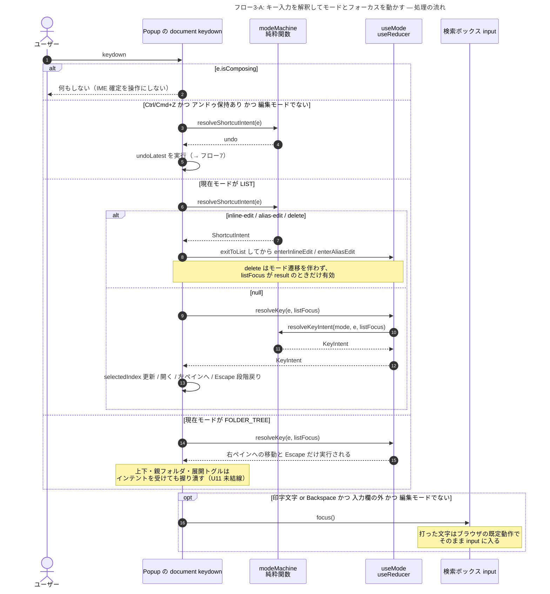

### 3-B 依存グラフ
> 答える問い: このフローは何に依存し、変更すると何に波及するか

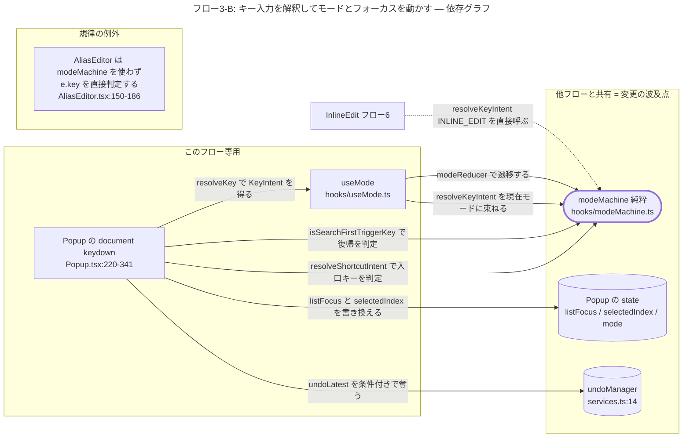

**要点**

- **不変条件（コード強制）**: モードへの入口は `LIST` からのみ有効。`modeReducer` が `LIST` 以外の `ENTER_*` を現状維持に倒す (`modeMachine.ts:62-79`)。だから別の行の編集に切り替えるには一度 `exitToList()` する (`Popup.tsx:116-117`)
- **`Ctrl/Cmd+Z` の乗っ取りは条件付き。** アンドゥ保持があり、かつ `INLINE_EDIT`/`ALIAS_EDIT`/`PANEL` でないときだけ。編集中のテキスト取り消しのつもりの Ctrl+Z が無関係な削除を復元する事故を避けるため (`Popup.tsx:229-239`)
- **`Delete` だけがフォーカス位置を見る。** `listFocus === 'result'` のときのみ削除になる (`Popup.tsx:255`)。逆に `F2`/`Ctrl+E` はフォーカス位置を見ないので、**検索ボックスに居ても編集に入れる**
- **B の「規律の例外」が示すもの**: `InlineEdit` は `resolveKeyIntent('INLINE_EDIT', e)` を経由するが、**`AliasEditor` は経由せず自前で `e.key` を判定している**。結果として `modeMachine` の `alias:confirm` / `alias:exit` / `alias:candidate-*` は定義とテストだけが存在し、本番コードに消費者がいない（grep 済み）。「キー割り当ての single source of truth」という設計意図はここで破れている
- **編集モードのキーは document まで来ない。** 両コンポーネントとも自分が処理するキーを `stopPropagation()` する (`InlineEdit.tsx:51` / `AliasEditor.tsx:160`)。これがないと「閉じる Enter」がそのまま「開く」に化ける

---

## フロー4: フォルダを選んで検索範囲を絞る

**処理**: 左ペインでフォルダを1つ選び、検索対象をその範囲に限定する
**起動**: 左ペインのフォルダ選択チップのクリック（「すべて」を含む）
**範囲**: チップの click から、絞り込まれた `results` の再計算まで
**含まない**: キーボードでのフォルダ移動とスコープ追従（U11 未実装）、展開状態の永続化（U11）

### 4-A 処理の流れ
> 答える問い: 誰が誰を呼び、何が返り、どこで失敗するか

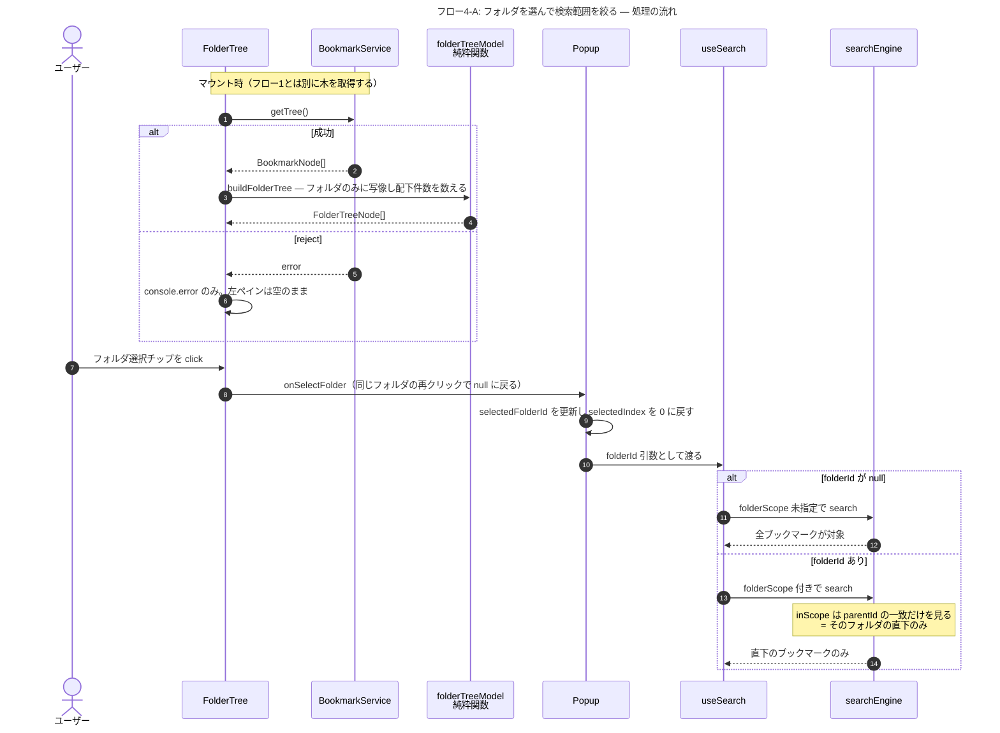

### 4-B 依存グラフ
> 答える問い: このフローは何に依存し、変更すると何に波及するか

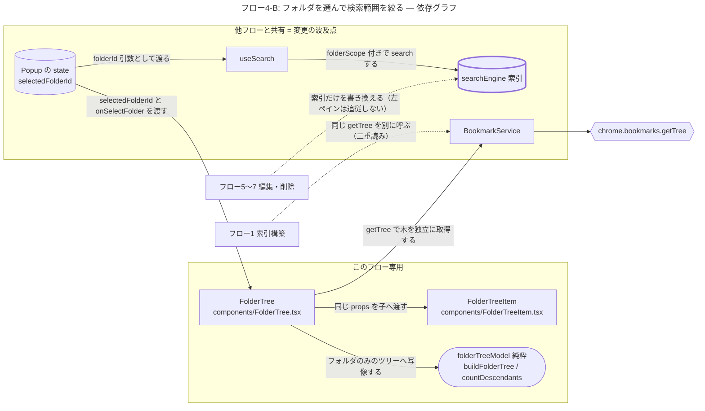

**要点**

- **「直下のみ」であってツリー配下ではない。** U6a の仕様変更で `includeSubfolders` が型・実装・テストから消えた。判定は `parentId` の一致1行だけ (`SearchEngine.ts:222-227`)
- **フォルダ名は照合対象としては生きている。** スコープは範囲フィルタだが、フォルダ名は検索キーワードのマッチ対象（基礎点4）でもある。この2つは別物 (`SearchEngine.ts:240`)
- **B の2本の破線が同じ問題の表と裏**: フロー1と `FolderTree` が `getTree()` を独立に呼び、結果を別々に保持する。そのため削除やアンドゥで索引が変わっても**左ペインの件数は更新されない**。左ペインを触る差分（U11）は、この二重読みを統合するかどうかを最初に決める必要がある
- **スコープは ID で保持する。** フォルダ名に `/` が含まれていても壊れないようにするため (`types/search.ts:44-47`)

---

## フロー5: 別名を追加して保存する

**処理**: 結果行に別名チップを追加し、`chrome.storage` へ保存して検索索引へ反映する
**起動**: 別名チップ領域のクリック、または別名編集キー
**範囲**: 入力欄での確定キーから、永続化と再検索の完了まで
**含まない**: 別名の検索時の使われ方（→ フロー2）、タイトル/URL の編集（→ フロー6）

### 5-A 処理の流れ
> 答える問い: 誰が誰を呼び、何が返り、どこで失敗するか

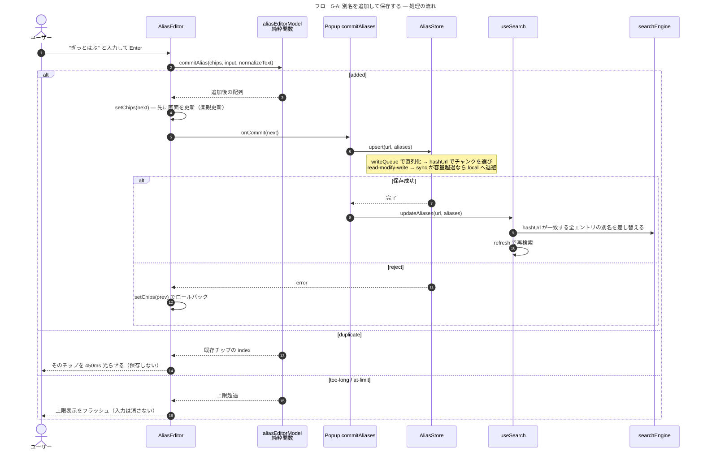

### 5-B 依存グラフ
> 答える問い: このフローは何に依存し、変更すると何に波及するか

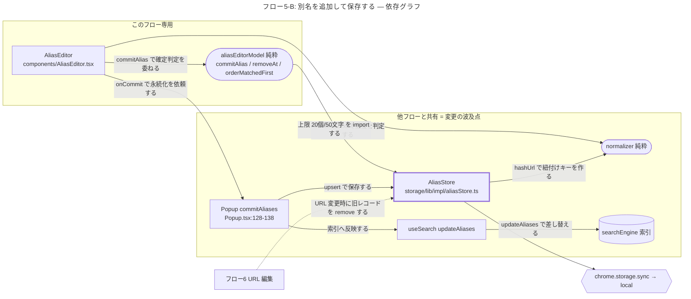

**要点**

- **不変条件（コード強制）**: 永続化 → 索引反映の順序。`commitAliases` は `await aliasStore.upsert()` の後でしか `updateAliases()` を呼ばない (`Popup.tsx:134-135`)。逆順にすると保存に失敗しても画面だけ更新される
- **不変条件（コード強制）**: `upsert`/`remove` の read-modify-write は `writeQueue` で直列化される (`aliasStore.ts:69,168`)。並行実行すると後勝ちの `set` が先の変更を丸ごと消す（コメントに実測で確認済みと明記）。キューを迂回する書き込み経路を足したら壊れる
- **B の `aliasEditorModel → AliasStore` の矢印に注意。** UI の純粋モジュールがデータ層から**定数だけ**を import している (`aliasEditorModel.ts:14`)。上限値を UI 側で再定義しないためのドリフト防止策で、逆向きの依存ではない
- **チップのクリックは保存しない。** 再編集のため入力欄へ戻すだけ。誤クリック後に Escape で離脱しても別名が失われないようにするため（別名削除にアンドゥが無い）(`AliasEditor.tsx:138-148`)
- **影響範囲**: `updateAliases` は `hashUrl` 一致の**全エントリ**に適用される (`SearchEngine.ts:145-160`)。同じ URL のブックマークが複数あれば全部に反映される

---

## フロー6: 行をインライン編集して保存する

**処理**: 結果行のタイトルと URL をその場で書き換えて保存する
**起動**: `F2` / `Ctrl+E` / 行のダブルクリック
**範囲**: 編集フォームの表示から、保存完了して LIST に戻るまで
**含まない**: 別名の編集（→ フロー5）、削除（→ フロー7）

### 6-A 処理の流れ
> 答える問い: 誰が誰を呼び、何が返り、どこで失敗するか

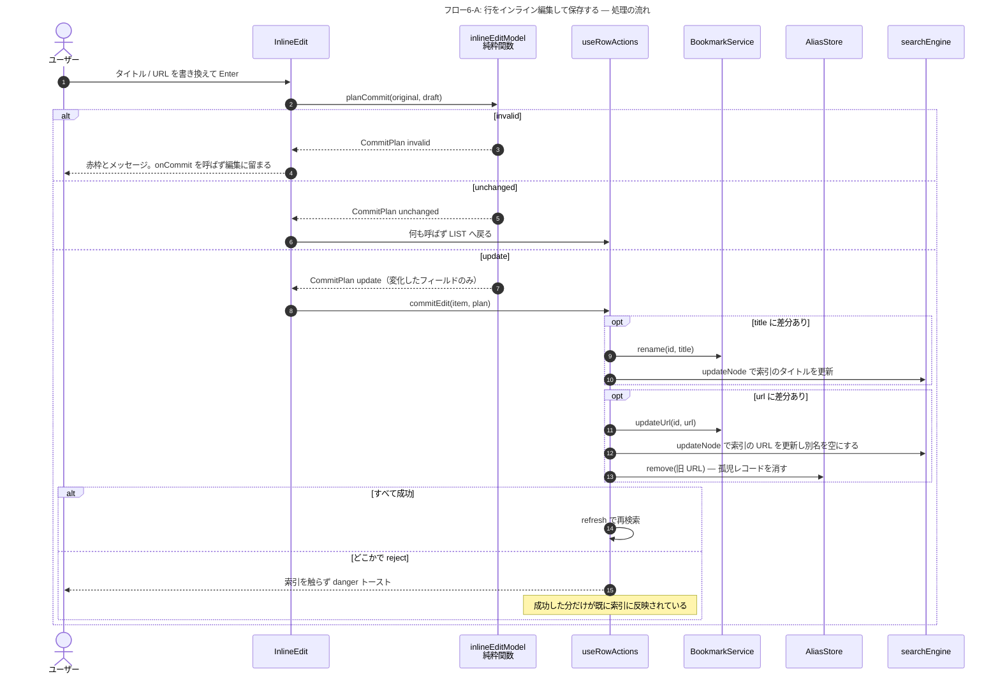

### 6-B 依存グラフ
> 答える問い: このフローは何に依存し、変更すると何に波及するか

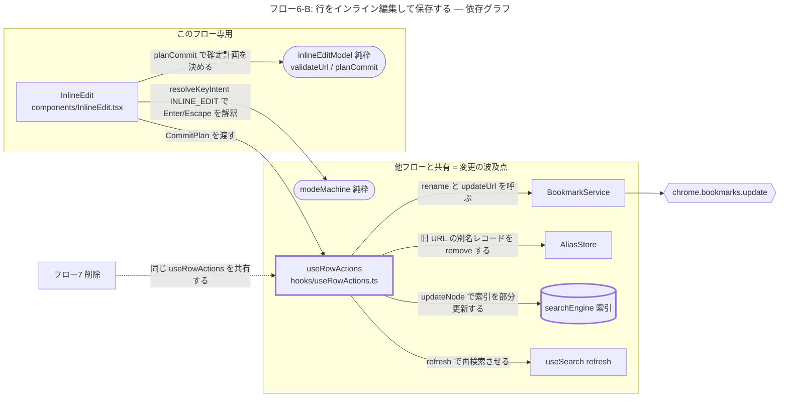

**要点**

- **不変条件（コード強制）**: タイトルと URL は**別々に** await して、それぞれ成功した直後に索引へ反映する (`useRowActions.ts:41-50`)。1つの try にまとめて索引更新を最後に1回にすると、片方だけ失敗したときに「実データは変更済み・索引は旧値」の乖離が生まれる
- **URL を変えると別名は引き継がれない。** 別名は `urlHash` で紐づくので URL が変われば別レコードになる。旧レコードは明示的に削除する — 同じ URL が将来別のブックマークとして登録されたときに別名が"復活"するのを防ぐため (`useRowActions.ts:51-58` / `SearchEngine.ts:179-183`)
- **`javascript:` と `data:` は保存できない。** それ以外は `chrome://` も含めて許可（既存ブックマークが持ち得るため）(`inlineEditModel.ts:14,32`)
- **フォーカスアウトは確定であって破棄ではない。** ただしフォーム内の Tab 移動では確定しない（`relatedTarget` がフォーム内かを見る）(`InlineEdit.tsx:70-76`)
- **罠**: URL が不正なままフォーカスアウトすると `planCommit` が `invalid` を返し `onCommit` が呼ばれない＝**編集モードから抜けられない** (`InlineEdit.tsx:35-42`)

---

## フロー7: 行を削除して5秒以内に元に戻す

**処理**: ブックマークを削除し、5秒間だけ取り消せる状態を保持する
**起動**: 右ペインにフォーカスがある状態での `Delete`、またはゴミ箱アイコンのクリック
**範囲**: 削除の実行から、アンドゥの成功または5秒経過による確定まで
**含まない**: 30日ゴミ箱による第2層の防御（U16 未実装）、`Ctrl+Z` がアンドゥとして解釈される条件（→ フロー3）

### 7-A 処理の流れ
> 答える問い: 誰が誰を呼び、何が返り、どこで失敗するか

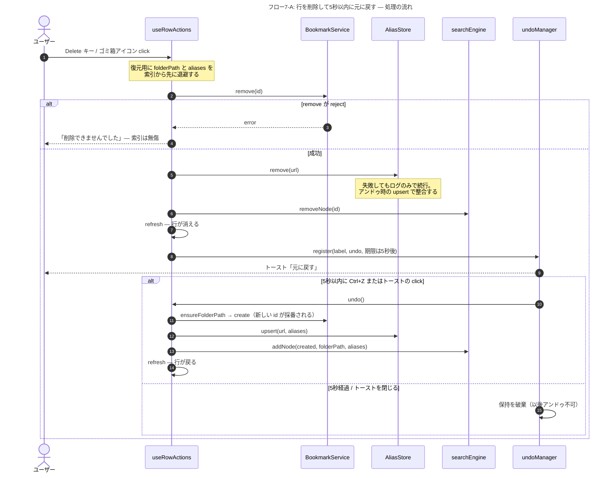

### 7-B 依存グラフ
> 答える問い: このフローは何に依存し、変更すると何に波及するか

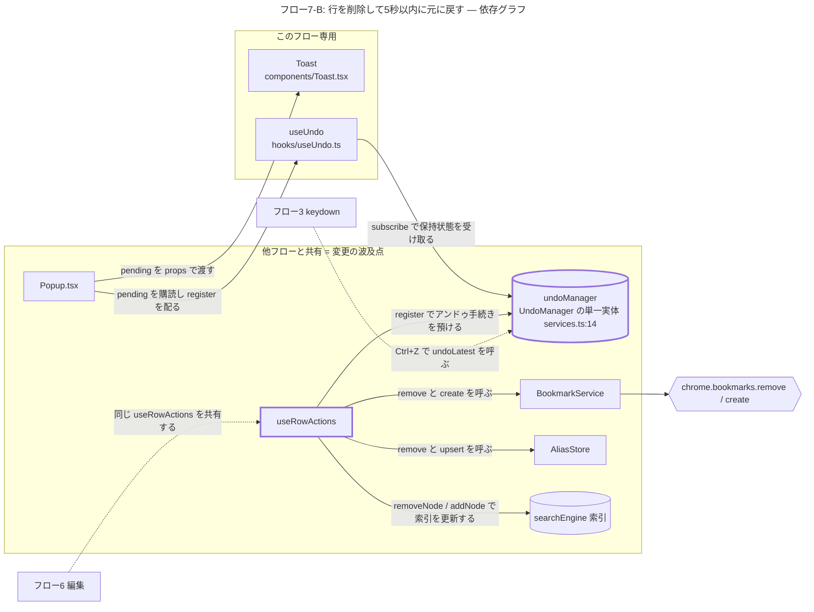

**要点**

- **不変条件（コード強制）**: chrome API の削除が成功したときだけ索引を触る。`remove` が reject したら即 return して索引もアンドゥも登録しない (`useRowActions.ts:80-86`)
- **別名の削除失敗は握り潰して続行する。** ブックマークは既に消えているので、ここで中断すると復元不能になる。別名の残留はアンドゥ時の `upsert` で上書きされる (`useRowActions.ts:88-94`)
- **復元されたブックマークは別の `id` を持つ。** `create` で新規作成されるため。別名が `urlHash` で紐づいているおかげで ID が変わっても別名は復元できる — この設計判断が効いている場所
- **B の `useUndo` が1つしかない理由**: `useRowActions` が自前で `useUndo` を呼ぶと、`Popup` 側のトースト表示用と別々に `UndoManager` を購読する2つの state ができる。だから `register` は引数として注入されている (`useRowActions.ts:24-27` / `Popup.tsx:50`)
- **期限は二重に守られている。** `setTimeout` と `undoLatest` 内の `Date.now()` 再チェック。バックグラウンドタブでのタイマースロットリング対策 (`UndoManager.ts:55-58`)
- **未確認**: `ensureFolderPath` は空配列のとき `root.children[0]` を「ブックマークバー」と仮定する (`bookmarkService.ts:159-164`)。ロケールやプロファイルでこの順序が保証されるかは確かめていない

---

## 全体にかかる不変条件

- **UI は `chrome.*` を直接呼ばない。** `pages/popup/src/` に `chrome.` の実呼び出しは存在しない（grep 済み。コメントとテストデータのみ）。**コードでは強制されていない規約**で、破っても型チェックも lint も通る
- **文字列比較は必ず `Normalizer` を通る。** 検索照合・別名の重複判定・URL 紐付けの3箇所すべて。生の `includes` / `===` で比較する差分は疑う
- **`packages/storage` は `packages/shared` に依存しない。** 循環になるため。実体は `services.ts` が注入し、構造的インターフェースでしか受けない（各 B 図の `normalizer` への破線）
- **純粋ロジックは React/chrome から切り離す。** `modeMachine` / `inlineEditModel` / `aliasEditorModel` / `folderTreeModel` / `virtualization` / `Normalizer` / `fuzzy` / `UndoManager` はすべて依存ゼロで単体テストされている。宣言を非 export にしてファイル末尾で export をまとめる書式も統一されている
- **外部通信はゼロ。** フォントも woff2 で同梱し CDN を使わない (`pages/popup/src/index.tsx:1-10`)。権限は `bookmarks` / `storage` / `activeTab` / `favicon` の4つのみ (`manifest.ts:33`)

## 意外な点

- **`AliasEditor` だけが `modeMachine` を使っていない。** `InlineEdit` は `resolveKeyIntent('INLINE_EDIT', e)` を経由するのに、`AliasEditor` は `e.key === 'Enter'` 等を直接判定する (`AliasEditor.tsx:159-186`)。そのため `alias:confirm` / `alias:exit` / `alias:candidate-*` の4インテントは定義とテストだけが存在し、本番の消費者がいない (`modeMachine.ts:108-111`)
- **行のダブルクリックは、編集に入る前に「開く」も発火する。** `onClick`（既定は開く）と `onDoubleClick`（インライン編集）が同じ `<button>` に付いており (`ResultRow.tsx:142-143`)、ブラウザは dblclick の前に click を発火する。つまり編集しようとダブルクリックすると裏で現在タブが遷移する。**コードから読み取れる挙動で、実機では未確認**
- **`FolderTree.tsx:17` の JSDoc が腐っている。** 「配下（サブフォルダ含む）へ絞り込む」と書いてあるが、U6a 以降の実装は直下のみ
- **ブックマークツリーを2回、別々に読む**（フロー1と4-B の破線）。結果を別々に保持するので、左ペインの件数は索引の変化に追従しない
- **`localStateStore` / `settingsStore` は定義済みだが誰も使っていない。** U11・U19 待ちの前倒し実装
- **`background/index.ts` はボイラープレートのまま**（9行。テーマをログに出すだけ）。この拡張は実質 Popup だけで完結している
- **`AliasStore.loadIndex` と `SearchEngine.loadIndex` は同名の別物。** 前者は private で、`chrome.storage` 上の `alias_index`（`urlHash` → チャンク番号の逆引き表）を読む

## 未解明

- **テストの現況は未確認。** `pnpm test` を実行していない。ユニットテストの分量は十分にある（`SearchEngine.test.ts` 408行、`aliasStore.test.ts` 298行、`modeMachine.test.ts` 285行）が、いま緑かどうかは見ていない
- **sync → local フェイルオーバーは実機未検証。** `isQuotaExceeded` はエラーメッセージの `/quota/i` で判定している (`aliasStore.ts:265`)。実際の Chrome が返す文言と一致するかはモック上でしか確かめられていない
- **ダブルクリックで現在タブが遷移する件**が実際に起きるか、また意図的な妥協なのかは未確認
- **`AliasEditor` が `modeMachine` を経由しない**のが意図的な判断なのか実装漏れなのかは、コードとコミットメッセージからは判断できなかった
- **左ペインの件数が削除後に更新されない件**が U11 での解消待ちなのか見落としなのかも同様

## 理解できたか確認する

1. 別名を1つ追加したとき、`chrome.storage` への書き込みと画面の更新はどちらが先か。逆順にすると何が起きるか
2. インライン編集でタイトルと URL を両方変え、URL の更新だけが失敗した。このとき画面・索引・実データはそれぞれどうなっているか
3. 「フォルダスコープにサブフォルダも含める」を復活させたい。触るファイルはいくつで、そのうち型を変える必要があるのはどれか
4. `Normalizer` に新しいメソッドを足すのではなく、`normalizeText` の引数を1つ増やしたい。どの依存グラフのどの線が壊れるか
5. 索引を書き換えたのに `refresh()` を呼び忘れた差分がある。どんな症状で、なぜ再現しにくいか
