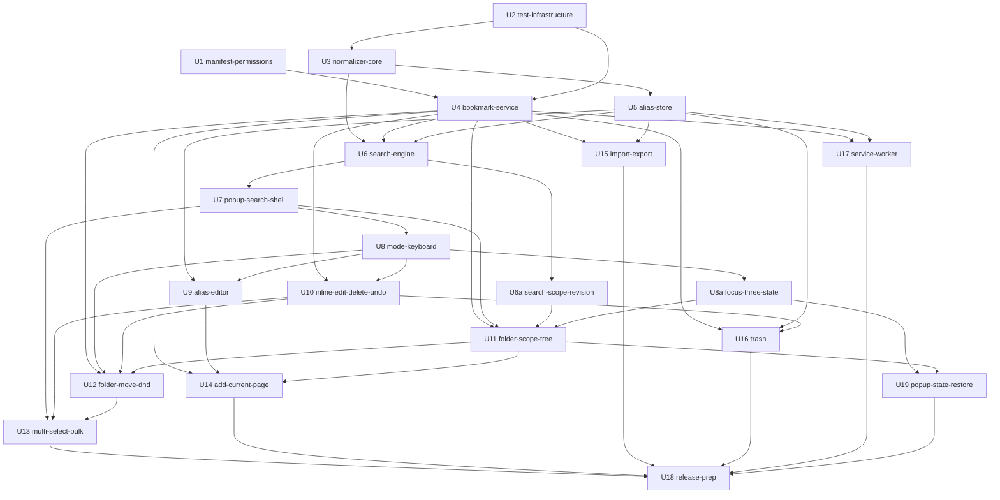

# MVP開発フロー (MVP Development Flow)

- **ドキュメント名**: mvp-development-flow
- **プロダクト名**: Findmark
- **作成日 / 更新日**: 2026-07-24
- **ゴール**: MVP(機能1〜12)の完成 = Chrome Web Store へ提出可能な状態
- **参照元（引用）**:
  - [docs/product-requirements.md](./product-requirements.md)
  - [docs/functional-design.md](./functional-design.md)
  - [docs/architecture.md](./architecture.md)
  - [docs/repository-structure.md](./repository-structure.md)
  - [docs/development-guidelines.md](./development-guidelines.md)
  - [docs/glossary.md](./glossary.md)
  - [docs/design/README.md](./design/README.md)（ポップアップUIデザインハンドオフ・レイアウトの正）
  - [docs/ideas/keyboard-first-navigation.md](./ideas/keyboard-first-navigation.md)（キーボード完結ナビゲーションの仕様変更・経緯）

> 本書は上記の永続ドキュメントを引用して構成した派生ロードマップである。
> 内容が永続ドキュメントと食い違う場合は、永続ドキュメント側を正とする。
> 設計・要件の変更は必ず `docs/` 側へ反映し、本書はそれに追従して更新する。

---

## MVPゴールとスコープ

### MVPの目的
Findmark の中核価値である「**自分だけの別名で数秒で引ける検索**」「**検索結果の場で完結する整理**」「**別名ごと持ち運べる移行**」を、外部通信ゼロ・host permission 不要のまま成立させ、Chrome Web Store に提出できる品質で完成させる。(PRD「目的」「プロダクトコンセプト」)

### スコープ内（MVP対象機能）

PRD「コア機能(MVP)」の機能1〜12を対象とする。

| # | 機能 | 優先度 | 引用 |
|---|------|--------|------|
| 1 | 検索ポップアップ(基盤) | P0 | PRD 機能1 |
| 2 | 検索マッチング(正規化) | P0 | PRD 機能2 |
| 3 | 別名(エイリアス)の登録・編集 | P0 | PRD 機能3 |
| 4 | その場で編集・整理(リネーム/URL編集/削除) | P0 | PRD 機能4 |
| 5 | フォルダスコープ(左ペインと右ペインの連携) | P0 | PRD 機能5 |
| 6 | フォーカス移動とキーボード操作 | P0 | PRD 機能6 |
| 7 | フォルダ移動(キーボード + D&D) | P0 | PRD 機能7 |
| 8 | 複数選択と一括操作 | P0 | PRD 機能8 |
| 9 | 現在のページをブックマーク登録 | P0 | PRD 機能9 |
| 10 | ファビコン表示 | P0 | PRD 機能10 |
| 11 | インポート / エクスポート | P0 | PRD 機能11 |
| 12 | ゴミ箱(削除データの保持・復元) | P1 | PRD 機能12 |
| 13 | ポップアップ状態の復元 | P1 | PRD 機能13 |

加えて、**機能実装の前提となる基盤整備**を MVP スコープに含める。これは architecture.md / repository-structure.md が「実装着手時の必須対応」として明記している現状ギャップである。

- **manifest / 権限の整備**: 現状 `permissions: ['storage']` のみ・`content_scripts`(`<all_urls>`)残存。最小権限(`bookmarks`/`storage`/`activeTab`/`favicon`)へ是正しないと機能が動かない。(architecture.md「現状ギャップ」)
- **テスト基盤の整備**: `packages/shared` / `packages/storage` に vitest 未導入・`turbo.json` に `test` タスクなし。ドメインロジックのユニットテスト方針(カバレッジ80%)を満たす前提。(repository-structure.md / development-guidelines.md「テスト戦略」)

### スコープ外（Post-MVP）

PRD「スコープ外」「将来的な機能(Post-MVP)」に従い、以下は本フローに含めない。

- 未ヒット時の別名登録提案(P1・Post-MVP)
- ローマ字→かな自動変換 / 漢字読み推定(辞書同梱)
- frecency ソート / タグ機能
- リンク切れ検出 / 重複ブックマーク検出
- オムニボックス連携 / サイドパネル対応
- フォルダ内の並び順変更
- テレメトリによる利用状況の自動計測(外部通信ゼロ方針による)
- Firefox 対応(MVP は Chrome 専用)

---

## デザイン準拠（レイアウトの正）

ポップアップの**視覚仕様（レイアウト・寸法・デザイントークン・タイポグラフィ・状態）**は [docs/design/README.md](./design/README.md) と `docs/design/Findmark Popup.dc.html`（760×560・hifi・9状態）を**正**とし、UI 作業単位はこれを忠実に再現する。

**優先関係（precedence）**:
- `docs/design/` = **視覚仕様の正**。
- 既存の永続ドキュメント（product-requirements / functional-design / architecture）= **データモデル・保存・検索ロジック・プライバシーの正**。
- **キーボード操作の正** = product-requirements「キーボードショートカット一覧」＋ functional-design「画面遷移図（Popupのモード状態遷移）」。design/README のキー割り当てはこれに追従する。
- README の「State Management / データ取得 / スコア」節（bookmarkId キー保存・スコア100/80…・別名上限8・外部 `favicon.ico`・サブフォルダ配下も対象・`→`展開/`←`折りたたみ・素キー `E`/`A`・`folderFilter`）は既存実装（U4/U5/U6）および仕様変更後の定義を**上書きしない**。詳細と非採用項目（全9件）は [functional-design.md](./functional-design.md)「UI設計 > デザイン非採用項目」を参照。
- **#2（検索スコア/ランキング）**: 今回は U6 実装（タイトル優先・タイトル昇順・URL非照合）を維持する。デザインの「別名を最上位・空クエリ時は最近順(updatedAt降順)」意図は**将来のロジック改修作業単位で検討**する（本フローの現スコープ外）。

**フォント**: `Noto Sans JP`（400/500/700）/ `IBM Plex Mono`（400/500）を **woff2 で同梱し `@font-face` で適用**する（CDN参照禁止＝CSP・外部通信ゼロ）。**U7** で導入する。

**状態 → 作業単位マッピング**:

| 状態 | 内容 | 作業単位 |
|---|---|---|
| 1a | 通常（検索前・3領域シェル・スコープは「すべて」） | **U7** |
| 1b / 2a / 2b | フォルダスコープ適用中・多階層ツリー・深階層省略 | **U11** |
| 1c | 別名ヒット表示（マッチチップ強調） | U7(表示) / U9(編集) |
| 1d | インライン編集（リネーム/URL/別名展開） | **U10** |
| 1e | 別名チップ編集 | **U9** |
| 1f | 複数選択・一括操作バー | **U13** |
| 1g | ドラッグ&ドロップ | **U12** |

---

## 作業単位一覧

各作業単位は steering スキル1サイクル（`.steering/[YYYYMMDD]-[作業単位名]/`）に対応する。
実装順は architecture.md の依存方向「UI → サービス → データ」に沿ってボトムアップに構成する。

| ID | 作業単位名 | 概要 | 対応MVP機能 | 依存 | 受け入れ基準(要約) | 主な対象領域 |
|----|-----------|------|------------|------|-------------------|-------------|
| U1 | manifest-permissions | manifest.ts を最小権限へ是正。`bookmarks`/`activeTab`/`favicon` 追加、`content_scripts` 削除、`web_accessible_resources` を最小化、`options_page`/`commands` 定義、不要な devtools エントリ整理 | 前提(1,10) | なし | 拡張がロードでき権限が4つのみ / `<all_urls>` 警告が出ない / popup・options が開く | `chrome-extension/manifest.ts` |
| U2 | test-infrastructure | `packages/shared`・`packages/storage` に vitest 導入、`turbo.json` に `test` タスク追加、CI にテスト実行ステップ追加。※既存の `packages/ui` 型解決エラー(`@/lib/utils` 等)の是正もここで扱う | 前提(全) | なし | `pnpm test` が両パッケージで実行できCIで走る / 全体 type-check が通る | `packages/*/package.json`, `turbo.json`, `.github/workflows/` |
| U3 | normalizer-core | Normalizer(NFKC・小文字化・カナ統一の `normalizeText`、`normalizeUrl`、FNV-1a の `hashUrl`)とドメイン型定義 | 2 | U2 | 全角半角/カナ/大小文字が同値化 / URL正規化の同値クラスがテストで担保 | `packages/shared/lib/search/Normalizer.ts`, `packages/shared/lib/types/` |
| U4 | bookmark-service | BookmarkService(chrome.bookmarks/tabs ラッパ: getTree/getFolderPath/ensureFolderPath/create/rename/updateUrl/move/remove/getCurrentTab/faviconUrl)、SettingsStore、LocalStateStore | 前提(1,4,7,9) | U1, U2 | フォルダパス解決・自動作成・現在タブ取得が動作 / UIがchrome APIを直接触らない | `packages/storage/lib/impl/bookmarkService.ts` 他 |
| U5 | alias-store | AliasStore(チャンク分割 `alias_chunk_N` + `alias_index` 逆引き、バイト長ベース分割、sync→local フォールバック、upsert/merge/remove/getAll、20個・50文字・重複排除の検証) | 3 | U3 | 100件境界でチャンク分割 / 上限超過で AliasLimitError / sync容量超過でlocal退避 | `packages/storage/lib/impl/aliasStore.ts` |
| U6 | search-engine | SearchEngine(正規化AND部分一致、matchedAliases付与、folderScope除外、スコアリング、結果0件時の Levenshtein フォールバック) | 2 | U3, U4, U5 | AND部分一致 / マッチ別名の付与 / scope除外 / 0件時のみフォールバック発火 | `packages/shared/lib/search/SearchEngine.ts` |
| U6a | search-scope-revision | **仕様変更対応**(完了済み U6 への修正)。`SearchQuery.folderScope` から `includeSubfolders` を廃止し、スコープ指定時は**直下のみ**を対象とする。未指定(=「すべて」)は全件対象。**並び順は現行維持(クエリ空はタイトル昇順)** で本単位では変更しない。既存テストの更新を含む | 2, 5 | U6 | `includeSubfolders` が型・実装・テストから消えている / スコープ指定時に直下のみへ絞られる / 「すべて」で全件が対象になる / 空クエリのブラウズがタイトル昇順のまま / 既存の検索テストがパス | `packages/shared/lib/types/search.ts`, `packages/shared/lib/search/SearchEngine.ts`, `pages/popup/src/hooks/useSearch.ts` |
| U7 | popup-search-shell | 検索ポップアップ表示基盤 **兼 デザイン状態1aの3領域シェル**: PopupShell(760×560)、SearchHeader(検索ボックス＋「＋追加」プレースホルダ)、左ペイン FolderTree(ツリー表示＋**フォルダ選択チップによる絞り込み(基本)**)、右ペイン ResultList(仮想スクロール)・ResultRow・Favicon(取得失敗→頭文字アバター)、useSearch。**デザイントークン定義＋フォント同梱(Noto Sans JP/IBM Plex Mono woff2)**。起動即フォーカス(※後述のとおり起動時の既定フォーカスは U11 で左ペインへ変更)・インクリメンタル検索(debounce120ms)・↑↓/Enter/クリックで開く。**ボイラープレートのデモPopupを置換**。※左ペインは件数表示に代えて📎フォルダ選択ボタンを置く(U7時点の意図的逸脱。**U11で廃止しフォルダ名クリックへ統合**。下記U11行参照)。フォルダ📁/名前はやや大きめ、深階層の見切れは横スクロール(スライド)で全表示、配下ありの親フォルダは三角/📂・📁/ホバー/カーソルで押下可能と明示。検索ボックスのフォルダチップ表示・ツリーのキーボード操作・展開永続・多階層省略(2b)は U11。**※完了当時の「配下(サブ含む)に絞り込む」は仕様変更により無効。直下のみへの是正は U6a が担う** | 1, 10, 5(基本) | U6 | 状態1aと寸法・トークンが整合 / 起動200ms以内にフォーカス / 1文字ごと絞り込み / Enterで開く / ファビコン↔アバターでレイアウト不動 / フォルダ選択で右ペインが切り替わる(範囲の定義は U6a で直下のみへ是正) | `pages/popup/src/`, フォント資産, トークン設定 |
| U8 | mode-keyboard | モード状態機械(LIST/INLINE_EDIT/ALIAS_EDIT/DRAG/PANEL)と一貫キー割り当て、Escape の段階的戻り、検索ファースト復帰(useMode) | 6 | U7 | 各モードで↑↓/Enter/Escapeが定義通り / Escapeが1段階ずつ戻る / 文字入力で検索へ復帰 | `pages/popup/src/hooks/useMode.ts` 他 |
| U8a | focus-three-state | **仕様変更対応**(完了済み U8 への修正)。フォーカス3状態(検索ボックス/右ペイン/左ペイン)の導入。`Mode` に `FOLDER_TREE` を追加、`resolveKeyIntent` に左ペインのキー意味論(`↑↓`/`←`/`→`/`Enter`/`Home`)を追加、`resolveListEscape` を4段階へ拡張、検索ボックスで `↑↓` を押すとフォーカスが外れ選択行も1つ移動、`Enter` はフォーカス位置に依らず選択行を開く、検索ボックスの `←→` はキャレット移動専用、検索ファースト復帰は印字文字に加え修飾なし `Backspace` もトリガーにする | 1, 6 | U8 | フォーカスが3箇所を`←→`/`↑↓`で行き来する / 検索ボックスの`←→`でクエリ途中を修正できる / `Enter`がどのフォーカス位置でも選択行を開く / Escapeが4段階で1つずつ戻る / 左ペイン・右ペインで印字文字または`Backspace`を打つと検索へ復帰 | `pages/popup/src/hooks/modeMachine.ts`, `pages/popup/src/hooks/useMode.ts`, `pages/popup/src/Popup.tsx` |
| U9 | alias-editor | 別名チップ編集UI(AliasEditor): 複数別名登録、Enter/`,`/Space確定、Backspace削除、重複時の点滅、上限表示、ALIAS_EDITモード連携 | 3 | U5, U8 | チップ確定/削除/再編集 / 正規化重複を弾く / 上限20個・50文字 / マッチ別名を先頭ハイライト | `pages/popup/src/components/AliasEditor.tsx` |
| U10 | inline-edit-delete-undo | インライン編集(リネーム/URL編集、同時展開、フォーカスアウト確定・Escape破棄・URL不正で赤枠)、削除、UndoManager + Toast(5秒アンドゥ) | 4 | U4, U8 | インラインでリネーム/URL編集 / URL不正で確定不可+インラインエラー / 削除が5秒アンドゥ付き | `pages/popup/src/components/InlineEdit.tsx`, `Toast.tsx`, `packages/shared/lib/undo/UndoManager.ts` |
| U11 | folder-scope-tree | 左ペインFolderTree(220px)を**キーボード操作可能化**し、スコープ方式へ移行。常にどれか1つのフォルダにスコープが当たる(起動直後は「すべて」)、左ペインのフォーカス移動でスコープが追従、`↑↓`フォルダ移動 / `←`親へ / `→`右ペインへ / `Enter`展開トグル / `Home`「すべて」へ、スコープ可視化としてのフォルダチップ表示、folderIDで保持、展開永続、多階層省略。**起動時の既定フォーカスを左ペインに切り替える**(保存状態からの復元は U19)。**マウス操作の再設計(2026-07-28決定)**: 行の押下対象を「展開三角(展開/折りたたみ専用。記号を分かりやすいものへ変更)」と「📁フォルダ名部分(スコープ選択。子なしフォルダも対象)」の2つに分離し、**📎フォルダ選択ボタンを廃止**する。これによりマウス操作とキーボード操作(フォーカス移動)が同じスコープ状態を更新するようになり、U8a以降で懸念されていた「マウスクリックによる実DOMフォーカスと内部フォーカスモデルの不一致」が構造的に解消される。※基本のフォルダ選択→絞り込みは U7 で実装済み | 5 | U4, U7, U8a | 常にスコープが1つ存在し既定は「すべて」 / 左ペインの`↑↓`でスコープが追従し右ペインが切替 / `←`親へ・`→`右ペインへ・`Enter`展開トグル・`Home`「すべて」へ / 起動時の既定フォーカスが左ペインになる / 「すべて」は全件・それ以外は直下のみ / フォルダパスは照合対象外 / `/`含みでも壊れない / チップはスコープ可視化のみで操作主体ではない / 展開三角とフォルダ名クリックが分離され📎ボタンが存在しない / 子なしフォルダも名前クリックでスコープ選択できる | `pages/popup/src/components/FolderTree.tsx`, `pages/popup/src/components/FolderTreeItem.tsx` 他 |
| U12 | folder-move-dnd | フォルダ移動: Ctrl+M の MovePanel(絞り込み→Enter、キーボード代替必須)、D&D(5px開始・ゴースト・スプリングロード600ms・オートスクロール・Escape中止)、move即時実行+アンドゥ | 7 | U4, U8, U10, U11 | キーボードとD&Dの両方で移動 / 現在の親は無効化 / 移動しても結果から消えずパス更新 / 5秒アンドゥ | `pages/popup/src/components/MovePanel.tsx`, `hooks/useDragAndDrop.ts` |
| U13 | multi-select-bulk | 複数選択(Ctrl/Cmd+クリック個別・Shift範囲・Ctrl/Cmd+A全件)、チェックボックス段階表示、一括操作バー、一括移動/削除を1アンドゥ単位で扱う | 8 | U7, U10, U12 | 3種の選択操作 / 選択中は一括操作バー表示 / 一括アンドゥが1回で全戻し | `pages/popup/src/hooks/useSelection.ts` 他 |
| U14 | add-current-page | 現在ページ登録: ヘッダー「+追加」で即時登録し編集パネルへ、タイトル/保存先(絞り込みDD・初期値=前回)/別名編集、各フィールド即時保存、パネル閉でも登録維持 | 9 | U4, U9, U11 | 即時登録→編集パネル / 登録済みは「★登録済み」 / 保存先初期値が前回フォルダ / 閉じても登録が残る | `pages/popup/src/components/AddCurrentPanel.tsx` |
| U15 | import-export | ImportExportService(独自JSON `format/version` 入出力、標準HTML入出力、`ensureFolderPath`自動作成、重複解決 skip/overwrite/keepBoth・一括適用)と Options の ImportExportTab / ConflictDialog | 11 | U4, U5 | 独自JSONで url/title/folderPath/aliases 入出力 / URL突合とフォルダ自動作成 / 3系統の重複解決 / version後方互換 | `packages/shared/lib/import-export/`, `pages/options/src/` |
| U16 | trash | TrashStore(30日保持・件数/容量上限で古い順自動削除、フォルダは配下ツリーごと保存、`ensureFolderPath`で復元)と Options の TrashTab / SettingsTab(保持日数・locale) | 12 | U4, U5, U10 | 削除が即時アンドゥ+30日ゴミ箱の2層 / 元パスへ復元(無ければ再作成) / 上限超過で古い順に退避 | `packages/storage/lib/impl/trashStore.ts`, `pages/options/src/components/TrashTab.tsx` |
| U17 | service-worker | Service Worker: 起動時クリーンアップ(存在しないフォルダID・別名参照の掃除)、`chrome.commands` 受信によるショートカット起動 | 前提(1,信頼性) | U4, U5 | 起動時に孤立参照を掃除 / ショートカットでpopup起動 | `chrome-extension/src/background/index.ts` |
| U19 | popup-state-restore | ポップアップ状態の復元: フォーカス位置・フォルダスコープ・選択ブックマーク(**ID保持**)・検索クエリを `storage.local`(`PopupSession`)へ**変更のたびに即時(debounce付き)** 保存し、次回起動時に復元。索引構築完了後に適用、削除済み参照は当該項目のみ既定値へフォールバック、復帰時のクエリ全選択 | 13 | U8a, U11 | 4項目が保存・復元される / 初回起動時は既定値(左ペイン・すべて・先頭行・空) / 削除済みフォルダは「すべて」へ・削除済みブックマークは先頭行へ倒れフォーカス位置は保存値のまま / 選択行がIDで保持されインデックスのズレが起きない / 印字文字での復帰時に既存クエリが全選択される / 200ms要件を満たす(既定値を先に適用) | `packages/storage/lib/types.ts`, `packages/storage/lib/impl/localStateStore.ts`, `pages/popup/src/Popup.tsx` 他 |
| U18 | release-prep | リリース準備: `_locales`(ja既定/en)多言語対応の全UI適用、アイコン(128px等)、スクリーンショット、ストア説明文(ja/en)、プライバシーポリシー(データ収集なし宣言)、`favicon`権限の警告有無確認 | リリース準備タスク | U7〜U16, U19 | 全UIがi18n化 / ストア提出物が揃う / 権限説明とプライバシーポリシー整合 | `packages/i18n/`, `chrome-extension/public/`, ストア素材 |

---

## 開発フロー（順序と依存）

### フェーズ / マイルストーン

- **フェーズ0: 基盤整備** — U1(manifest/権限), U2(テスト基盤)
  - マイルストーン: 拡張が最小権限でロードでき、`pnpm test` が動く
- **フェーズ1: 共有ドメイン / データレイヤー** — U3(Normalizer), U4(BookmarkService), U5(AliasStore), U6(SearchEngine)
  - マイルストーン: 検索・別名・ブックマーク操作のロジックがユニットテスト付きで完成(UIなしで検証可能)
- **フェーズ2: Popup コア** — U7(検索表示基盤+ファビコン), U8(モード/キーボード)
  - マイルストーン: 起動→検索→開く の基本導線が動作
- **フェーズ2.5: キーボード完結対応** — U6a(スコープ仕様変更), U8a(フォーカス3状態)
  - マイルストーン: 検索ボックス / 右ペイン / 左ペインをキーボードだけで行き来でき、フォルダスコープが直下のみ方式で動作する
- **フェーズ3: 編集・整理機能** — U9(別名編集), U10(インライン編集/削除/アンドゥ), U11(フォルダスコープ/ツリー), U19(状態復元), U12(移動/D&D), U13(複数選択/一括), U14(現在ページ登録)
  - マイルストーン: 検索結果の場で整理を完結でき、前回の作業状態を引き継いで再開できる
- **フェーズ4: Options / 信頼性** — U15(インポート/エクスポート), U16(ゴミ箱), U17(Service Worker)
  - マイルストーン: 移行・復元・掃除まで含めた全機能が揃う(機能完成)
- **フェーズ5: リリース準備** — U18(i18n/アイコン/ストア/プライバシー)
  - マイルストーン: Chrome Web Store 提出可能

### 依存グラフ

### 推奨実装順（トポロジカル順の一例）

`U1 → U2 → U3 → U4 → U5 → U6 → U7 → U8 → U9 → U6a → U8a → U10 → U11 → U19 → U12 → U13 → U14 → U15 → U16 → U17 → U18`

> U1/U2、U15〜U17 などは依存が解決していれば並行着手も可能。ただし steering は1サイクルずつ完了(受け入れ承認)させてから次へ進む。
>
> **U6a / U8a はキーボード完結ナビゲーションの仕様変更([ideas/keyboard-first-navigation.md](./ideas/keyboard-first-navigation.md))に伴う、完了済み単位への修正**。U11 が両方に依存するため、U11 着手前に済ませる。完了済みの U6 / U8 を書き換えるのではなく独立した単位として起票し、steering の1サイクル運用に合わせる。

---

## MVP完成の定義（Definition of Done）

### 作業単位の完了
- [ ] U1〜U17（機能1〜12の実装 + 基盤 + 信頼性）が全て完了している
- [x] U6a / U8a（キーボード完結ナビゲーションの仕様変更対応）が完了している
- [x] U19（ポップアップ状態の復元・機能13）が完了している
- [ ] U18（リリース準備）が完了している

### 横断的な受け入れ基準（PRD 非機能要件 / 成功指標）
- [ ] **検索到達時間**: 起動→目的のブックマークを開くまで平均5秒以内(タスク型UTで検証。最重要受け入れ基準)
- [ ] **パフォーマンス**: 起動→検索フォーカス200ms以内 / 1,000件で1文字あたり再描画100ms以内 / 別名upsert 100ms以内
- [ ] **プライバシー**: 外部通信ゼロ(`fetch`/XHR/WebSocket なし)/ 権限は `bookmarks`・`storage`・`activeTab`・`favicon` の4つのみ / host permission なし
- [ ] **信頼性**: 削除・移動を含む全操作でデータ損失ゼロ(即時アンドゥ + 30日ゴミ箱の二重防御)
- [ ] **品質ゲート**: `pnpm type-check` / `pnpm lint` / ユニットテスト(shared・storage 80%目標) / E2E 主要導線がパス
- [ ] **国際化**: `_locales`(ja既定/en)で主要UIが多言語化されている

---

## 開発の進め方（steering 連携）

各作業単位は steering スキル1サイクルとして実装する。

1. 本書「作業単位一覧」から、**依存が解決済みの単位**を1つ選ぶ(推奨実装順を基本とする)。
2. `/add-feature [作業単位名]`（または `steering` スキル・モード1）で
   `.steering/[YYYYMMDD]-[作業単位名]/` に `requirements.md` / `design.md` / `tasklist.md` を作成する。
   - このとき、本書の当該単位の「受け入れ基準」を requirements.md の受け入れ基準に写し、
     引用元(PRDの該当機能・functional-design のコンポーネント設計)へリンクする。
3. 計画承認（ゲート1）→ 実装（モード2）→ 検証（モード3）→
   受け入れ承認（ゲート2）→ 振り返り（モード4）の順で完了させる。
   - 実装は必ず development-guidelines.md のコーディング規約・レイヤー依存(UI→サービス→データ)を遵守する。
4. 区切りで `/commit-steering [作業単位名]` によりコミットする(Conventional Commits・PR は `dev` 宛て)。
5. 完了した単位を下記「進捗」表で更新する。

---

## 進捗

| ID | 作業単位名 | 対応機能 | 状態 | steering ディレクトリ |
|----|-----------|---------|------|----------------------|
| U1 | manifest-permissions | 前提(1,10) | ✅ 完了 (2026-07-24) | `.steering/20260724-manifest-permissions/` |
| U2 | test-infrastructure | 前提(全) | ✅ 完了 (2026-07-24) | `.steering/20260724-test-infrastructure/` |
| U3 | normalizer-core | 2 | ✅ 完了 (2026-07-25) | `.steering/20260724-normalizer-core/` |
| U4 | bookmark-service | 前提(1,4,7,9) | ✅ 完了 (2026-07-25) | `.steering/20260725-bookmark-service/` |
| U5 | alias-store | 3 | ✅ 完了 (2026-07-25) | `.steering/20260725-alias-store/` |
| U6 | search-engine | 2 | ✅ 完了 (2026-07-25) | `.steering/20260725-search-engine/` |
| U7 | popup-search-shell | 1, 10, 5(基本) | ✅ 完了 (2026-07-25) | `.steering/20260725-popup-search-shell/` |
| U8 | mode-keyboard | 6 | ✅ 完了 (2026-07-27) | `.steering/20260726-mode-keyboard/` |
| U9 | alias-editor | 3 | ✅ 完了 (2026-07-27) | `.steering/20260727-alias-editor/` |
| U6a | search-scope-revision | 2, 5 | ✅ 完了 (2026-07-28) | `.steering/20260728-search-scope-revision/` |
| U8a | focus-three-state | 1, 6 | ✅ 完了 (2026-07-28) | `.steering/20260728-focus-three-state/` |
| U10 | inline-edit-delete-undo | 4 | ✅ 完了 (2026-07-28) | `.steering/20260728-inline-edit-delete-undo/` |
| U11 | folder-scope-tree | 5 | ✅ 完了 (2026-08-07) | `.steering/20260728-folder-scope-tree/` |
| U12 | folder-move-dnd | 7 | ✅ 完了 (2026-08-08) | `.steering/20260808-folder-move-dnd/` |
| U13 | multi-select-bulk | 8 | 未着手 | - |
| U14 | add-current-page | 9 | 未着手 | - |
| U15 | import-export | 11 | 未着手 | - |
| U16 | trash | 12 | 未着手 | - |
| U17 | service-worker | 前提(1,信頼性) | 未着手 | - |
| U19 | popup-state-restore | 13 | ✅ 完了 (2026-08-08) | `.steering/20260807-popup-state-restore/` |
| U18 | release-prep | リリース準備 | 未着手 | - |
